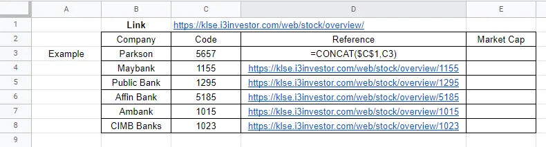

In this article, I will be showing the process of scraping some listed companies market capitalization in Malaysia data using Google Sheet. We will perform web scraping on the [i3 Investor site](https://klse.i3investor.com/web/index).


## Generate Webpage for Scraping
First of all, open a new google sheet and create a table like this:


Inside the table, we have a few companies name and their listed code. Notice that in cell C3, we put a link — this link will serve as a “prefix”. If the stock code is put at the back of the link, it will direct to the webpage of the particular page.

```
prefix link: https://klse.i3investor.com/web/stock/overview/
link to webpage: https://klse.i3investor.com/web/stock/overview/1023
```

Now, we use the concatenate function to append the code to the prefix links for all the companies in the table:



## Web Scraping in Action
Before we start web scraping, we need to learn about this function — IMPORTXML().

```
=importxml("url", "query")
```

Notice that we already have all the URLs needed as we have created the links on the table. Now, the missing piece is called “query” — simply means what do we want to know and where can it be found?

The query is called the XPath where it is used in web browser, now let’s hope into Maybank stock page and get the XPath query.


After clicking inspect, a window will pop out highlighting a code segment. Here, we need to right click and select Copy full XPath.


Let’s hope back to Google Sheet, you will be pasting the query as follow:

```
=importxml("url","/html/body/div[3]/div/div[2]/div[8]/div[1]/div[2]/div[1]/div[2]/p/strong")
Note: The URL will be the URLs in the Reference column
```


After applying the formula to the Market Cap column, you will manage to scrape all the Market Capitalization data on the sheet — the data will be updated live.


