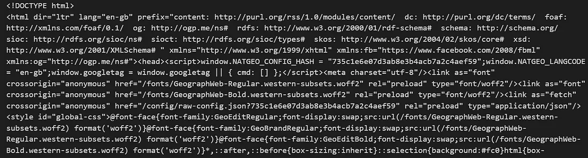
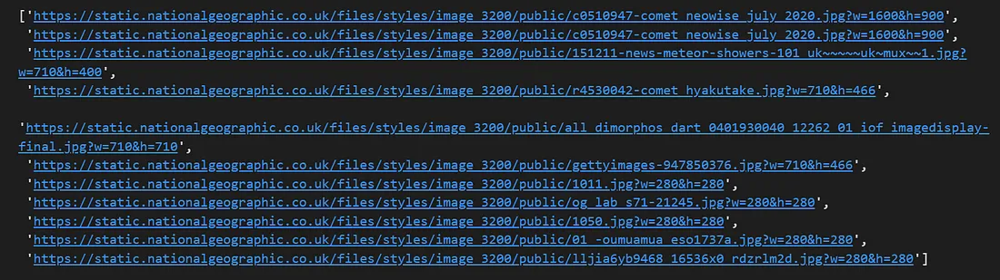
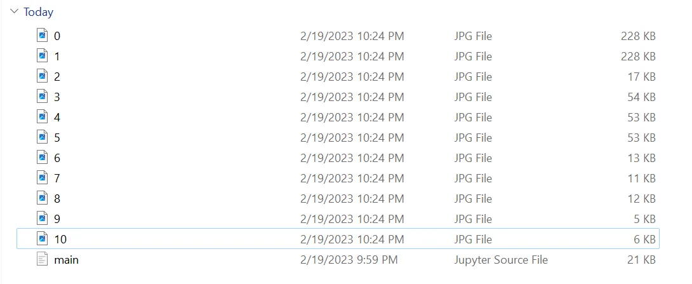

<p style="text-align: center; color:grey;"><i>Images from Unsplash</i></p>

In this article, we will learn how to image scraping on this [**National Geographic article: Asteroids vs. comets: How do they differ, and do they pose a threat to Earth?**](https://www.nationalgeographic.co.uk/space/2023/01/asteroids-vs-comets-how-do-they-differ-and-do-they-pose-a-threat-to-earth) We will learn how to download in bulk the high-quality images in the webpage with Python code.

**The process:**
- Find the webpage data structure for the URL specified.
- Search for the images link and save in a list.
- Download all the images.

### Find the webpage data structure for the URL specified
We will be using Visual Studio Code with Python and Jupyter notebook configured. However, a Python code file will also do the job. Here are the three packages to be installed using Window PowerShell:
```python 
# Lauch Power Shell by pressing Start and then type Power Shell in the search bar
# installation procedure
py -m pip install requests
py -m pip install bs4
py -m pip install urllib
```

First, we start by importing the modules needed. Then, we need to make HTTP request to view the webpage data structure we want. This can be done as follows:
```python
import requests
from bs4 import BeautifulSoup
import urllib.request

def getdata(url): 
    r = requests.get(url) 
    return r.text 

htmldata = getdata("https://www.nationalgeographic.co.uk/space/2023/01/asteroids-vs-comets-how-do-they-differ-and-do-they-pose-a-threat-to-earth") 
soup = BeautifulSoup(htmldata, 'html.parser') 
```

You can check the output by typing the variable name:

<center></center>
<p style="text-align: center; color:grey;"><i>Output representing webpage structure.</i></p>

### Search for the images link and save in a list
Now, we want to search for all the images links that embedded images in the webpage. We will use a test list to store each of the link as list of elements for download later. The print function is used to print out all the links that are being searched.

```python 
test = list()
for item in soup.find_all('img'): 
    print(item['src'])
    test.append(item.get('src'))
```
<center></center>
<p style="text-align: center; color:grey;"><i>All the searched links in list</i></p>

### Download all the images
Now simply using a for loop, we can save all the images inside our current folder. The number of iterations, n will be the number of images in the list. In our code, we will also rename the images with number 0,1,2,…,n to avoid duplicate file name.

```python
for i in range(len(test)):
    urllib.request.urlretrieve(test[i], str(i)+".jpg")
```

<center></center>
<p style="text-align: center; color:grey;"><i>All the images being downloaded</i></p>

### Extra:
Some website will have several images urls mixed up including .svg, .png., .gif and .jpg. We can use if statement to counter this issue:

```python
temp = list()
for i in range(len(test)):
    if test[i].__contains__('.png' or '.jpg' or '.jpeg'):
        temp.append(test[i])

for i in range(len(temp)):
    urllib.request.urlretrieve(temp[i], str(i)+".jpg")
```

That said, job well done. Do note that this approach has restriction on the type of web page for scraping. **It works best for articles pages with images embedded.** If you encounter connection time out error with your request, do have a check on the site accessibility (Internet Service Provider). Otherwise, it should work perfectly!

### References:
1. [Beautiful Soup Documentation — Beautiful Soup 4.4.0 documentation (beautiful-soup-4.readthedocs.io)](https://beautiful-soup-4.readthedocs.io/en/latest/)
2. [urllib.request — Extensible library for opening URLs — Python 3.11.2 documentation](https://docs.python.org/3/library/urllib.request.html)