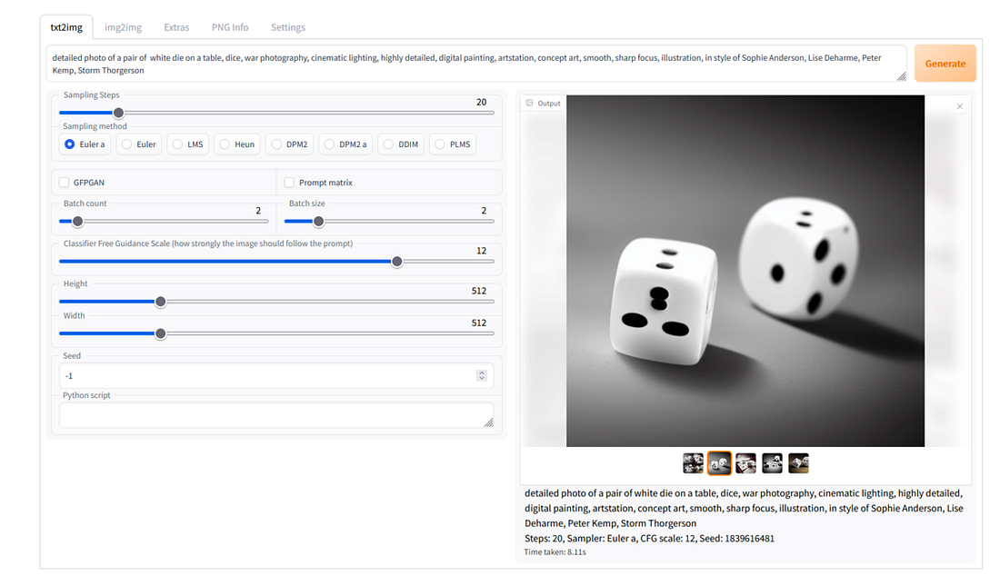
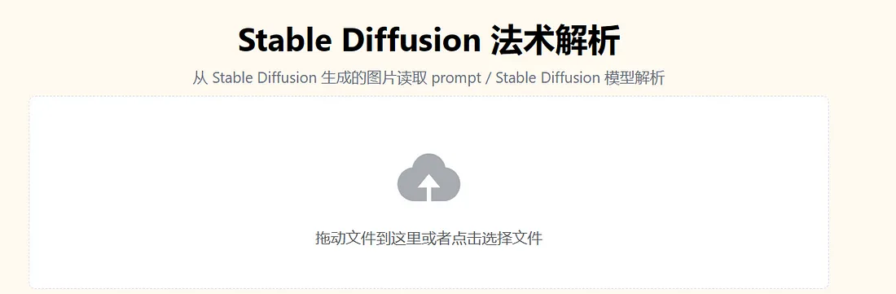
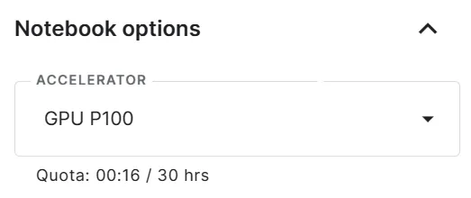
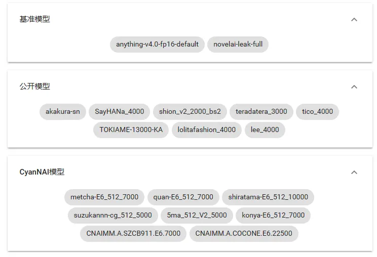

<p style="text-align: center; color:grey;"><i>Images from Unsplash</i></p>

> *Disclaimer: This article is for educational purpose only and the author does not suggest any illegal usage of this technology (generative AI). Please be responsible for your generations and creations. Do not use them for any malicious intent or harm in any form and be respectful.*

There are two ways to use Stable Diffusion — either locally on your own PC or through a cloud computing services such as [**Google Collab**](https://colab.research.google.com/) and [**Kaggle**](https://www.kaggle.com/).

It has been a frustration for many without a decent GPU and sufficient VRAM. This has caused long computation time and a lot of friction for you to tune your model parameter/ prompt, and worse, you are not even able to load the Stable Diffusion model.


<p style="text-align: center; color:grey;"><i>Sources: Stable Diffusion WebUI https://cdn.changelog.com/uploads/news_items/RdAG/large.png?v=63829970528</i></p>

I will break this article in **3 parts** according to the resources I gathered, and you are free to discover the one that you see fit.

### 1. Google Collab — Realistic & Animated Image Generation
*Terms: google collab, civitai, account*

Google Collab offers a decent and fast GPU and long-running hours for any Google users with a Google account. You can check out the YouTube video [**here**](https://www.youtube.com/@nolanaatama) by Nolan Aatama where you can learn about some quick installation steps to run Stable Diffusion in your own account. The account provides installation guide on various models such as Dreamshaper and more.

You can check out the models offered on [**Civitai**](https://civitai.com/) to look for prompt examples and user review of the model as well as other models offered on the platform.

```yaml {linenos=true}
# prompts example
positive:
space, rocket, stallite, earth, milky ways, space dust, high res, 8k

negative:
lowres, bad hands, bad fingers, sketeches, paintings,
```

If you want to check the prompts for any of the generated images you like can use this [**Stable Diffusion Decomposer**](https://spell.novelai.dev/) to get the details of each generated images.


<p style="text-align: center; color:grey;"><i>Stable Diffusion Decomposer</i></p>

You need to create a Civitai account to post your review and submit comment.

Do note that it takes around 10 minutes to run the code. It took around 20 seconds to generate a 512x1024 pixels image which is decent. For Google Collab, I think there is no computing quota being set and you can run the program for a few hours. But do avoid leaving the tabs idle as Google will reconnect your program which caused you to re-run all the code again.

### 2. Kaggle — Animated Image Generation
*Terms: kaggle, webui, gpu, telegram*

I only manage to find scripts that provide animated image generation on Kaggle, you can look at it [**here**](https://www.kaggle.com/code/camenduru/stable-diffusion-webui-kaggle). You just need to copy and run all the codes in the notebook to access the WebUI. Do note that on Kaggle, you only have 30 hours of GPU resources being allocated, so use it wisely and shut down the connection when you are not running the program to conserve the quota allocated to you.

<center></center>
<p style="text-align: center; color:grey;"><i>Turn off GPU if it is not in use</i></p>

If you like animated image and you don’t want to always re-run the scripts to access WebUI, you can also check out this [**site**](https://www.kamiya.dev/), a site that host the WebUI for animated image generation. You can get around 100 quotas by signing in daily (which allows you to generate about 90+ images). You also need to acquire the sign-in token with a Telegram account.


<p style="text-align: center; color:grey;"><i>Some of the model offered on the site</i></p>

### 3. Your Own PC
*Terms: local, google translation, extension, apply and restart*

If you want to run Stable Diffusion locally, you can have a read on this article on the installation guide. You can use Google Translate for the article as it is in Chinese.

Basically, this is what you need to do:

- Installation of [**Stable Diffusion WebUI**](https://github.com/AUTOMATIC1111/stable-diffusion-webui)
- Load models, put in `models/Stable-diffusion/` files after the installation step above (can get from [**Civitai**](https://civitai.com/) website)
- After opening the local URL, go to the Extensions tab and install `https://github.com/civitai/sd_civitai_extension`.
- Go to Installed tab and click **Apply and Restarts UI**
- Done!