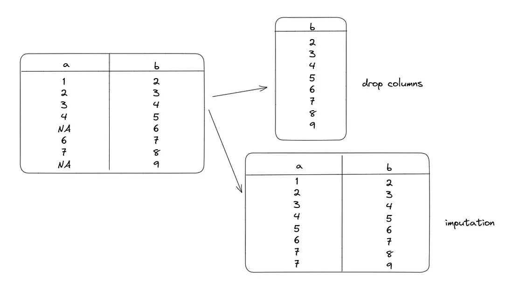
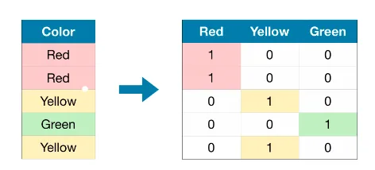
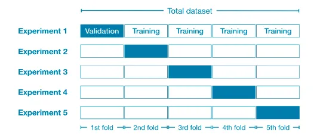
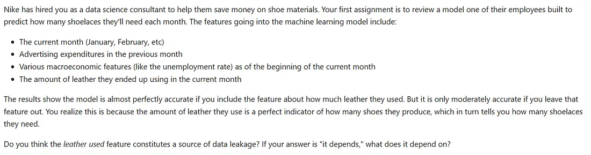

<center></center>
<p style="text-align: center; color:grey;"><i>Images from Unsplash</i></p>

> *Disclaimer: This article is my learning note from the courses I took from Kaggle.*

Using machine learning in data analysis is a rather procedural approach. As we can notice from the approach, we will start by *Preparing data >> Defining a model >> Model diagnostic checking >> Model prediction* to complete our workflow. This workflow is often and commonly practiced when we are doing data analysis work. In this course, we will learn some important and useful technique that can be used in our work to achieve a better model.

**Main learnings:**

- Approaches towards missing data values and categorical variables (non-numeric)
- Construct pipeline to improve our workflow and code flow.
- Cross-validation technique
- Build state-of-the-art model such as `XGBoost`
- Approaches to avoid data leakage.

##  1. Missing Values & Categorial Variables
### 1.1 Missing values
We can deal with missing values with the following three ways:

- Drop the columns containing missing values (not recommended, might loss access to important information)
- Imputation to fill the empty cells with some number.
- Imputation, then add a new column that shows the missing entries.

<center></center>
<p style="text-align: center; color:grey;"><i>Visualize the methods</i></p>

Imputation will perform better than dropping the entire columns. This is how we can do that in code:

```py
## 1. drop columns with missing values
# get the columns name
cols_with_missing = [col for col in X_train.columns
                      if X_train[col].isnull().any()]

# perform drop
reduced_X_train = X_train.drop(cols_with_missing, axis = 1)

## 2. imputation
from sklearn.impute import SimpleImputer
my_imputer = SimpleImputer()
imputed_X_train = pd.DataFrame(my_imputer.fit_transform(X_train))

# imputation removed column names, put back
imputed_X_train.columns = X_train.columns

## 3. extended imputation
X_train_plus = X_train.copy()
for col in cols_with_missing:
  X_train_plus[col + '_was_missing'] = X_train_plus[col].isnull()

my_imputer = SimpleImputer()
imputed_X_train_plus = pd.DataFrame(my_imputer.fit_transform(X_train_plus))

imputed_X_train_plus.columns = X_train_plus.columns
```

### 1.2 Categorical variables
There are three ways to deal with categorical variables (non-numeric data):

- Dropping the categorical variables (if the columns does not provide any useful information)
- Ordinal encoding — assign a unique value in the dataset to a different integer.
- One-hot encoding — create new columns to indicate the presence of each possible value in the original data

<center></center>
<p style="text-align: center; color:grey;"><i>One hot encoding example</i></p>

For One-hot encoding, it means that if a column with 100 rows contains 100 unique values, it will create an extra `(100 rows *100 unique values –100 original rows)` new entries.

We can apply the 3 approaches with the following code:
```py 
## 1. droppping categorical variables
dorp_X_train = X_train.select_dtypes(exclude= ['object'])

## 2. ordinal encoding
from sklearn.preprocessing import OrdinalEncoder
label_X_train = X_train.copy()

ordinal_encoder = OrdinalEncoder()
label_X_train[object_cols] = ordinal_encoder.fit_transform(X_train[object_cols])

## 3. one hot encoding
from sklearn.preprocessing import OneHotEncoder

# one hot encode categorical data
OH_encoder = OneHotEncoder(handle_unknown = 'ignore', sparse = False)
OH_cols_train = pd.DataFrame(OH_encoder.fit_transform[object_cols])

# add back removed index
OH_cols_train.index = X_train.index

# remove categorical column and add back the one hot encoded columns
num_X_train = X_train.drop(object_cols, axis = 1)
OH_X_train = pd.concat([num_X_train, OH_cols_train], axis = 1)
```

## 2. Pipelines
Pipeline is a way to bundle our preprocessing and modelling steps to keep our code organized. The benefits of using pipeline are it gives a cleaner code, reduces bugs and make our model easier to be implemented.

Here’s how we can apply pipeline to impute missing numerical entries and one-hot encode missing categorical entries:
```py
from sklearn.compose import ColumnTransformer
from sklearn.pipeline import Pipeline
from sklearn.impute import SimpleImputer
from sklearn.preprocessing import OneHotEncoder

# preprocess numerical data
numerical_transformer = SimpleImputer(strategy = 'constant')

# preprocess categorical data
categorical_transformer = Pipeline(steps = [
  ('imputer', SimpleImputer(strategy = 'most frequent')),
  ('onehot', OneHotEncoder(handle_unknown = 'ignore'))
])

# bundle the two preprocesses
preprocessor = ColumnTransformer(
  transformers = [
    ('num', numerical_transformer, numerical_cols),
    ('cat', categorical_transformer, categorical_cols)  
])

# bundle preprocessing and modelling
my_pipeline = Pipeline(steps = [
  ('preprocessor', preprocessor),
  ('model', model)
  ])

# model evaluation
my_pipeline.fit(X)train, y_train)
preds = my_pipeline.predict(X_valid)
mean_absolute_error(y_valid, preds)
```

## 3. Cross-validation
Cross-validation means we run our modelling process on different subsets of the data to get several measures of our model quality. Although this technique gives a more accurate measure of model quality, it can take some time to run as it need to estimate multiple models as we can see from the below images.

It is recommended to run cross-validation for smaller datasets while for larger datasets, a single validation if often suffice.

<center></center>
<p style="text-align: center; color:grey;"><i>Cross-Validation</i></p>

Here’s how we can apply cross-validation in Python together with pipeline which we learned earlier on:
```py
from sklearn.model_selection import cross_val_score

# split the data to 5 sets for validation
scores = -1 * cross_val_score(my_pipeline, X, y,
  cv = 5, scoring = 'neg_mean_absolute_error')
print(scores.mean())
```

It is surprising to see that negative mean absolute error is used in the code. This is because “sklearn” has a convention where all metrics are defined so a high number is better. Thus, the use of negatives allows convention consistency.

## 4. XGBoost — Gradient Boosting
In the random forest method, we improve a model prediction by averaging the prediction of many decision trees. Random forest method is one of an ensemble method where we combine the prediction of several models. A state-of-the-art method would be to apply gradient boosting where we perform iterative cycles to add models into an ensemble to result in better prediction.

**Concepts:**

- Use the current ensemble to generate predictions for each observation in the dataset.
- Use the prediction to calculate a loss function.
- Use the loss function to fit a new model that will be added to the ensemble which will reduce the loss.
- Add this new model to the ensemble.
- Repeat

Here’s how to do it in code:
```py
from xgboost import XGBRegressor
from sklearn.metrics import mean_absolute_error

my_model = XGBRegressor()
my_model.fit(X_train, y_train)

predictions = my_model.predict(X_valid)
mean_absolute_error(predictions, y_valid)
```

There are a few parameters in the `xgregressor` function that might affect the accuracy of our result:

- `n_estimators` which means how many times to go through the modelling cycle (concepts above), value too high or too low might result in overfitting or underfitting respectively
- `early_stopping_rounds` which means stopping the model when the validation score stops improving with imposed criteria
- `learning_rate` which means multiply the predictions from each model by a small number before adding up the prediction from each component model
- `n_jobs` which aims to improve model’s runtime. We can set the number equal to the cores of our machine

```py
model = XGBRegressor(n_estimators = 1000, learning_rate = 0.05,
  n_jobs = 4)

model.fit(X_train,y_train, early_stopping_rounds = 5,
  eval_set = [(X_valid, y_valid)],
  verbose = False)
```

## 5. Data Leakage
Data leakage happens when training data contains information about the target, but similar data will not be available when we used the model to perform prediction. The two main types of data leakage are target leakage and train-test contamination.

### 5.1 Target leakage
Target leakage occurs when predictors include data that will not be available at the time when predictions is made. A way to overcome this issue is to think about timing or chronological order that data becomes available rather than whether a feature will help to make good predictions.

### 5.2 Train-test contamination
Train-test contamination happens when validation data affects the preprocessing behavior as the validation process is corrupted.

```
For example, imagine you run preprocessing (like fitting an imputer for 
missing values) before calling train_test_split(). The end result? 
Your model may get good validation scores, giving you great confidence 
in it, but perform poorly when you deploy it to make decisions.
```

In the courses, there are several interesting case studies on data leakage that worth looking to improve our acumen when interpreting results from work.

<center></center>
<p style="text-align: center; color:grey;"><i>Case 1</i></p>

**Guide:**

This is tricky, and it depends on details of how data is collected (which is common when thinking about leakage). Would you at the beginning of the month decide how much leather will be used that month? If so, this is ok. But if that is determined during the month, you would not have access to it when you make the prediction. If you have a guess at the beginning of the month, and it is subsequently changed during the month, the actual amount used during the month cannot be used as a feature (because it causes leakage).