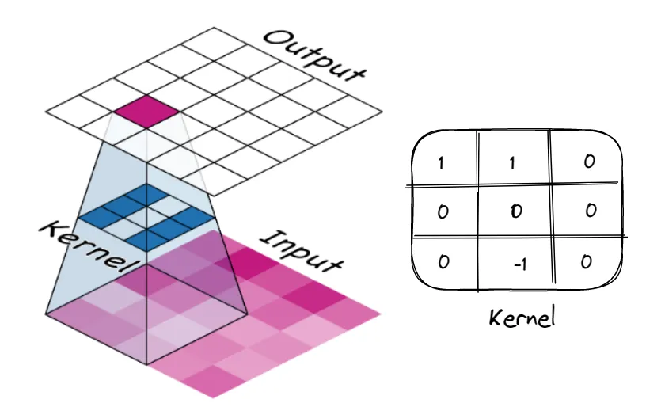

<center></center>
<p style="text-align: center; color:grey;"><i>Images from Unsplash</i></p>

> *Disclaimer: This article is my learning note from the courses I took from Kaggle.*

Computer vision literally means computer able to see and recognize stuff. Applications such as Google Lens and Google Image Search are some good examples of where computer vision is being used in our daily life.

In this course, we will explore some technique used to empower computer with the power of seeing:

- Building an image classifier with Keras
- Concepts of visual feature extraction
- Custom `covnet`
- Apply data augmentation to extend dataset.

## 1. Convolutional Classifier
Convolutional neural networks or “`covnet`” is a neural network specializes in computer vision. A `covnet` used for image classification has two parts: a convolutional base and a dense head. The base is used to extract the features of an image while the head is used to determine the class of the image. So, the aims of training a neural network are simply to know which feature to extract from a particular image and to know which class the image will belong from the features.

<center></center>
<p style="text-align: center; color:grey;"><i>The process</i></p>

Here is how we can train a covnet on Python to recognize a car and a truck:
```py
# 1. load pretrained base
pretrained_base = tf.keras.models.load_model(
    # file path
    '../input/cv-course-models/cv-course-models/vgg16-pretrained-base',
)
pretrained_base.trainable = False

# 2. attach classfier head
from tensorflow import keras
from tensorflow.keras import layers

model = keras.Sequential([
  pretrained_base,
  layers.Flatten(), # transform 2d output to 1d
  layers.Dense(6, activation = 'relu'),
  layers.Dense(1, activation = 'sigmoid'), # transform output to class probability (truck)
])

# 3. model fitting
model.compile(
  optimizer = 'adam',
  loss = 'binary_crossentropy',
  metrics = ['binary_accurary'],
)

history = model.fit(
  ds_train,
  validation_data = ds_valid,
  epochs = 30,
  verbose = 0,
)

# 4. visualize model loss
import pandas as pd

history_frame = pd.DataFrame(history.history)
history_frame.loc[:, ['loss', 'val_loss']].plot()
history_frame.loc[:, ['binary_accurary', 'val_binary_accurary']].plot();
```

## 2. Features Extraction
### 2.1 Convolution and ReLU
The process of feature extraction does three things. It filters an image for a certain feature; it detects the feature within the filtered image, and it condenses the image to enhance the features.

<center></center>
<p style="text-align: center; color:grey;"><i>Featur extraction overview</i></p>

In training, the covnet will learn weights from image features and the weights are contained in the convolutional layers. The weights are known as **kernels** which can be presented as an array of number. A kernel will scan over an image and produce a weighted sum of pixel values (finding the best kernel values) — emphasizing and de-emphasizing certain image patterns and information.

<center></center>
<p style="text-align: center; color:grey;"><i>The process</i></p>

Activations in the network is called feature maps. Feature maps is the result when filter is applied to image — it contains features a kernel extract.

<center></center>
<p style="text-align: center; color:grey;"><i>Applying filter</i></p>

After filtering, the feature maps will be passed to an activation function which can be though as scoring pixel values according to some measure of importance. For example, ReLU activation assumes negative values are not important, so they are set to zero. In fact, these images are how the head of a network is able to solve the classification problem — looking for a particular characteristic of images that we want to classify.

<center></center>
<p style="text-align: center; color:grey;"><i>After passing through activation function</i></p>

Here’s how to can perform feature extraction in Python:
```py
# define kernel
import tensorflow as tf
kernel =tf.constant([
    [-1, -1, -1],
    [-1,  8, -1],
    [-1, -1, -1],
])

plt.figure(figsize = (3,3))
show_kernel(kernel)

# applying kernel
image_filter = tf.nn.conv2d(
  input = image,
  fitlers = kernel, 
  strides = 1, # section 3
  padding = 'SAME',
)

plt.figure(figsize = (6,6))
plt.imshow(tf.squeeze(image_filter))
plt.axis('off')
plt.show();

# applying activation function
image_detect = tf.nn.relu(image_filter)

plt.figure(figsize = (6,6))
plt.imshow(tf.squeeze(image_filter))
plt.axis('off')
plt.show();
```

### 2.2 Maximum Pooling
```py
from tensorflow import keras
from tensorflow.keras import layers

model = keras.Sequential([
    layers.Conv2D(filters=64, kernel_size=3), # activation is None
    layers.MaxPool2D(pool_size=2),
    # More layers follow
])
```

Notice that after the Conv2D layer, we will apply a MaxPool2D layer for the condensation step. This layer will not contain any trainable weights as of the previous layer, but it will condense the feature maps to only retain important feature. This is what maximum pooling does. It takes patches of activations in the original feature maps and replaces them with maximum activation in those patches. The pooling steps will increase the proportions of active pixels to zero pixels — intensifying the feature after ReLU activation.

<center></center>
<p style="text-align: center; color:grey;"><i>Maximum pooling</i></p>

Is zero pixels **unimportant**? In fact, zero pixels carries positional information and MaxPool2D function will remove them (positional information of the feature maps) and this will lead to a property in covnet known as translation invariance.

This means that a covnet with maximum pooling tend to not distinguish features by their location in image. Notice from the first row of images below, after repeated pooling, the positional information is destroyed and no longer distinguishable. But pooling only causes translation invariance in network over small distance. The second row of the image features two dots far apart and this feature remains distinct after repeated pooling.

In fact, such invariance is good for an image classifier as it reduces data for training since we do not need to teach the network differences in perspective and framing when same features are positioned on different part of an original image.

<center></center>
<p style="text-align: center; color:grey;"><i></i></p>

## 3. Sliding Window
Both convolution and pooling steps are performed over a sliding window with parameters “kernel_size” for convolution and “pool_size” for pooling.

Notice in section 2.1, when we perform pooling, there are two extra parameters: `strides` and `padding`. `strides` means how far the window will move each step and padding describes how the pixels at the edge are being handle.

<center></center>
<p style="text-align: center; color:grey;"><i>Pooling layer will almost always have stride values greater than 1, like (2, 2) or (3, 3), but not larger than the window itself.</i></p>

Considering the sliding window process, is it necessary to always stay within the boundary? In fact, there is a trade-off between staying within and out of bound by changing the parameter `padding` in our code:

- `padding = ‘valid’`: Convolution window stay entirely inside input. Output will shrink. It will shrink more for larger kernels. This will limit the number of layers contained in a network, notably small size input.
- `padding = ‘same’`: Pad the input with 0’s around the border to make size of output and input the same. However, this will dilute the influence of pixels at the borders.

```py
from tensorflow import keras
from tensorflow.keras import layers

model = keras.Sequential([
    layers.Conv2D(filters=64,
                  kernel_size=3,
                  strides=1,
                  padding='same',
                  activation='relu'),
    layers.MaxPool2D(pool_size=2,
                     strides=1,
                     padding='same')
    # More layers follow
])
```

Example for visualization:
```py
show_extraction(
    image, kernel,

    # Window parameters
    conv_stride=3,
    pool_size=2,
    pool_stride=2,

    subplot_shape=(1, 4),
    figsize=(14, 6),    
)
```

Since the circle is just 1 pixel wide, using `stride = 3` is too coarse to produce a decent feature maps. We should then reduce the number of strides for a better feature map.

<center></center>
<p style="text-align: center; color:grey;"><i>The more horizontal parts of the input end up with the greatest activation as the kernel is designed to detect horizontal lines.</i></p>

## 4. Custom Covnet
Through feature extraction, we learned how to extract simple features from an image through filter, detect and pooling. By repeating the extraction process, we can extract more complex and refined features as the process travel deeper into the network.

This can be done through convolution blocks with stacks of Conv2D and MaxPool2D layers as below:

<center></center>
<p style="text-align: center; color:grey;"><i></i></p>

Here’s how we can design a `covnet` that can extract complex features:
```py
# 1. define model
from tensorflow import keras
from tensorflow.keras import layers

model = keras.Sequential([

    # First Convolutional Block
    layers.Conv2D(filters=32, kernel_size=5, activation="relu", padding='same',
                  input_shape=[128, 128, 3]),
    layers.MaxPool2D(),

    # Second Convolutional Block
    layers.Conv2D(filters=64, kernel_size=3, activation="relu", padding='same'),
    layers.MaxPool2D(),

    # Third Convolutional Block
    layers.Conv2D(filters=128, kernel_size=3, activation="relu", padding='same'),
    layers.MaxPool2D(),

    # Classifier Head
    layers.Flatten(),
    layers.Dense(units=6, activation="relu"),
    layers.Dense(units=1, activation="sigmoid"),
])
model.summary()

# 2. model training
model.compile(
    optimizer=tf.keras.optimizers.Adam(epsilon=0.01),
    loss='binary_crossentropy',
    metrics=['binary_accuracy']
)

history = model.fit(
    ds_train,
    validation_data=ds_valid,
    epochs=40,
    verbose=0,
)

# 3. model loss evaluation
import pandas as pd

history_frame = pd.DataFrame(history.history)
history_frame.loc[:, ['loss', 'val_loss']].plot()
history_frame.loc[:, ['binary_accuracy', 'val_binary_accuracy']].plot();
```

## 5. Data Augmentation
More data will generally help a model performs better — to better differentiate image. In this section, we will learn to augment our data by applying transformation to our datasets such as rotation, flipping, warping and changing of contrast and color tone. Here’s how to perform data augmentation in Python:

<center></center>
<p style="text-align: center; color:grey;"><i>Data augmentation example</i></p>

```py
# 1. define model - with augmentation
from tensorflow import keras
from tensorflow.keras import layers


pretrained_base = tf.keras.models.load_model(
    '../input/cv-course-models/cv-course-models/vgg16-pretrained-base',
)
pretrained_base.trainable = False

model = keras.Sequential([
    # Preprocessing
    layers.RandomFlip('horizontal'), # flip left-to-right
    layers.RandomContrast(0.5), # contrast change by up to 50%
    # Base
    pretrained_base,
    # Head
    layers.Flatten(),
    layers.Dense(6, activation='relu'),
    layers.Dense(1, activation='sigmoid'),
])

# 2. model training
model.compile(
    optimizer='adam',
    loss='binary_crossentropy',
    metrics=['binary_accuracy'],
)

history = model.fit(
    ds_train,
    validation_data=ds_valid,
    epochs=30,
    verbose=0,
)

# 3. model loss evaluation
import pandas as pd

history_frame = pd.DataFrame(history.history)

history_frame.loc[:, ['loss', 'val_loss']].plot()
history_frame.loc[:, ['binary_accuracy', 'val_binary_accuracy']].plot();
```