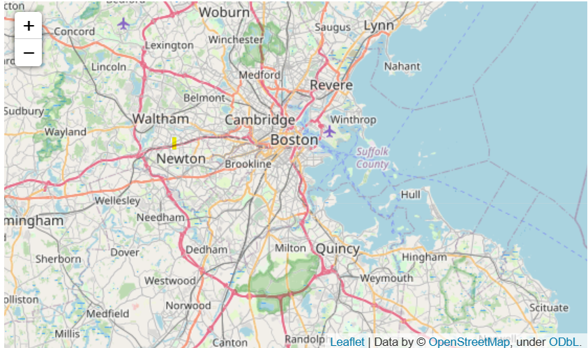

<center></center>
<p style="text-align: center; color:grey;"><i>Images from Unsplash</i></p>

> *Disclaimer: This article is my learning note from the courses I took from Kaggle.*

**Geospatial analysis** is the gathering, display and manipulation of imagery, GPS, satellite photography and historical data, described explicitly in terms of geographic coordinates. This course will learn on methods to visualize geospatial data and perform some analysis concerning a particular geographic location or region. 

Some interesting questions that can be addressed with geospatial analysis are:
- Which areas affected by earthquakes would require additional reinforcement?
- Where should a popular coffee shop select its next store, if it is considering an expansion?
- With forest conservation areas set up in some regions, will animals migrate to those areas or other areas instead?

## 1. Creating Maps
To visualize geographic coordinates as a map, we need the help of `geopandas` library. Note that there are a few geospatial file formats available such as `shapefile`, `GeoJSON`, `KML` and `GPKG`. But all the files can be loaded with `geopandas`library:

```py
# read the shape file
full_data = gpd.read_file("file_name")
```

Here's how we can create a map for a geospatial data file. In fact, in every `GeoDataFrame`, there will be a geometry column that describe the geometric objects when we display them with the `plot()` function. They can be a point, linestring or polygon :
```py
## 1. Prework
# plot the data only 
wild_lands.plot()

# campsites point
POI_data = gpd.read_file("../input/geospatial-learn-course-data/DEC_pointsinterest/DEC_pointsinterest/Decptsofinterest.shp")
campsites = POI_data.loc[POI_data.ASSET=='PRIMITIVE CAMPSITE'].copy()

# foot trails as linestring
roads_trails = gpd.read_file("../input/geospatial-learn-course-data/DEC_roadstrails/DEC_roadstrails/Decroadstrails.shp")
trails = roads_trails.loc[roads_trails.ASSET=='FOOT TRAIL'].copy()

# country boundaris as polygon
counties = gpd.read_file("../input/geospatial-learn-course-data/NY_county_boundaries/NY_county_boundaries/NY_county_boundaries.shp")

## 2. Visualize the map
# Plot a base map with counties boundaries
ax = counties.plot(figsize=(10,10), color='none', edgecolor='gainsboro', zorder=3)

# Add in the campsites and foot trails
wild_lands.plot(color='lightgreen', ax=ax)
campsites.plot(color='maroon', markersize=2, ax=ax)
trails.plot(color='black', markersize=1, ax=ax)
```

<center></center>
<p style="text-align: center; color:grey;"><i>Point, linestring and polygon (geometric objects)</i></p>

## 2. Coordinate Reference System
In order to create a `GeoDataFrame`, we have to set the CRS. The CRS is referenced by European Petroleum Survey Group code - `EPSG 32630` used by `GeoDataFrame` or also known as the "Mercator" projection that preserves angles and slightly distorts area. What's more, `EPSG 4326` corresponds to coordinates in latitude and longitude. It is a coordinate system of latitude and longitude based on an ellipsoidal (squashed sphere) model of the earth. 

Here's how to do it in code:

```py
# read file
facilities_df = pd. read_csv("file_name")

# convert to geodataframe
facilities = gpd.GeoDataFrames(facilities_df, geometry = points_from_xy(facilities_df.Longitude, facilities_df.Latitiude))

# set crs
facilities.crs = {'init': 'epsg:4326'}

# view first five rows
facilities.head()
```

It is also possible to change the CRS so that we can have datasets with matching CRS. If we cannot do it with code, alternatively, we can use `proj4 string` of CRS to convert to latitude and longitude coordinates using `+proj=longlat +ellps=WGS84 +datum=WGS84 +no_defs`:

```py
# match facilities crs with regions
ax = regions.plot(figsize=(8,8), color='whitesmoke', linestyle=':', edgecolor='black')
facilities.to_crs(epsg=32630).plot(markersize=1, ax=ax)

# change CRS to EPSG 4326 and display the data
regions.to_crs("+proj=longlat +ellps=WGS84 +datum=WGS84 +no_defs").head()
```

### 2.1 Geometric Objects Attributes
Previously, we introduced the geometry column in a `GeoDataFrame`, in fact they are built-in attributes that could help to give us some interesting information about our data. For example, we want to find the coordinates of each point, the length of linestring or the area of a polygon.

```py
# find points x-coordinate
facilities.geometry.head().x

# find area of polygons
regions.loc[:, "AREA"] = regions.geometry.area/ 10**6
```
## 3. Interactive Maps
In this section, we will explore methods to plot interactive maps such as heatmaps, points and choropleth maps. These features are enabled by the `folium` package. 

Some maps to plot with `folium` package:
- Simple Map
- Markers/ Bubbles
- Clustered markers
- Heatmaps
- Choropleth maps

To create a simple map for visualization as follows:
```py
# Create a map
m_1 = folium.Map(location=[42.32,-71.0589], tiles='openstreetmap', zoom_start=10)

# Display the map
m_1
```
<center></center>
<p style="text-align: center; color:grey;"><i>A simple map</i></p>

Let's say we want to add some markers to the map. Here's a case where we add markers to denote places that experienced robbery on the map:
```py
# data preparatin
daytime_robberies = crimes[((crimes.OFFENSE_CODE_GROUP == 'Robbery') & \
                            (crimes.HOUR.isin(range(9,18))))]

# Create a map
m_2 = folium.Map(location=[42.32,-71.0589], tiles='cartodbpositron', zoom_start=13)

# Add points to the map
for idx, row in daytime_robberies.iterrows():
    Marker([row['Lat'], row['Long']]).add_to(m_2)

# Display the map
m_2
```
<center></center>
<p style="text-align: center; color:grey;"><i>Maps with markers</i></p>

Now notice that the markers are scattered all over the place. It is possible to cluster together the markers when we zoom out the map and let the markers spread out as we zoom in with the help of `MarkerCluster()`:
```py
# Create the map
m_3 = folium.Map(location=[42.32,-71.0589], tiles='cartodbpositron', zoom_start=13)

# Add points to the map
mc = MarkerCluster()
for idx, row in daytime_robberies.iterrows():
    if not math.isnan(row['Long']) and not math.isnan(row['Lat']):
        mc.add_child(Marker([row['Lat'], row['Long']]))
m_3.add_child(mc)

# Display the map
m_3
```
<center></center>
<p style="text-align: center; color:grey;"><i>Clustered markers</i></p>

An alternative to markers on map, we could also use circle for the same purpose - that is bubble maps:
```py
# Create a base map
m_4 = folium.Map(location=[42.32,-71.0589], tiles='cartodbpositron', zoom_start=13)

def color_producer(val):
    if val <= 12:
        return 'forestgreen'
    else:
        return 'darkred'

# Add a bubble map to the base map
for i in range(0,len(daytime_robberies)):
    Circle(
        location=[daytime_robberies.iloc[i]['Lat'], daytime_robberies.iloc[i]['Long']],
        radius=20,
        color=color_producer(daytime_robberies.iloc[i]['HOUR'])).add_to(m_4)

# Display the map
m_4
```
<center></center>
<p style="text-align: center; color:grey;"><i>Bubble map</i></p>

Now consider that among few cities with different crime rate. We would like to visualize whether which city has relatively more criminal incidents than the other, a heatmap would do a good job to show us which areas of a city are susceptible to more criminal cases:
```py
# Create a base map
m_5 = folium.Map(location=[42.32,-71.0589], tiles='cartodbpositron', zoom_start=12)

# Add a heatmap to the base map
HeatMap(data=crimes[['Lat', 'Long']], radius=10).add_to(m_5)

# Display the map
m_5
```
<center></center>
<p style="text-align: center; color:grey;"><i>Heat map</i></p>

Well, you should notice that heatmap makes geographic boundaries between different areas non-distinguishable. We can also use choropleth maps instead to visualize the crime rate by district. 

```py
# GeoDataFrame with geographical boundaries of Boston police districts
districts_full = gpd.read_file('../input/geospatial-learn-course-data/Police_Districts/Police_Districts/Police_Districts.shp')
districts = districts_full[["DISTRICT", "geometry"]].set_index("DISTRICT")
districts.head()

# Number of crimes in each police district
plot_dict = crimes.DISTRICT.value_counts()
plot_dict.head()

# Create a base map
m_6 = folium.Map(location=[42.32,-71.0589], tiles='cartodbpositron', zoom_start=12)

# Add a choropleth map to the base map
Choropleth(geo_data=districts.__geo_interface__, 
           data=plot_dict, 
           key_on="feature.id", 
           fill_color='YlGnBu', 
           legend_name='Major criminal incidents (Jan-Aug 2018)'
          ).add_to(m_6)

# Display the map
m_6
```
<center></center>
<p style="text-align: center; color:grey;"><i>Choropleth map</i></p>

## 4. Manipulating Geospatial Data
When we are using application such a Google Maps, we could easily get a place location on the map by just knowing the address or name. In fact, we are using what it's known as geocoder to generate locations of the places that we want to go. 

Here's an interesting example where we try to geocode 100 top universities in Europe with only the universities name:
```py
# 1. prepare a dataset with the universitites name
universities = pd.read_csv("../input/geospatial-learn-course-data/top_universities.csv")
universities.head()

# 2. apply geocode to each of the universitites
def my_geocoder(row):
    try:
        point = geolocator.geocode(row).point
        return pd.Series({'Latitude': point.latitude, 'Longitude': point.longitude})
    except:
        return None

universities[['Latitude', 'Longitude']] = universities.apply(lambda x: my_geocoder(x['Name']), axis=1)

print("{}% of addresses were geocoded!".format(
    (1 - sum(np.isnan(universities["Latitude"])) / len(universities)) * 100))

# Drop universities that were not successfully geocoded
universities = universities.loc[~np.isnan(universities["Latitude"])]
universities = gpd.GeoDataFrame(
    universities, geometry=gpd.points_from_xy(universities.Longitude, universities.Latitude))
universities.crs = {'init': 'epsg:4326'}
universities.head()
```

Now let's plot out the locations to see if they are accurate:
```py
# Create a map
m = folium.Map(location=[54, 15], tiles='openstreetmap', zoom_start=2)

# Add points to the map
for idx, row in universities.iterrows():
    Marker([row['Latitude'], row['Longitude']], popup=row['Name']).add_to(m)

# Display the map
m
```
<center></center>
<p style="text-align: center; color:grey;"><i>European universitites</i></p>

### 4.1 Table Joins
In this section, we will explore on combining data frames with shared index for the case of `GeoDataFrame`. An example is that we have a dataset with boundaries of every country in Europe and a dataset with their estimated population and GDP, we can perform attribute join to merge the two datasets:

```py
europe = europe_boundaries.merge(europe_stats, on="name")
europe.head()
```

Furthermore, it is also possible to merge `GeoDataFrame` based on spatial relationship between objects in geometry columns. Recall back that we geocode top 100 universities in Europe previously. Can we match each university with its corresponding country? Spatial join allow us to perform match for such as scenario.

> *The spatial join above looks at the "geometry" columns in both `GeoDataFrames`. If a Point object from the universities `GeoDataFrame` intersects a Polygon object from the `europe` DataFrame, the corresponding rows are combined and added as a single row of the `european_universities` DataFrame. Otherwise, countries without a matching university (and universities without a matching country) are omitted from the results.*

```py
# Use spatial join to match universities to countries in Europe
european_universities = gpd.sjoin(universities, europe)

# Investigate the result
print("We located {} universities.".format(len(universities)))
print("Only {} of the universities were located in Europe (in {} different countries).".format(
    len(european_universities), len(european_universities.name.unique())))

european_universities.head()
```

## 5. Proximity Analysis
For the previous four sections, we are exposed to a lot of the functions in `geopandas`. Here, we will look into some application areas with the learned functions:

Some useful application:
- Measuring distance between points on a map
- Select points within some radius of a feature

To compute distances from two `GeoDataFrames`, we need to make sure they have the same CRS. The distances can be easily computed in `GeoPandas`. Moreover, we can find the mean distance between two points with `mean` too. Here's an example where we deal with dataset with air quality monitoring stations in the same city where we would like to know the mean distance from one monitoring station to the other:
```py
# check CRS of geodataframes
print(stations.crs)
print(releases.crs)

# Select one release incident in particular
recent_release = releases.iloc[360]

# Measure distance from release to each station
distances = stations.geometry.distance(recent_release.geometry)
distances

# find the mean distance
print('Mean distance to monitoring stations: {} feet'.format(distances.mean()))
```

### 5.1 Creating a Buffer
The purpose of creating a buffer is for us to understand points on a map that lies some radius away from a point. For example, there's a toxic gas being release accidentally to the air. There are some air quality monitoring centers nearby. We want to know whether those centers are able to detect the toxic gas.

A working example would be as follows:
```py
# 1. creating a two miles buffer
two_mile_buffer = stations.geometry.buffer(2*5280)
two_mile_buffer.head()

# 2. create map with release incidents and monitoring stations
m = folium.Map(location=[39.9526,-75.1652], zoom_start=11)
HeatMap(data=releases[['LATITUDE', 'LONGITUDE']], radius=15).add_to(m)
for idx, row in stations.iterrows():
    Marker([row['LATITUDE'], row['LONGITUDE']]).add_to(m)
    
# Plot each polygon on the map
GeoJson(two_mile_buffer.to_crs(epsg=4326)).add_to(m)

# Show the map
m
```
<center></center>
<p style="text-align: center; color:grey;"><i></i></p>

Now we want to check if a toxic release occurred within 2 miles of any monitoring station, to do that we would need to test each polygon. But that would be tedious work. Consider combining all the polygons into one object, we can check whether the toxic gas is within the radar of the closest monitoring station:

```py
# check if output is true
my_union.contains(releases.iloc[360].geometry)
```