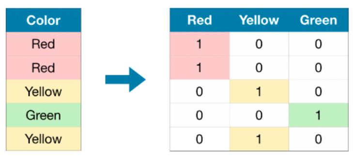

<center></center>
<p style="text-align: center; color:grey;"><i>Images from Unsplash</i></p>

In econometrics, the ordinary least square (OLS) model is widely used to estimate the parameter of a linear regression model.

```
y = beta0 + beta1*x + epsilon
```

Of course, the model can be used to model risk such as flood risk as well. From the equation above, we let `y` represents the flood risk. `y` would be a continuous variable, like a flood risk score. It also could be represented as a binary outcome: `0` for no risk and `1` for risk present. The `x` is the distance to the historical flood location, it is the distance to the nearest historical flood location. For `0`, it is the intercept, it shows the estimated flood risk when `x` is `0` or when the location is exactly the historical flood site. `1`, represents the slope. It is expected to be negative as greater distances from historical flood sites correspond to lower flood risks. For the error term, `epsilon`, it captures the unobserved factors that affect flood risk but are not included in the model. 

The outcome from the model will be presented on Streamlit web app together with a flood prediction service page to receive user location input and return the flood risk on the input location. 

<center></center>
<p style="text-align: center; color:grey;"><i>The Streamlit Web App</i></p>

Refer to my GitHub repository, for my work on [this project](https://github.com/keanteng/flood_risk_model), the link to the web app can be found on the **landing page**. 

## 1. The Workflow
- Random address generation using web scraping
- Geocoding, computing distance and response variable
- Model fitting and evaluation
- Models comparison
- Creating and deploying web app

## 2. Random Address Generation Using Web Scraping
Fitting of the flood risk model requires a predictor and a response variable. The predictor variable is collected by computing the minimum distance between a random location and the nearest historical flood location. To obtain the random location, Python `selenium` module is used to scrape random addresses online by locating the Xpath components on web pages. About 16, 000 random locations are scraped in 3 hours. 

The data collected contains information such as state, region, country, addresses, zip code and phone number. 

<center></center>
<p style="text-align: center; color:grey;"><i>Web Scraping In Action</i></p>

Refer to my [GitHub](https://github.com/keanteng/flood_risk_model/blob/main/randomaddress.ipynb) for the corresponding notebook.


## 3. Geocoding, Computing Distance And Response Variable
Geocoding services like Nominatim is used to convert the random addresses generated into geographic coordinate with longitude and latitude. 

```py
# geocoding function
def my_geocoder(row):
    try:
        point = geolocator.geocode(row).point
        return pd.Series({'Latitude': point.latitude, 'Longitude': point.longitude})
    except:
        return pd.Series({'Latitude': None, 'Longitude': None})

data[['Latitude', 'Longitude']] = data.apply(lambda x: my_geocoder(x['Location']), axis=1)

# check the percentage of data successfully geocoded
print("{}% of addresses were geocoded!".format(
    (1 - sum(np.isnan(data["Latitude"])) / len(data)) * 100))
```

To compute for the minimum distance between any random location with the nearest historical flood location, `geopandas` module is required. Since initially, the coordinate is in the format of `EPSG: 4326`, to ensure that we obtain distance output in meter, we would need to convert the coordinate to the format of `EPSG: 3857`:

```py
geocoded_data = gpd.GeoDataFrame(geocoded, geometry = gpd.points_from_xy(geocoded.Longitude, geocoded.Latitude), crs = "EPSG:4326").to_crs('EPSG:3857')

flood_points_data = gpd.GeoDataFrame(flood_points, geometry = gpd.points_from_xy(flood_points.Longitude, flood_points.Latitude), crs = "EPSG:4326").to_crs('EPSG:3857')

for i in range(0, len(geocoded_data)):
    distances = flood_points_data.geometry.distance(geocoded_data.iloc[i].geometry)
    geocoded_data.loc[i, 'distance'] = distances.min()
```

Subsequently, the response variable is computed by assuming no flood risk if the distance is less than 500 m, otherwise, flood risk exists. 

## 4. Model Fitting And Evaluation
The flood risk model is fitted using `LogisticRegression()` from the `scikit` module. The model requires at least two dimensions predictor variables. Thus, One-Hot encoding is applied to the `state` column before model fitting taking place.

<center></center>
<p style="text-align: center; color:grey;"><i>One Hot Encoding Illustration</i></p>

```py
# train test split
X = data[['distance','state']]

y = data['flood_risk']

X_train, X_valid, y_train, y_valid = train_test_split(X, y, test_size = 0.2, random_state = 0)

X_train.shape, X_valid.shape, y_train.shape, y_valid.shape

# Apply one-hot encoder to each column with categorical data
OH_encoder = OneHotEncoder(handle_unknown='ignore', sparse_output=False) # ori: spare = False

# Get list of categorical variables
s = (X_train.dtypes == 'object')
object_cols = list(s[s].index)

OH_cols_train = pd.DataFrame(OH_encoder.fit_transform(X_train[object_cols]))
OH_cols_valid = pd.DataFrame(OH_encoder.transform(X_valid[object_cols]))

# One-hot encoding removed index; put it back
OH_cols_train.index = X_train.index
OH_cols_valid.index = X_valid.index

# Remove categorical columns (will replace with one-hot encoding)
num_X_train = X_train.drop(object_cols, axis=1)
num_X_valid = X_valid.drop(object_cols, axis=1)

# Add one-hot encoded columns to numerical features
OH_X_train = pd.concat([num_X_train, OH_cols_train], axis=1)
OH_X_valid = pd.concat([num_X_valid, OH_cols_valid], axis=1)
```

### 4.1 Model Evaluation
 The model is evaluated based on its accuracy, training and test score. 
 
 ```py
 # print the scores on training and test set
print('Training set score: {:.4f}'.format(logreg.score(OH_X_train, y_train)))
print('Test set score: {:.4f}'.format(logreg.score(OH_X_valid, y_valid)))
 ```
 
The model is able to achieve an accuracy of 0.9880, which is remarkably accurate. The model achieved an accuracy score of 0.9880, training set accuracy of 0.9928. Furthermore, the training set score and the test set score are very close to each other, which means that the model is not overfitting. 

<center></center>
<p style="text-align: center; color:grey;"><i>Test Set Outcome</i></p>
 
Generally, training score measures how to model fit in the training data. If a model fits so well in a data with lots of variance it results in overfitting. This will result in a poor test score. The mode curved a lot to fit the training data and generalized very poorly. For test score, since we implement train-test split before fitting the model, it represents a real life scenario. Thus, the higher the test score, the better.

The model is then further evaluated with confusion matrix, training and test set score, receiver operating curve (ROC) as well as cross-validation. Of course, comparisons were made with other models such as KNN, SVM, XGB and more. However, logistic regression is chosen as it is able to achieve a high accuracy score with only slightly poor performance compared to XGB classifier (negligible differences).

<center></center>
<p style="text-align: center; color:grey;"><i>Multi-models Comparison</i></p>

From the confusion matrix below, it can be observed that the true positive is 251, true negative is 575 while the false negative is 8 and the false positive is 2. These results show that our model performs very well in predicting the flood risk of a location in Malaysia. Furthermore, we compute the accuracy (0.9880), classification error (0.0120), precision (0.9921) and sensitivity (0.9691).

```py
# confusion matrix
from sklearn.metrics import confusion_matrix, ConfusionMatrixDisplay
cm = confusion_matrix(y_valid, y_pred_test)

# visualize confusion matrix with seaborn heatmap
disp = ConfusionMatrixDisplay(confusion_matrix=cm)
disp.plot()
```

<center></center>
<p style="text-align: center; color:grey;"><i>Confusion Matrix</i></p>

Precision can be defined as the percentage of correctly predicted positive outcomes out of all the predicted positive outcomes. It can be given as the ratio of true positives (TP) to the sum of true and false positives (TP + FP). Precision identifies the proportion of correctly predicted positive outcomes. It is more concerned with the positive class than the negative class. Recall can be defined as the percentage of correctly predicted positive outcomes out of all the actual positive outcomes. It can be given as the ratio of true positives (TP) to the sum of true positives and false negatives (TP + FN). Recall is also called Sensitivity.

```py
from sklearn.metrics import classification_report
print(classification_report(y_valid, y_pred_test))
```

ROC curve stands for receiver operating characteristic curve. It shows the performance of classification models at various classification threshold levels. The curve also shows the performance of a classification model at various classification threshold levels. From the image below, we can see that the area under the curve is closed to one. Perfect classifier will have AUC equal to 1 whereas a random classifier will have a ROC-AUC equal to 0.5. Since our model ROC-AUC approximates to 1, we can conclude that our classifier does a good job in predicting whether a location has a flood risk or no flood risk.

```py
from sklearn.metrics import roc_auc_score
from sklearn.metrics import roc_curve
logit_roc_auc = roc_auc_score(y_valid, logreg.predict(OH_X_valid))
fpr, tpr, thresholds = roc_curve(y_valid, logreg.predict_proba(OH_X_valid)[:,1])
plt.figure()
plt.plot(fpr, tpr, label='Logistic Regression (area = %0.2f)' % logit_roc_auc)
plt.plot([0, 1], [0, 1],'r--')
plt.xlim([0.0, 1.0])
plt.ylim([0.0, 1.05])
plt.xlabel('False Positive Rate')
plt.ylabel('True Positive Rate')
plt.title('Receiver operating characteristic')
plt.legend(loc="lower right")
plt.savefig('images/Log_ROC.png')
```

<center></center>
<p style="text-align: center; color:grey;"><i>ROC Curve</i></p>

## 5. Creating And Deploying Web App
With the fitted model, a Streamlit web app is created to present my workflows, analysis and findings. A flood prediction service is added to predict flood risk based on user location input. By typing a location in the input box, a function will be called to compute the distance of the input and the nearest flood data points. The distance computed is then passed to the logistic function for flood risk computation. The flood prediction service works based on the logistic function used for the study. After all the computation, an output in `0` or `1` will be returned to the user. 

<center></center>
<p style="text-align: center; color:grey;"><i>Flood Risk Prediction Service Page On Streamlit Web App</i></p>


