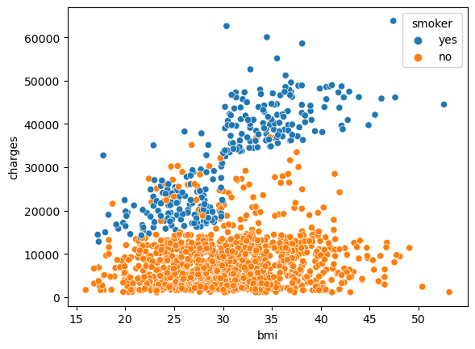

<center></center>
<p style="text-align: center; color:grey;"><i>Images from Unsplash</i></p>

> *Disclaimer: This article is my learning note from the courses I took from Kaggle.*

In this course, we will explore on data visualization using `seaborn`, a Python package to visualize data with a variety of plot types. The package is powerful yet easy to use, check out the below images on the plot types that `seaborn` is able to generate. You can also scroll to the bottom to see the table summary:

<center></center>
<p style="text-align: center; color:grey;"><i>Plots That seaborn Can Create</i></p>

Let's explore the Python code to create different plot type with `seaborn`

### 1. Lineplot
In the code below, we use `sns.lineplot()` where it tells Python that we want to produce a line chart with the specified datasets. We only need to change the `data` parameters if we would like to plot for a different dataset.

Moreover, we can also set the size of the plot by calling `plt.figure(figsize = (w,h))`. By adjusting the height and width of the plot we can set our plot to the desired size. 

```py
# setting the plot size
plt.figure(figsize = (16,6)) # width and height

# plot line plot
sns.lineplot(data = fifa_data)
```
<center></center>
<p style="text-align: center; color:grey;"><i>Line Plot</i></p>

Now, let's consider that we are using a dataset about the number of steams per day for songs such as:

```
Shape of You
Despacito
Something Just Like This
```

We would like to compare the streams between "Shape of You" and "Despacito". But we do not want the plot to include the song "Something Just Like This". Here's how we can do it:

```py
plt.title("Comparing Two Songs Streams")

sns.lineplot(data = spotify['Shape of You'], label = 'Shape of You')
sns.lineplot(data = spotify['Despacito'], label = 'Shape of You')

plt.xlabel("Date")
```
<center></center>
<p style="text-align: center; color:grey;"><i>Comparing Two Songs Streams</i></p>

### 2. Bar Charts & Heatmaps
For bar chart, we can plot it with `sns.barplot()`. Let's say we want to visualize the average arrival delay for an airline service by month starting from January to December:

```py
data = pd.read_csv(file_name, index_cols = 'Month')
sns.barplot(x = data.index, y =data['delay'])
plt.title("Average Arrival Delay By Month")
plt.ylabel('Arrival Delay (in minute)')
```
<center></center>
<p style="text-align: center; color:grey;"><i>Bar Plot</i></p>

Let's also look at heatmap where it can be used to illustrate patterns in our dataset by color-coding each cell to its corresponding value:

```py
sns.heatmap(data = data, annot = True)
plt.title('Average Airline Delay for Each Airline')
plt.xlabel('Airline')
```
<center></center>
<p style="text-align: center; color:grey;"><i>Heatmap</i></p>


The `annot` parameter ensures all value appears on the chart. By setting to `False`, we would have no number for each cell.

### 3. Scatter Plot
Scatter plot is used to show the relationship between two variables. It is a useful plot to understand the relationship between two variables. Here's how we can plot it using Python:

```py
sns.scatterplot(x = insurance_data['bmi'], y = insurance_data['charge'])
```
<center></center>
<p style="text-align: center; color:grey;"><i>Scatter Plot</i></p>

From the above plot, it seems that BMI are positive correlated with the insurance costs. Now, let's do a double-checking by adding a regression line to our plot:

```py
sns.regplot(x = insurance_data['bmi'], y = insurance_data['charge'])
```
<center></center>
<p style="text-align: center; color:grey;"><i>Scatter Plot With Regression Line</i></p>

In fact we can also perform some color-coding to our plot by adding the `hue` parameter. Let's say we want to color-code the plot by separating people that smoke and do not smoke:

```py
sns.scatterplot(x = insurance_data['bmi'], y = insurance_data['charge'], hue = insurance_data['smoker'])
```
<center></center>
<p style="text-align: center; color:grey;"><i>Color-Coded Scatter Plot</i></p>

It seems that smoker will tend to pay more than non-smoker. Let's check it again by adding two regression lines:

```py
sns.lmplot(x = 'bmi', y = 'charge', hue = 'smoker', data = insurance_data)
```

<center></center>
<p style="text-align: center; color:grey;"><i>Multiple Regression Lines Plot</i></p>

Another interesting plot to look into is known as the categorical scatter plot. The plot can be produced with the `sns.swarmplot()` command:

```py
sns.swarmplot(x = insurance_data['smoker'], y = insurance_data['charges'])
```
<center></center>
<p style="text-align: center; color:grey;"><i>Swarm Plot</i></p>

Here're some insights from the plot:
- Non-smokers are charge less than smoker on average
- People that pay the most are smokers, while those that pay the least are non-smoker.

### 4. Distributions
In this section, we will explore about histograms as well as the density plots. Histogram is a graph that shows the frequency of numerical data using rectangles while for a density plot, it represents the distribution of a numeric variable.  

Here's an example for histogram:

```py
sns.histplot(irisi_data['Petal Length'])
```

<center></center>
<p style="text-align: center; color:grey;"><i>Histogram Plot</i></p>

For density plot, we will use the kernel density estimate plot, it looks like a smoothed histogram. By changing the `shade` parameter, we can turn the display of the shaded region on and off.

```py
sns.kdeplot(data = iris_data['Petal Length'], shade = True)
```

<center></center>
<p style="text-align: center; color:grey;"><i>KDE Plot</i></p>

Here's the code to produce two-dimensional kernel density plot:

```py
sns.jointplot(x = irid_data['Petal Length'], y = ['Sepal Width'], kind = 'kde')
```

<center></center>
<p style="text-align: center; color:grey;"><i>2D KDE Plot</i></p>

Furthermore, to color-code the histogram of the kernel density estimate plot, simply add a `hue` parameter as below:

```py
sns.histplot(data = iris_data, x = 'Petal Length', hue = 'Species')
sns.kdeplot(data = iris_data, x = 'Petal Length', hue 'Species', shade = True)
```

<center></center>
<p style="text-align: center; color:grey;"><i>Color-Coded Histogram Plot</i></p>

<center></center>
<p style="text-align: center; color:grey;"><i>Color-Coded KDE Plot</i></p>

### 5. Plot Style
There are several themes available in the `seaborn` module, you can set the style or theme of your plot before you start plotting:

```py
sns.set_style('dark')

# your plot here
# try other themes with: drakgrid, whitegrid, dark or white
```

### 6. Summary
Here's a summary of all the plot you have learned:

| Type    | Category | Code | Remarks |
| -------- | ------- |-------- |--------|
| Line Chart  | Trend    | `sns.lineplot()`| Show trends over time, multiple lines can be used to show trend in more than a group|
| Bar Chart | Relationship  | `sns.barplot()`| Compare quantities with respect to different groups|
| Heatmap   | Relationship | `sns.heatmap()`|Find color-coded patterns in tables of numbers|
| Scatter Plot| Relationship |`sns.scatterplot()`|Show relationship between two continuous variables|
| Regression Line| Relationship | `sns.regplot()`|See linear relationship between two variables|
| Multi-Regression Line| Relationship |`sns.lmplot()`| See linear relationship between two variables involving group|
| Categorical Scatter Plot| Relationship | `sns.swarmplot()`|Observe the relationship between continuous variable and categorical variable|
| Histogram| Distribution | `sns.histplot()`  |Show distribution of single numerical variable|
| KDE Plot| Distribution | `sns.kdeplot()`|Show a smooth distribution of a single or more numerical variable|
| 2D KDE Plot| Distribution | `sns.jointplot(kind = 'kde')`|Display a 2D KDE plot with each KDE correspond to each variable|
