<center></center>
<p style="text-align: center; color:grey;"><i>Images from Unsplash</i></p>

> *Disclaimer: This article is my learning note from the courses I took from Kaggle.*

The most common application of machine learning in the real world is forecasting. For example, businesses forecasting product demand, governments forecasting economic growth and meteorologists forecasting the weather. The understanding of things to come has become a pressing need across the science, government and industry, and machine learning is increasingly being applied to address this need.

In this course, we will learn about time series forecasting. We will also learn about:
- Engineering features to model major time series components such as trends, seasons and cycles
- Visualize time series with plot
- Create forecasting hybrids (combine the strength of complementary models)
- Adapt machine learning methods to various forecasting tasks


## 1. Introduction
Basically, a time series is a set of observations recorded over time. The observations are recorded with a regular frequency such as day, week, month, quarter or year. We can use linear regression to build forecasting model for time series data:

```
target  = weight_1 * feature_1 + weight_2 * feature_2 + bias
```

Parameters such as `weight_1`, `weight_2` and `bias` are learned by the regression algorithm during training. 

There are two unique features to time series:
- Time-step feature
- Lag feature

Time-step feature can be derived from the time index. The most basic time-step feature is the time dummy that counts time steps in series from the beginning to the end:

```
|          | Hardcover | Time |
|----------|-----------|------|
| 1/4/2000 |    139    |   1  |
| 2/4/2000 |    219    |   2  |
| 3/4/2000 |    135    |   3  |
```

Linear regression with the time dummy produces the model:
```
target = weight * time + bias
```

In a time plot:
```py
import matplotlib.pyplot as plt
import seaborn as sns
plt.style.use("seaborn-whitegrid")
plt.rc(
    "figure",
    autolayout=True,
    figsize=(11, 4),
    titlesize=18,
    titleweight='bold',
)
plt.rc(
    "axes",
    labelweight="bold",
    labelsize="large",
    titleweight="bold",
    titlesize=16,
    titlepad=10,
)
%config InlineBackend.figure_format = 'retina'

fig, ax = plt.subplots()
ax.plot('Time', 'Hardcover', data=df, color='0.75')
ax = sns.regplot(x='Time', y='Hardcover', data=df, ci=None, scatter_kws=dict(color='0.25'))
ax.set_title('Time Plot of Hardcover Sales');
```

<center>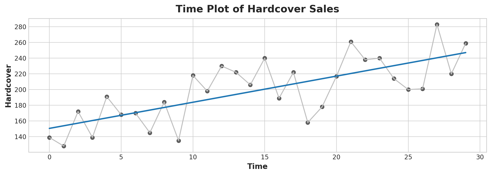</center>
<p style="text-align: center; color:grey;"><i>Time Plot</i></p>

Time-step features let us model time dependence. A series is time dependent if its value can be predicted from the time they occurred in.

Moreover, to make a lag feature from the dataset we will shift the observation of the target series so that they appear to have occurred later in time. Here's a 1-step lag feature:

```
|            |Hardcover|Lag_1|
|------------|---------|-----|
|Date        |         |     |
|2000-04-01  |139      |NaN  |
|2000-04-02  |128      |139.0|  
|2000-04-03	 |172      |128.0|
|2000-04-04  |139      |172.0|
|2000-04-05  |191      |139.0|
```

Linear regression with the time dummy produces the model:
```
target = weight * lag + bias
```

In a time plot:
```py
fig, ax = plt.subplots()
ax = sns.regplot(x='Lag_1', y='Hardcover', data=df, ci=None, scatter_kws=dict(color='0.25'))
ax.set_aspect('equal')
ax.set_title('Lag Plot of Hardcover Sales');
```

<center>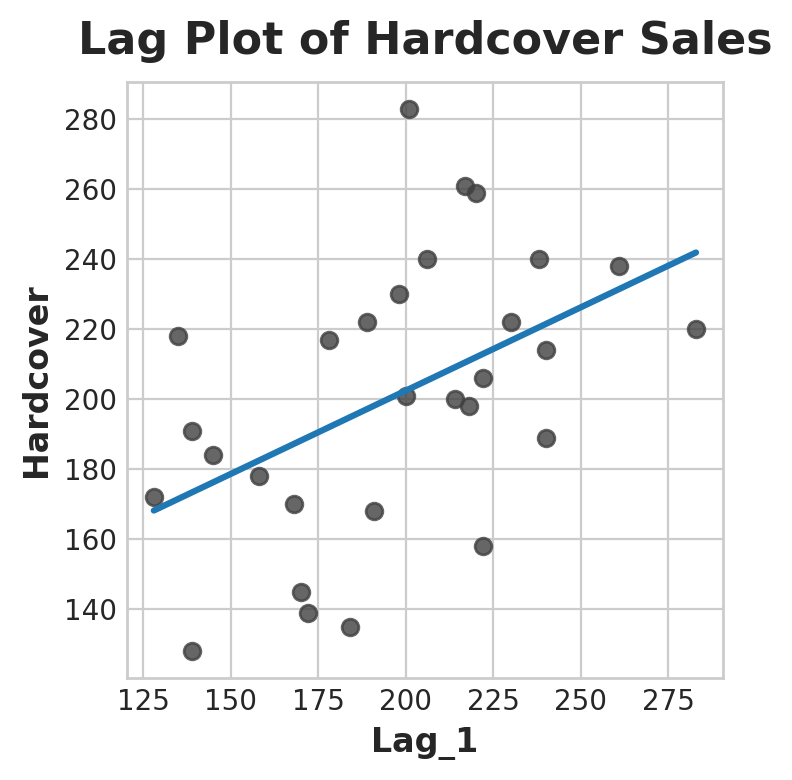</center>
<p style="text-align: center; color:grey;"><i>Lag Plot</i></p>

From the plot, it seems that sales on one day are correlated with sales from the previous day. In general, lag features let us model serial dependence which means an observation can be predicted from previous observation. 

### 1.1 Example
In this section, we will look at an example using the tunnel traffic dataset from November 2003 to November 2005

Add time features to the data:
```py
df = tunnel.copy()

df['Time'] = np.arange(len(tunnel.index))
df.head()
```

To produce a linear regression plot:
```py
from sklearn.linear_model import LinearRegression

# Training data
X = df.loc[:, ['Time']]  # features
y = df.loc[:, 'NumVehicles']  # target

# Train the model
model = LinearRegression()
model.fit(X, y)

# Store the fitted values as a time series with the same time index as
# the training data
y_pred = pd.Series(model.predict(X), index=X.index)

ax = y.plot(**plot_params)
ax = y_pred.plot(ax=ax, linewidth=3)
ax.set_title('Time Plot of Tunnel Traffic');
```

<center>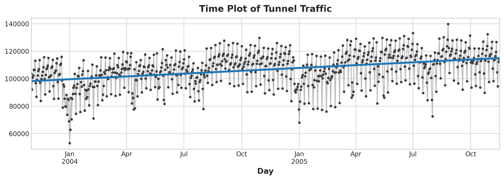</center>
<p style="text-align: center; color:grey;"><i>Time Plot of Tunnel Traffic</i></p>

Now let's add a lag column and use it for a linear regression plot:
```py
df['Lag_1'] = df['NumVehicles'].shift(1)

from sklearn.linear_model import LinearRegression

X = df.loc[:, ['Lag_1']]
X.dropna(inplace=True)  # drop missing values in the feature set
y = df.loc[:, 'NumVehicles']  # create the target
y, X = y.align(X, join='inner')  # drop corresponding values in target

model = LinearRegression()
model.fit(X, y)

y_pred = pd.Series(model.predict(X), index=X.index)

fig, ax = plt.subplots()
ax.plot(X['Lag_1'], y, '.', color='0.25')
ax.plot(X['Lag_1'], y_pred)
ax.set_aspect('equal')
ax.set_ylabel('NumVehicles')
ax.set_xlabel('Lag_1')
ax.set_title('Lag Plot of Tunnel Traffic');
```

<center>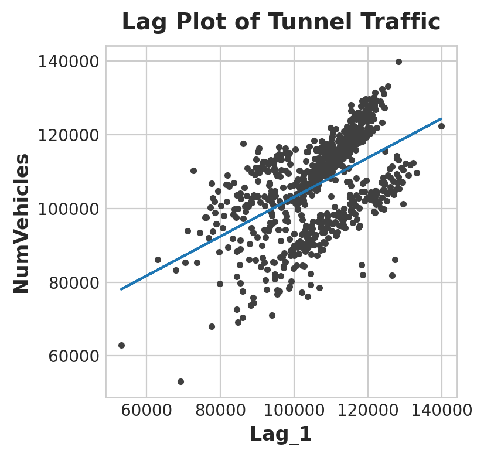</center>
<p style="text-align: center; color:grey;"><i>Time Plot</i></p>

Here is how our forecast respond to the behavior of the series in the recent past:

```py
ax = y.plot(**plot_params)
ax = y_pred.plot()
```

<center>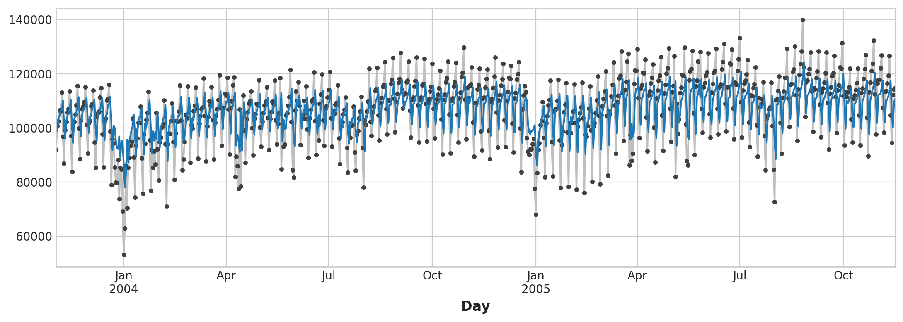</center>
<p style="text-align: center; color:grey;"><i>Observed vs Prediction Plot</i></p>

## 2. Trend
Trend is a component of a time series that represents a persistent, long-term change in the mean of the series. It is the slowest-moving part of a series, the part representing the largest timescale of importance. 

<center>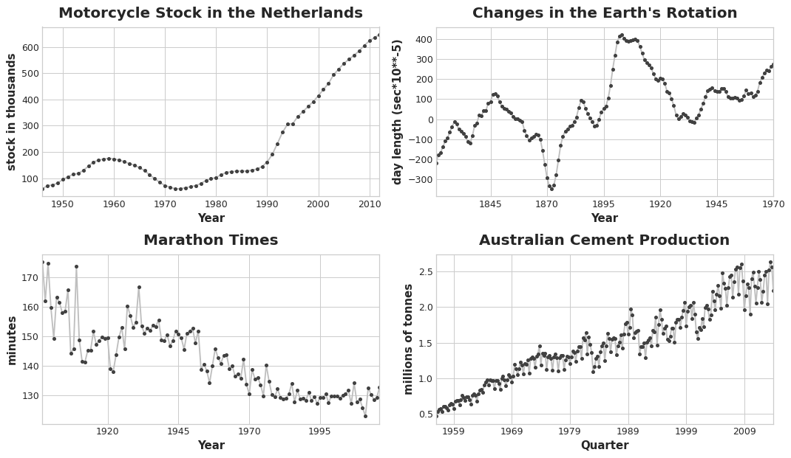</center>
<p style="text-align: center; color:grey;"><i>Example of Trend</i></p>

To see what kind of trend a series have, we can use the moving average plot. We compute the average values within a sliding window of some defined width. 

> Each point on the graph represents the average of all the values in the series that fall within the window on either side. The idea is to smooth out any short-term fluctuations in the series so that only long-term changes remain.

<center>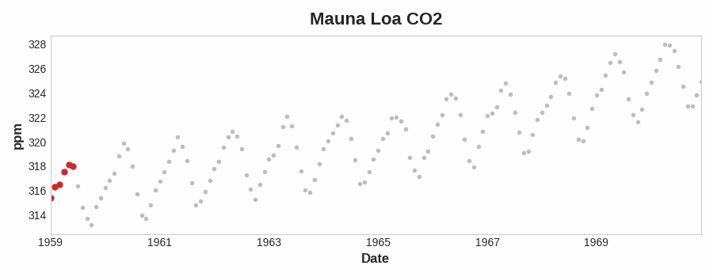</center>
<p style="text-align: center; color:grey;"><i>Moving Average</i></p>

From the above plot, we can see there is a repeating up and down movement yearly (seasonal change). For a change to be a part of the trend, it should occur over a longer period than the seasonal change. Thus, we take an average over a longer period than any seasonal period in the series (window size of 12) to smooth over the season within each year to visualize the trend.

After identifying the trend, we can model it using a time-step feature. For example, a linear trend:

```
target = a * time + b
```

If we notice the trend to be quadratic, we can square the time dummy to the feature set:

```
target = a * time ** 2 + b * time + c
```

<center>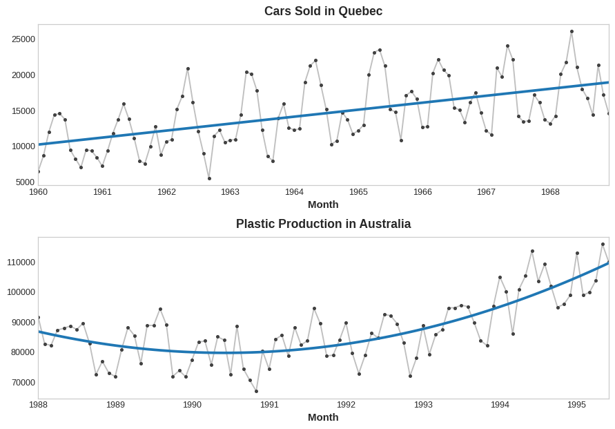</center>
<p style="text-align: center; color:grey;"><i>Quadaratic vs Linear Trend</i></p>

### 2.1 Example
Let's look back at the tunnel traffic dataset that we used for the previous section, in the series the observations are on a daily basis. We will use windows of 365 days to smooth over short-term changes within the year:

```py
moving_average = tunnel.rolling(
    window=365,       # 365-day window
    center=True,      # puts the average at the center of the window
    min_periods=183,  # choose about half the window size
).mean()              # compute the mean (could also do median, std, min, max, ...)

ax = tunnel.plot(style=".", color="0.5")
moving_average.plot(
    ax=ax, linewidth=3, title="Tunnel Traffic - 365-Day Moving Average", legend=False,
);
```
<center>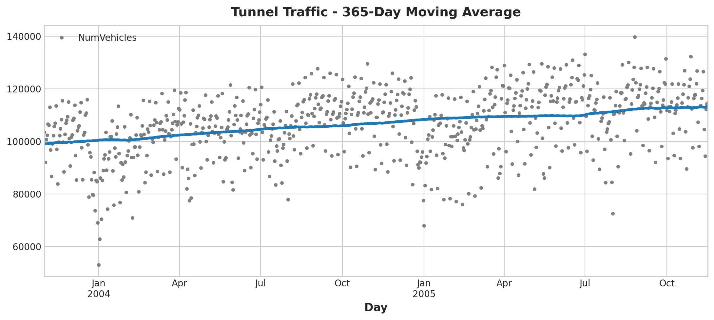</center>
<p style="text-align: center; color:grey;"><i>Moving Average Plot</i></p>

Now we will use the `DeterministicProcess` function from the `statsmodels` library to perform linear regression on the series:

```py
from statsmodels.tsa.deterministic import DeterministicProcess

dp = DeterministicProcess(
    index=tunnel.index,  # dates from the training data
    constant=True,       # dummy feature for the bias (y_intercept)
    order=1,             # the time dummy (trend)
    drop=True,           # drop terms if necessary to avoid collinearity
)

# `in_sample` creates features for the dates given in the `index` argument
X = dp.in_sample()

X.head()
```

```
            const	trend	
Day
2003-11-01	1.0	    1.0
2003-11-02	1.0	    2.0
2003-11-03	1.0	    3.0
2003-11-04	1.0	    4.0
2003-11-05	1.0	    5.0
```

Model fitting:
```py
from sklearn.linear_model import LinearRegression

y = tunnel["NumVehicles"]  # the target

# The intercept is the same as the `const` feature from
# DeterministicProcess. LinearRegression behaves badly with duplicated
# features, so we need to be sure to exclude it here.
model = LinearRegression(fit_intercept=False)
model.fit(X, y)

y_pred = pd.Series(model.predict(X), index=X.index)
```

Plotting:
```py
ax = tunnel.plot(style=".", color="0.5", title="Tunnel Traffic - Linear Trend")
_ = y_pred.plot(ax=ax, linewidth=3, label="Trend")
```
<center>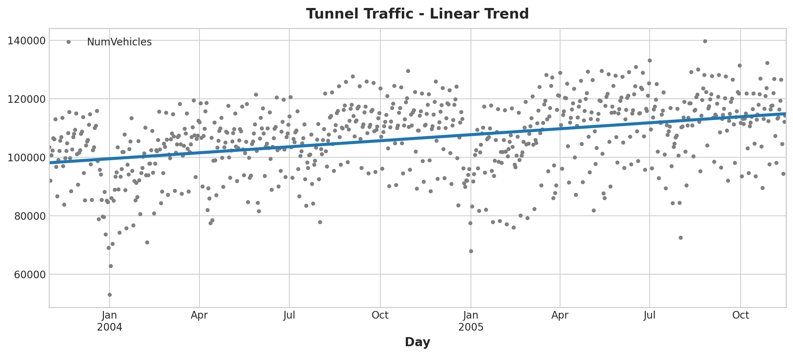</center>
<p style="text-align: center; color:grey;"><i>Time Plot</i></p>

Now let's make a forecast using the fitted model:
```py
X = dp.out_of_sample(steps=30)

y_fore = pd.Series(model.predict(X), index=X.index)
y_fore.head()
```

```
2005-11-17    114981.801146
2005-11-18    115004.298595
2005-11-19    115026.796045
2005-11-20    115049.293494
2005-11-21    115071.790944
Freq: D, dtype: float64
```
```py
ax = tunnel["2005-05":].plot(title="Tunnel Traffic - Linear Trend Forecast", **plot_params)
ax = y_pred["2005-05":].plot(ax=ax, linewidth=3, label="Trend")
ax = y_fore.plot(ax=ax, linewidth=3, label="Trend Forecast", color="C3")
_ = ax.legend()
```

<center>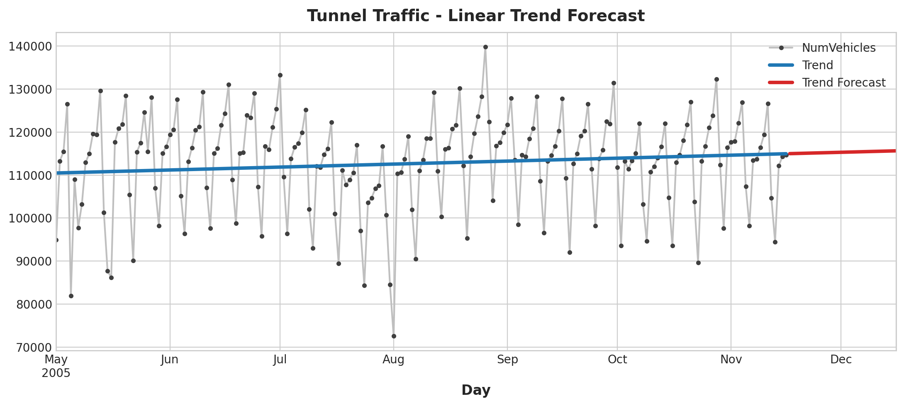</center>
<p style="text-align: center; color:grey;"><i>Forecast Plot</i></p>

## 3. Seasonality
A time series exhibits seasonality if there is a regular, periodic change in the mean of the series. Normally, such changes follow the clock and calendar. It can be repetitions over a day, week, or year. 

<center></center>
<p style="text-align: center; color:grey;"><i>Seasonality Plot</i></p>

In this section, we will explore two kinds of feature to model seasonality:
- Indicator: Best for season with few observations like weekly or daily observation
- Fourier Feature: Best for season with many observations (annual season of daily observations)

Seasonal plot can be used to discover seasonal patterns where it shows segments of the time series plot against some common period (period you want to observe). Seasonal indicators are binary features that represent seasonal differences in the level of a time series. We can perform **one-hot encoding** to get weekly seasonal indicators or monthly seasonal indicator. 

### 3.1 Fourier Features & The Periodogram
For long seasons over many observations, indicators seem to be impractical to capture the overall shape of the seasonal curve:

<center>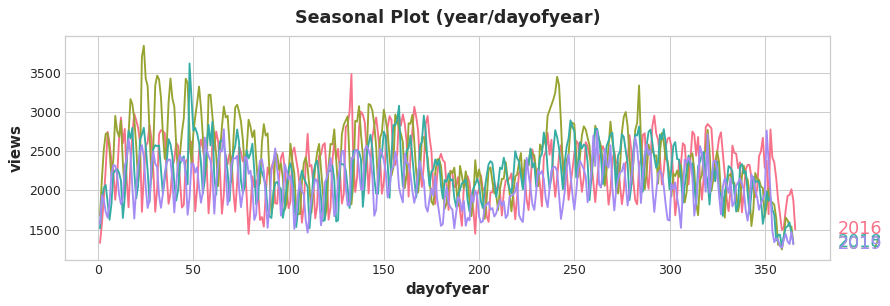</center>
<p style="text-align: center; color:grey;"><i>Seasonal Plot</i></p>

For the above plot, we can see the repetitions of various frequencies such as yearly and weekly. Of course, we want to capture these frequencies with Fourier features. 

Fourier features are pairs of sine and cosine curves, one pair for each potential frequency in the season starting with the longest. Fourier pairs modeling annual seasonality would have frequencies: once per year, twice per year, three times per year, and so on.

<center>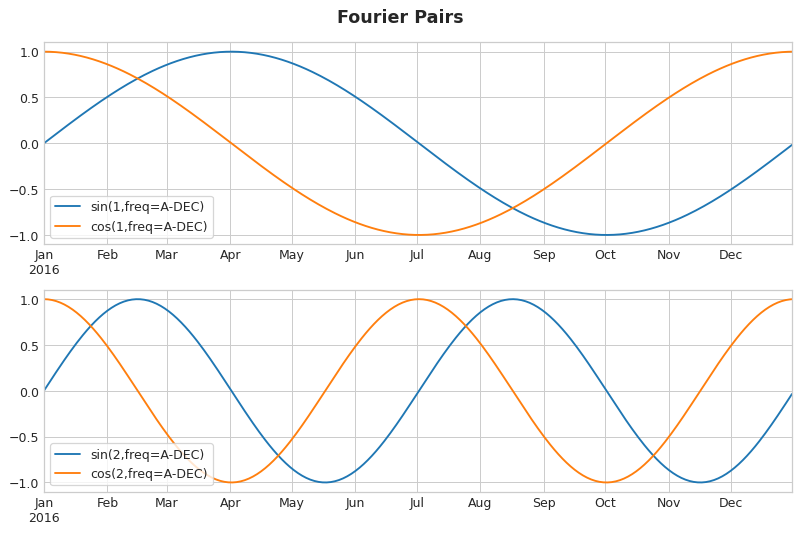</center>
<p style="text-align: center; color:grey;"><i>Fourier Pairs</i></p>

> If we add a set of these sine / cosine curves to our training data, the linear regression algorithm will figure out the weights that will fit the seasonal component in the target series. 

<center>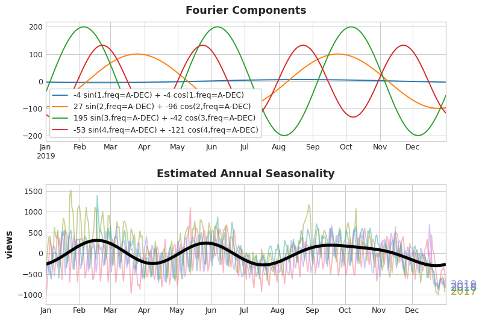</center>
<p style="text-align: center; color:grey;"><i>Fourier Pairs & Approx Seasonal Pattern</i></p>

In fact, we only need eight features (4 sin and cosine pairs) to get a good estimate of the annual seasonality. The question remains is how do we get to choose the number of Fourier pairs? We can approach the problem with a periodogram where it tells us the frequencies in a time series. 

<center>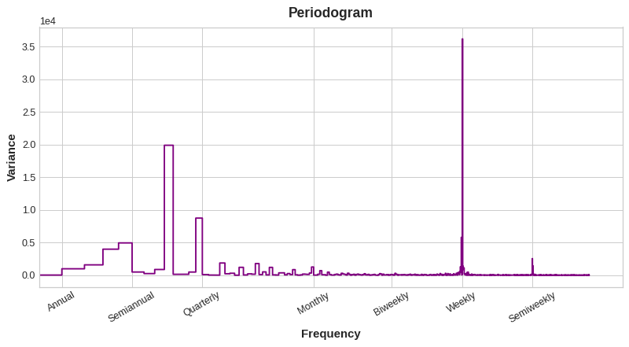</center>
<p style="text-align: center; color:grey;"><i>Periodogram</i></p>

From the above plot, the periodogram drops off after the quarterly frequency, so we will choose four Fourier pairs to estimate the annual season. We ignore the weekly frequency as it is better to model with indicators. 

Here's how we can derive a set of Fourier features from the index of time series:
```py
import numpy as np


def fourier_features(index, freq, order):
    time = np.arange(len(index), dtype=np.float32)
    k = 2 * np.pi * (1 / freq) * time
    features = {}
    for i in range(1, order + 1):
        features.update({
            f"sin_{freq}_{i}": np.sin(i * k),
            f"cos_{freq}_{i}": np.cos(i * k),
        })
    return pd.DataFrame(features, index=index)


# Compute Fourier features to the 4th order (8 new features) for a
# series y with daily observations and annual seasonality:
#
# fourier_features(y, freq=365.25, order=4)
```

### 3.2 Example
Defining some functions. We are using the same tunnel traffic dataset as before:
```py
# annotations: https://stackoverflow.com/a/49238256/5769929
def seasonal_plot(X, y, period, freq, ax=None):
    if ax is None:
        _, ax = plt.subplots()
    palette = sns.color_palette("husl", n_colors=X[period].nunique(),)
    ax = sns.lineplot(
        x=freq,
        y=y,
        hue=period,
        data=X,
        ci=False,
        ax=ax,
        palette=palette,
        legend=False,
    )
    ax.set_title(f"Seasonal Plot ({period}/{freq})")
    for line, name in zip(ax.lines, X[period].unique()):
        y_ = line.get_ydata()[-1]
        ax.annotate(
            name,
            xy=(1, y_),
            xytext=(6, 0),
            color=line.get_color(),
            xycoords=ax.get_yaxis_transform(),
            textcoords="offset points",
            size=14,
            va="center",
        )
    return ax


def plot_periodogram(ts, detrend='linear', ax=None):
    from scipy.signal import periodogram
    fs = pd.Timedelta("1Y") / pd.Timedelta("1D")
    freqencies, spectrum = periodogram(
        ts,
        fs=fs,
        detrend=detrend,
        window="boxcar",
        scaling='spectrum',
    )
    if ax is None:
        _, ax = plt.subplots()
    ax.step(freqencies, spectrum, color="purple")
    ax.set_xscale("log")
    ax.set_xticks([1, 2, 4, 6, 12, 26, 52, 104])
    ax.set_xticklabels(
        [
            "Annual (1)",
            "Semiannual (2)",
            "Quarterly (4)",
            "Bimonthly (6)",
            "Monthly (12)",
            "Biweekly (26)",
            "Weekly (52)",
            "Semiweekly (104)",
        ],
        rotation=30,
    )
    ax.ticklabel_format(axis="y", style="sci", scilimits=(0, 0))
    ax.set_ylabel("Variance")
    ax.set_title("Periodogram")
    return ax
```

We will start with the seasonal plots over a week and a year:
```py
X = tunnel.copy()

# days within a week
X["day"] = X.index.dayofweek  # the x-axis (freq)
X["week"] = X.index.week  # the seasonal period (period)

# days within a year
X["dayofyear"] = X.index.dayofyear
X["year"] = X.index.year
fig, (ax0, ax1) = plt.subplots(2, 1, figsize=(11, 6))
seasonal_plot(X, y="NumVehicles", period="week", freq="day", ax=ax0)
seasonal_plot(X, y="NumVehicles", period="year", freq="dayofyear", ax=ax1);
```

<center>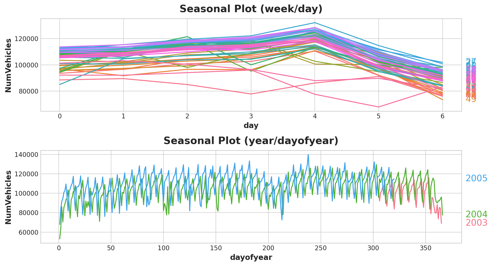</center>
<p style="text-align: center; color:grey;"><i>Seasonal Plot</i></p>

For the periodogram:

```py
plot_periodogram(tunnel.NumVehicles);
```
<center>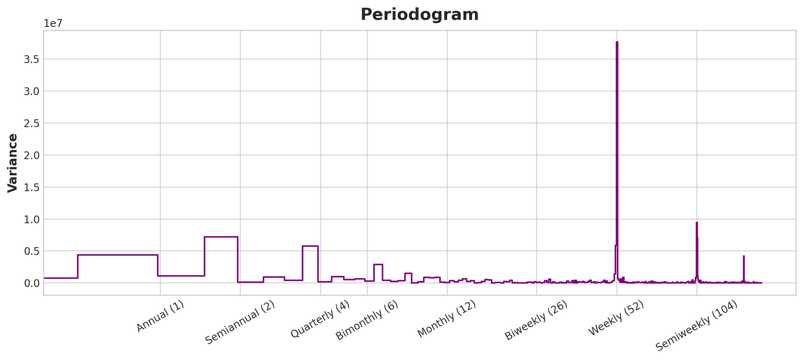</center>
<p style="text-align: center; color:grey;"><i>Forecast Plot</i></p>

From the periodogram, there is a strong weekly season and a weaker annual season. We'll model the weekly season with indicator and the yearly season with Fourier features. From right to left, the periodogram falls off between Bimonthly (6) and Monthly (12), so let's use 10 Fourier pairs.

```py
from statsmodels.tsa.deterministic import CalendarFourier, DeterministicProcess

fourier = CalendarFourier(freq="A", order=10)  # 10 sin/cos pairs for "A"nnual seasonality

dp = DeterministicProcess(
    index=tunnel.index,
    constant=True,               # dummy feature for bias (y-intercept)
    order=1,                     # trend (order 1 means linear)
    seasonal=True,               # weekly seasonality (indicators)
    additional_terms=[fourier],  # annual seasonality (fourier)
    drop=True,                   # drop terms to avoid collinearity
)

X = dp.in_sample()  # create features for dates in tunnel.index
```

Model prediction:
```py
y = tunnel["NumVehicles"]

model = LinearRegression(fit_intercept=False)
_ = model.fit(X, y)

y_pred = pd.Series(model.predict(X), index=y.index)
X_fore = dp.out_of_sample(steps=90)
y_fore = pd.Series(model.predict(X_fore), index=X_fore.index)

ax = y.plot(color='0.25', style='.', title="Tunnel Traffic - Seasonal Forecast")
ax = y_pred.plot(ax=ax, label="Seasonal")
ax = y_fore.plot(ax=ax, label="Seasonal Forecast", color='C3')
_ = ax.legend()
```

<center></center>
<p style="text-align: center; color:grey;"><i>Forecast Plot</i></p>

## 4. Time Series as Features
For some time series, they can only be modeled as a serially dependent properties, that is using as features past values of the target series. The goal in this lesson is to train models to fit curves to plots like those on the right -- we want them to learn serial dependence:

<center>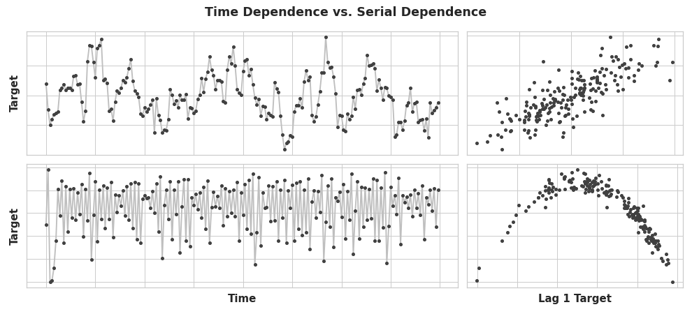</center>
<p style="text-align: center; color:grey;"><i>Time vs Serial Dependence Plot</i></p>

One common way for serial dependence to manifest is in cycle - patterns of growth and decay in a time series associated with how the value in a series at one time depends on values at previous times, but not necessarily on the time step itself. Cyclic behavior is a characteristic of systems that can effect themselves, economies, epidemics, animal populations and volcano eruptions often display cyclic behavior:

<center>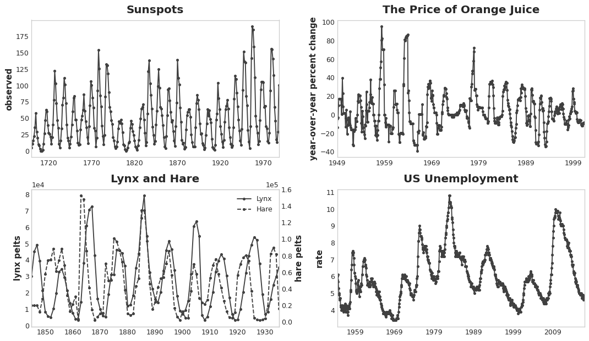</center>
<p style="text-align: center; color:grey;"><i>Cyclical Plot</i></p>

> What distinguishes cyclic behavior from seasonality is that cycles are not necessarily time dependent, as seasons are. What happens in a cycle is less about the particular date of occurrence, and more about what has happened in the recent past

### 4.1 Lagged Series & Lag Plots
To investigate serial dependence, we need to create "lagged" copies of the series. When we say "lagging", it means we are shifting the time series values forward by one or more time steps. By lagging a time series, we make past values appear contemporaneous with the values we are trying to predict. 

```

            y	    y_lag_1	y_lag_2			
1954-07	    5.8	    NaN	    NaN
1954-08	    6.0	    5.8	    NaN
1954-09	    6.1	    6.0	    5.8
1954-10	    5.7	    6.1	    6.0
1954-11	    5.3	    5.7	    6.1
```
A lag plot shows a time series values plotted against its lags. In the below images, there is a strong linear relationship between current unemployment rate and past rates.

<center>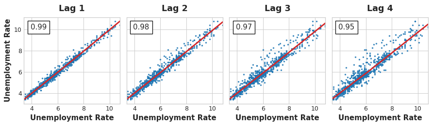</center>
<p style="text-align: center; color:grey;"><i>Lag Plots</i></p>

In order to measure serial dependence, we can use autocorrelation - the correlation a time series has with one of its lag. In general, it would not be useful to include every lag with a large autocorrelation. We can find the partial autocorrelation that tells us the correlation of a lag accounting for all the previous lags (amount of new correlation the lag contribute).

In the figure below, lag 1 through lag 6 fall outside the intervals of "no correlation" (in blue), so we might choose lags 1 through lag 6 as features for US Unemployment. (Lag 11 is likely a false positive.)

<center>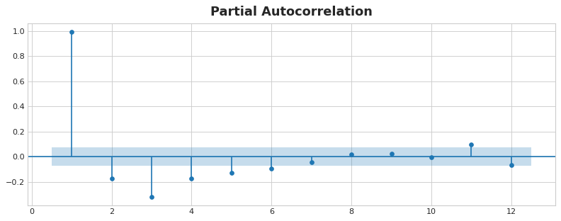</center>
<p style="text-align: center; color:grey;"><i>Partial Autocorrelation Plot</i></p>

Importantly, we need to be mindful that autocorrelation and partial autocorrelation are measures of linear dependence. Real-world time series often have non-linear dependences, it's good that a make a lag plot when choosing lag features. 

<center>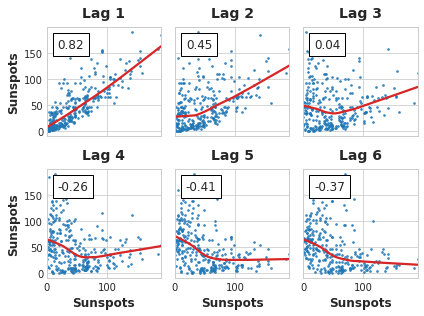</center>
<p style="text-align: center; color:grey;"><i>Lag Plot</i></p>

Some non-linear relationship is the above image can be transformed to linear or learned by an appropriate algorithm. 

### 4.2 Example
Let's define some functions for it to be used for the flu trend dataset, containing records of doctor's visits for the flu for weeks between 2009 and 2016:

```py
import matplotlib.pyplot as plt
import numpy as np
import pandas as pd
import seaborn as sns
from scipy.signal import periodogram
from sklearn.linear_model import LinearRegression
from sklearn.model_selection import train_test_split
from statsmodels.graphics.tsaplots import plot_pacf

def lagplot(x, y=None, lag=1, standardize=False, ax=None, **kwargs):
    from matplotlib.offsetbox import AnchoredText
    x_ = x.shift(lag)
    if standardize:
        x_ = (x_ - x_.mean()) / x_.std()
    if y is not None:
        y_ = (y - y.mean()) / y.std() if standardize else y
    else:
        y_ = x
    corr = y_.corr(x_)
    if ax is None:
        fig, ax = plt.subplots()
    scatter_kws = dict(
        alpha=0.75,
        s=3,
    )
    line_kws = dict(color='C3', )
    ax = sns.regplot(x=x_,
                     y=y_,
                     scatter_kws=scatter_kws,
                     line_kws=line_kws,
                     lowess=True,
                     ax=ax,
                     **kwargs)
    at = AnchoredText(
        f"{corr:.2f}",
        prop=dict(size="large"),
        frameon=True,
        loc="upper left",
    )
    at.patch.set_boxstyle("square, pad=0.0")
    ax.add_artist(at)
    ax.set(title=f"Lag {lag}", xlabel=x_.name, ylabel=y_.name)
    return ax


def plot_lags(x, y=None, lags=6, nrows=1, lagplot_kwargs={}, **kwargs):
    import math
    kwargs.setdefault('nrows', nrows)
    kwargs.setdefault('ncols', math.ceil(lags / nrows))
    kwargs.setdefault('figsize', (kwargs['ncols'] * 2, nrows * 2 + 0.5))
    fig, axs = plt.subplots(sharex=True, sharey=True, squeeze=False, **kwargs)
    for ax, k in zip(fig.get_axes(), range(kwargs['nrows'] * kwargs['ncols'])):
        if k + 1 <= lags:
            ax = lagplot(x, y, lag=k + 1, ax=ax, **lagplot_kwargs)
            ax.set_title(f"Lag {k + 1}", fontdict=dict(fontsize=14))
            ax.set(xlabel="", ylabel="")
        else:
            ax.axis('off')
    plt.setp(axs[-1, :], xlabel=x.name)
    plt.setp(axs[:, 0], ylabel=y.name if y is not None else x.name)
    fig.tight_layout(w_pad=0.1, h_pad=0.1)
    return fig


data_dir = Path("../input/ts-course-data")
flu_trends = pd.read_csv(data_dir / "flu-trends.csv")
flu_trends.set_index(
    pd.PeriodIndex(flu_trends.Week, freq="W"),
    inplace=True,
)
flu_trends.drop("Week", axis=1, inplace=True)

ax = flu_trends.FluVisits.plot(title='Flu Trends', **plot_params)
_ = ax.set(ylabel="Office Visits")
```

<center>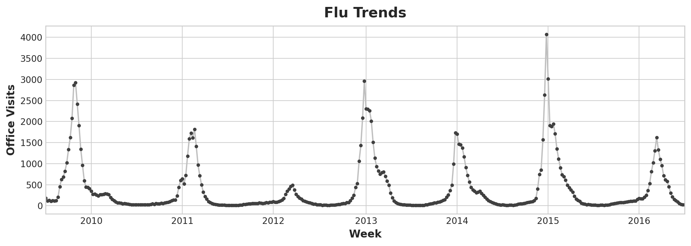</center>
<p style="text-align: center; color:grey;"><i>Flu Trend Plot</i></p>

> Flu Trends data shows irregular cycles instead of a regular seasonality: the peak tends to occur around the new year, but sometimes earlier or later, sometimes larger or smaller.

Let's look at the lag and autocorrelation plot:
```py
_ = plot_lags(flu_trends.FluVisits, lags=12, nrows=2)
_ = plot_pacf(flu_trends.FluVisits, lags=12)
```

<center>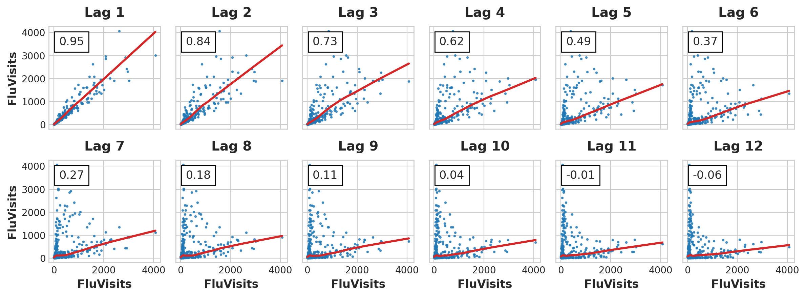</center>
<p style="text-align: center; color:grey;"><i>Lag Plot</i></p>

<center>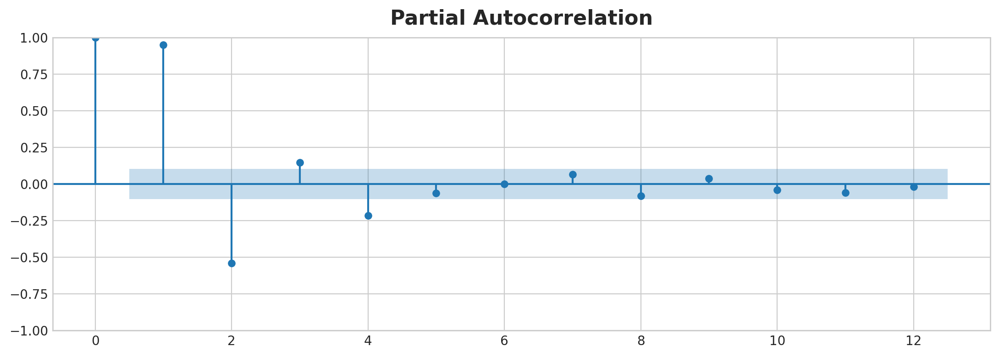</center>
<p style="text-align: center; color:grey;"><i>PACF Plot</i></p>

From the lag plot, it seems that the relationship of the flu visits to its lags is mostly linear. For PACF plot, we can capture the serial dependence using lags 1, 2, 3 and 4. Here's how to make lag and fill the `NaN` cells with 0:

```py
def make_lags(ts, lags):
    return pd.concat(
        {
            f'y_lag_{i}': ts.shift(i)
            for i in range(1, lags + 1)
        },
        axis=1)


X = make_lags(flu_trends.FluVisits, lags=4)
X = X.fillna(0.0)
```

Making forecast:
```py
# Create target series and data splits
y = flu_trends.FluVisits.copy()
X_train, X_test, y_train, y_test = train_test_split(X, y, test_size=60, shuffle=False)

# Fit and predict
model = LinearRegression()  # `fit_intercept=True` since we didn't use DeterministicProcess
model.fit(X_train, y_train)
y_pred = pd.Series(model.predict(X_train), index=y_train.index)
y_fore = pd.Series(model.predict(X_test), index=y_test.index)

ax = y_train.plot(**plot_params)
ax = y_test.plot(**plot_params)
ax = y_pred.plot(ax=ax)
_ = y_fore.plot(ax=ax, color='C3')
```

<center>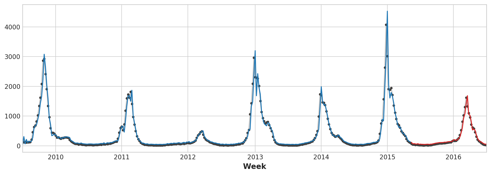</center>
<p style="text-align: center; color:grey;"><i>Forecast Plot</i></p>

To improve the forecast we could try to find leading indicators, time series that could provide an "early warning" for changes in flu cases. For our second approach then we'll add to our training data the popularity of some flu-related search terms as measured by Google Trends.

Plotting the search phrase 'FluCough' against the target 'FluVisits' suggests such search terms could be useful as leading indicators: flu-related searches tend to become more popular in the weeks prior to office visits.

```py
ax = flu_trends.plot(
    y=["FluCough", "FluVisits"],
    secondary_y="FluCough",
)
```

<center>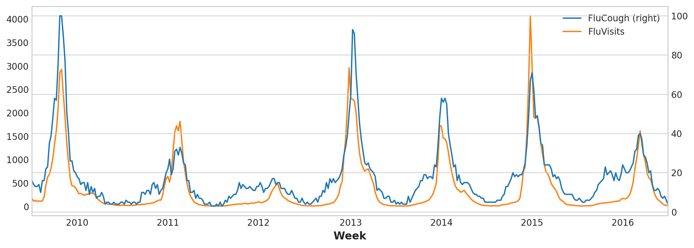</center>
<p style="text-align: center; color:grey;"><i>Flu Trend Plot</i></p>

Filtering the search terms:

```py
search_terms = ["FluContagious", "FluCough", "FluFever", "InfluenzaA", "TreatFlu", "IHaveTheFlu", "OverTheCounterFlu", "HowLongFlu"]

# Create three lags for each search term
X0 = make_lags(flu_trends[search_terms], lags=3)
X0.columns = [' '.join(col).strip() for col in X0.columns.values]

# Create four lags for the target, as before
X1 = make_lags(flu_trends['FluVisits'], lags=4)

# Combine to create the training data
X = pd.concat([X0, X1], axis=1).fillna(0.0)
```

Forecast:
```py
X_train, X_test, y_train, y_test = train_test_split(X, y, test_size=60, shuffle=False)

model = LinearRegression()
model.fit(X_train, y_train)
y_pred = pd.Series(model.predict(X_train), index=y_train.index)
y_fore = pd.Series(model.predict(X_test), index=y_test.index)

ax = y_test.plot(**plot_params)
_ = y_fore.plot(ax=ax, color='C3')
```

<center>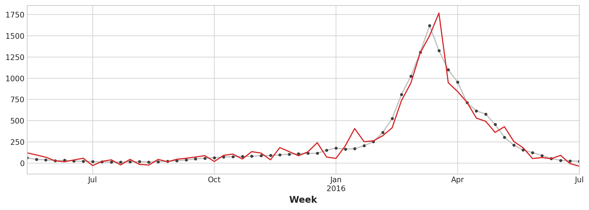</center>
<p style="text-align: center; color:grey;"><i>Forecast Plot</i></p>

Our forecasts are a bit rougher, but our model appears to be better able to anticipate sudden increases in flu visits, suggesting that the several time series of search popularity were indeed effective as leading indicators.

> The time series illustrated in this lesson are what you might call "purely cyclic": they have no obvious trend or seasonality. It's not uncommon though for time series to possess trend, seasonality, and cycles -- all three components at once. You could model such series with linear regression by just adding the appropriate features for each component. You can even combine models trained to learn the components separately

## 5. Hybrid Models
To design an effective hybrid, we have to know how a time series is constructed. Previously, we learned about trend, season and cycles. Many time series can be described by an additive model of these three components plus some error term:

```
series = trend + seasons + cycles + error
```

Residuals of a model are the difference between the model's target and the prediction, as illustrated below:

<center>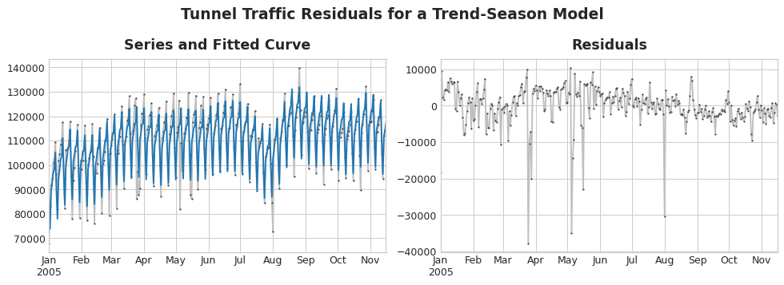</center>
<p style="text-align: center; color:grey;"><i>Residuals Plot</i></p>

Now imagine that we learn the time series components in an iterative manner: we start by learning the trend, then by subtracting it out, we learn the series seasonality, follow by cycles and then the error term:

<center></center>
<p style="text-align: center; color:grey;"><i>Learning TS Components</i></p>

Of course, it is possible for use to use one algorithm for some components and another algorithm for the rest. That means, we use one algorithm to fit the original series and another algorithm for the residuals series:

```py
# 1. Train and predict with first model
model_1.fit(X_train_1, y_train)
y_pred_1 = model_1.predict(X_train)

# 2. Train and predict with second model on residuals
model_2.fit(X_train_2, y_train - y_pred_1)
y_pred_2 = model_2.predict(X_train_2)

# 3. Add to get overall predictions
y_pred = y_pred_1 + y_pred_2
```

While it's possible to use more than two models, in practice it doesn't seem to be especially helpful. In fact, the most common strategy for constructing hybrids is the one we've just described: a simple (usually linear) learning algorithm followed by a complex, non-linear learner like GBDTs or a deep neural net, the simple model typically designed as a "helper" for the powerful algorithm that follows.

There are generally two ways a regression algorithm can make predictions: either by transforming the features or by transforming the target. Feature-transforming algorithms learn some mathematical function that takes features as an input and then combines and transforms them to produce an output that matches the target values in the training set. Linear regression and neural nets are of this kind.

Target-transforming algorithms use the features to group the target values in the training set and make predictions by averaging values in a group; a set of feature just indicates which group to average. Decision trees and nearest neighbors are of this kind.

The important thing is this: feature transformers generally can extrapolate target values beyond the training set given appropriate features as inputs, but the predictions of target transformers will always be bound within the range of the training set. If the time dummy continues counting time steps, linear regression continues drawing the trend line. Given the same time dummy, a decision tree will predict the trend indicated by the last step of the training data into the future forever. Decision trees cannot extrapolate trends. Random forests and gradient boosted decision trees (like XGBoost) are ensembles of decision trees, so they also cannot extrapolate trends.

<center>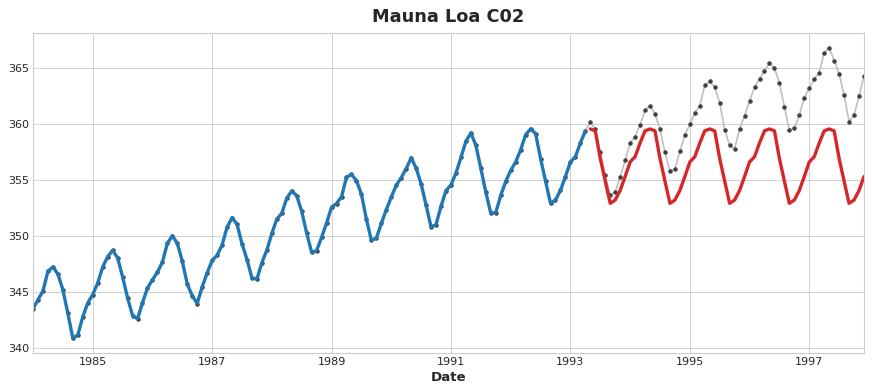</center>
<p style="text-align: center; color:grey;"><i>Decision Tree Failed to Extrapolate Trend</i></p>

So, we could use linear regression to extrapolate the trend, transform the target to remove the trend, and apply XGBoost to the detrended residuals. To hybridize a neural net (a feature transformer), you could instead include the predictions of another model as a feature, which the neural net would then include as part of its own predictions. The method of fitting to residuals is actually the same method the gradient boosting algorithm uses, so we will call these boosted hybrids; the method of using predictions as features is known as "stacking", so we will call these stacked hybrids.

### 5.1 Example
In this example, we will use the US Retail Sales data set from 1992 to 2019. We will also create a linear regression and XGBoost hybrid for prediction.

```
            BuildingMaterials	FoodAndBeverage	
1992-01-01	8964	            29589
1992-02-01	9023	            28570
1992-03-01	10608	            29682
1992-04-01	11630	            30228
1992-05-01	12327	            31677
```

We will start by learning the trend of the series using linear regression (a quadratic trend is used)

```py
y = retail.copy()

# Create trend features
dp = DeterministicProcess(
    index=y.index,  # dates from the training data
    constant=True,  # the intercept
    order=2,        # quadratic trend
    drop=True,      # drop terms to avoid collinearity
)
X = dp.in_sample()  # features for the training data

# Test on the years 2016-2019. It will be easier for us later if we
# split the date index instead of the dataframe directly.
idx_train, idx_test = train_test_split(
    y.index, test_size=12 * 4, shuffle=False,
)
X_train, X_test = X.loc[idx_train, :], X.loc[idx_test, :]
y_train, y_test = y.loc[idx_train], y.loc[idx_test]

# Fit trend model
model = LinearRegression(fit_intercept=False)
model.fit(X_train, y_train)

# Make predictions
y_fit = pd.DataFrame(
    model.predict(X_train),
    index=y_train.index,
    columns=y_train.columns,
)
y_pred = pd.DataFrame(
    model.predict(X_test),
    index=y_test.index,
    columns=y_test.columns,
)

# Plot
axs = y_train.plot(color='0.25', subplots=True, sharex=True)
axs = y_test.plot(color='0.25', subplots=True, sharex=True, ax=axs)
axs = y_fit.plot(color='C0', subplots=True, sharex=True, ax=axs)
axs = y_pred.plot(color='C3', subplots=True, sharex=True, ax=axs)
for ax in axs: ax.legend([])
_ = plt.suptitle("Trends")
```

<center>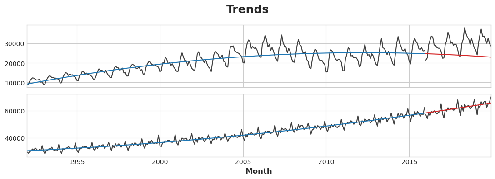</center>
<p style="text-align: center; color:grey;"><i>Trend Plot</i></p>

Linear regression algorithm is capable of multi-output regression, the XGBoost algorithm is not. To predict multiple series at once with XGBoost, we'll instead convert these series from wide format, with one time series per column, to long format, with series indexed by categories along rows.

```py
# The `stack` method converts column labels to row labels, pivoting from wide format to long
X = retail.stack()  # pivot dataset wide to long
display(X.head())
y = X.pop('Sales')  # grab target series
```

```
            Industries	
1992-01-01	BuildingMaterials	8964
            FoodAndBeverage	    29589
1992-02-01	BuildingMaterials	9023
            FoodAndBeverage	    28570
1992-03-01	BuildingMaterials	10608
```

Construct the train and test set:
```py
# Turn row labels into categorical feature columns with a label encoding
X = X.reset_index('Industries')
# Label encoding for 'Industries' feature
for colname in X.select_dtypes(["object", "category"]):
    X[colname], _ = X[colname].factorize()

# Label encoding for annual seasonality
X["Month"] = X.index.month  # values are 1, 2, ..., 12

# Create splits
X_train, X_test = X.loc[idx_train, :], X.loc[idx_test, :]
y_train, y_test = y.loc[idx_train], y.loc[idx_test]
```

Convert the trend predictions made earlier to long format and then subtract them from the original series. That will give us detrended (residual) series that XGBoost can learn.

```py
# Pivot wide to long (stack) and convert DataFrame to Series (squeeze)
y_fit = y_fit.stack().squeeze()    # trend from training set
y_pred = y_pred.stack().squeeze()  # trend from test set

# Create residuals (the collection of detrended series) from the training set
y_resid = y_train - y_fit

# Train XGBoost on the residuals
xgb = XGBRegressor()
xgb.fit(X_train, y_resid)

# Add the predicted residuals onto the predicted trends
y_fit_boosted = xgb.predict(X_train) + y_fit
y_pred_boosted = xgb.predict(X_test) + y_pred
```

```py
axs = y_train.unstack(['Industries']).plot(
    color='0.25', figsize=(11, 5), subplots=True, sharex=True,
    title=['BuildingMaterials', 'FoodAndBeverage'],
)
axs = y_test.unstack(['Industries']).plot(
    color='0.25', subplots=True, sharex=True, ax=axs,
)
axs = y_fit_boosted.unstack(['Industries']).plot(
    color='C0', subplots=True, sharex=True, ax=axs,
)
axs = y_pred_boosted.unstack(['Industries']).plot(
    color='C3', subplots=True, sharex=True, ax=axs,
)
for ax in axs: ax.legend([])
```

<center>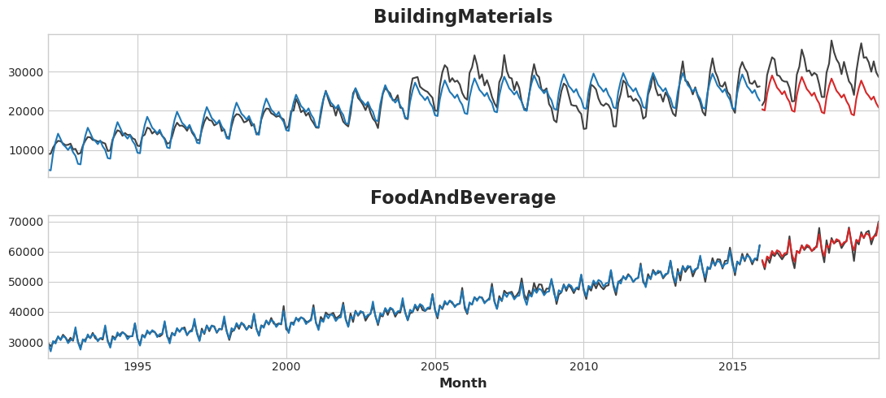</center>
<p style="text-align: center; color:grey;"><i>Forecast Plot</i></p>

## 6. Forecasting with Machine Learning
Before we design a forecasting model, we should ask:
- What information is available at the time the forecast is made
- Time period during which you require the forecasted values

The **forecast origin** is time at which you are making a forecast. Practically, you might consider the forecast origin to be the last time for which you have training data for the time being predicted. Everything up to he origin can be used to create features.

The **forecast horizon** is the time for which you are making a forecast. We often describe a forecast by the number of time steps in its horizon: a "1-step" forecast or "5-step" forecast, say. The forecast horizon describes the target.

<center>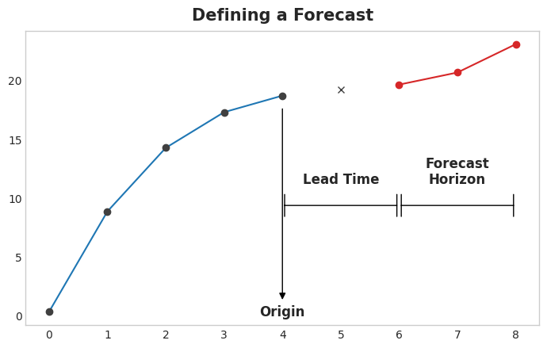</center>
<p style="text-align: center; color:grey;"><i>Example</i></p>

The time between the origin and the horizon is the lead time (or sometimes latency) of the forecast. A forecast's lead time is described by the number of steps from origin to horizon: a "1-step ahead" or "3-step ahead" forecast, say. In practice, it may be necessary for a forecast to begin multiple steps ahead of the origin because of delays in data acquisition or processing.

To forecast time series with ML algorithm, we have to transform the series into a `DataFrame` that we can use with the algorithms. Each row in a `DataFrame` represents a single forecast. The time index of the row is the first time in the forecast horizon, but we arrange values for the entire horizon in the same row. For multistep forecasts, this means we are requiring a model to produce multiple outputs, one for each step.

<center>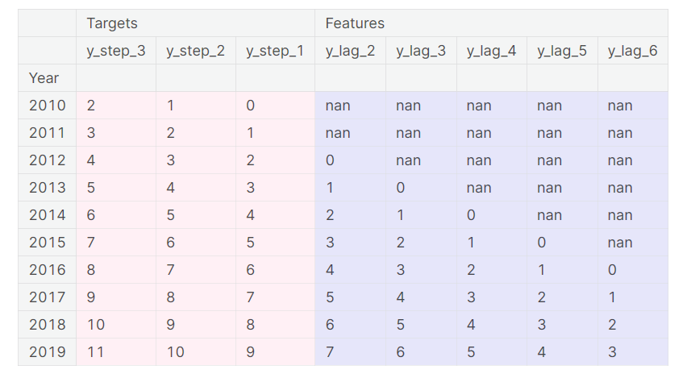</center>
<p style="text-align: center; color:grey;"><i>DataFrame Example</i></p>

The above illustrates how a dataset would be prepared similar to the Defining a Forecast figure: a three-step forecasting task with a two-step lead time using five lag features. The original time series is y_step_1. The missing values we could either fill in or drop.

### 6.1 Multistep Forecasting Strategies
**Direct Strategy**
Train a separate model for each step in the horizon: one model forecasts 1-step ahead, another 2-steps ahead, and so on. Forecasting 1-step ahead is a different problem than 2-steps ahead (and so on), so it can help to have a different model make forecasts for each step. The downside is that training lots of models can be computationally expensive.

<center>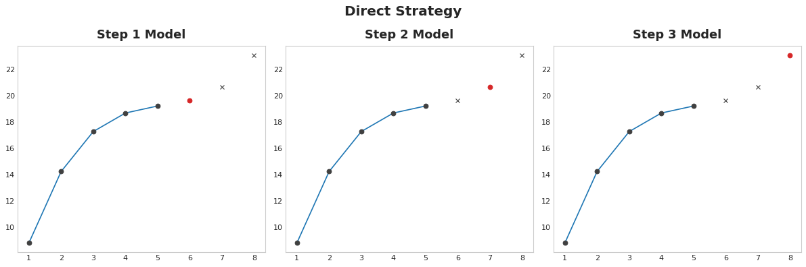</center>
<p style="text-align: center; color:grey;"><i></i></p>

**Recursive Strategy**
Train a single one-step model and use its forecasts to update the lag features for the next step. With the recursive method, we feed a model's 1-step forecast back in to that same model to use as a lag feature for the next forecasting step. We only need to train one model, but since errors will propagate from step to step, forecasts can be inaccurate for long horizons.

<center>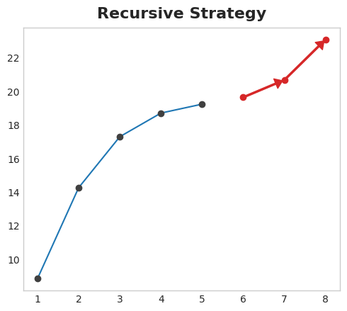</center>
<p style="text-align: center; color:grey;"><i></i></p>

**DirRec Strategy**
A combination of the direct and recursive strategies: train a model for each step and use forecasts from previous steps as new lag features. Step by step, each model gets an additional lag input. Since each model always has an up-to-date set of lag features, the DirRec strategy can capture serial dependence better than Direct, but it can also suffer from error propagation like Recursive.

<center>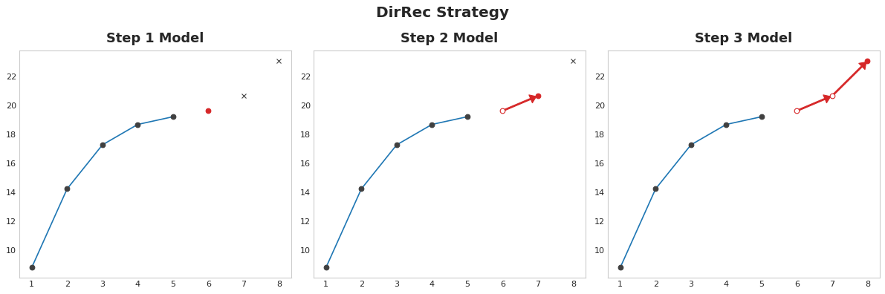</center>
<p style="text-align: center; color:grey;"><i></i></p>

### 6.2 Example
Here, let's take a look at the flu trends dataset previously used. We will apply multi-output and direct strategy to the dataset for forecast.

Preparing datset:
```py
def make_lags(ts, lags, lead_time=1):
    return pd.concat(
        {
            f'y_lag_{i}': ts.shift(i)
            for i in range(lead_time, lags + lead_time)
        },
        axis=1)


# Four weeks of lag features
y = flu_trends.FluVisits.copy()
X = make_lags(y, lags=4).fillna(0.0)


def make_multistep_target(ts, steps):
    return pd.concat(
        {f'y_step_{i + 1}': ts.shift(-i)
         for i in range(steps)},
        axis=1)


# Eight-week forecast
y = make_multistep_target(y, steps=8).dropna()

# Shifting has created indexes that don't match. Only keep times for
# which we have both targets and features.
y, X = y.align(X, join='inner', axis=0)
```

```py
# Create splits
X_train, X_test, y_train, y_test = train_test_split(X, y, test_size=0.25, shuffle=False)

model = LinearRegression()
model.fit(X_train, y_train)

y_fit = pd.DataFrame(model.predict(X_train), index=X_train.index, columns=y.columns)
y_pred = pd.DataFrame(model.predict(X_test), index=X_test.index, columns=y.columns)
```

```py
train_rmse = mean_squared_error(y_train, y_fit, squared=False)
test_rmse = mean_squared_error(y_test, y_pred, squared=False)
print((f"Train RMSE: {train_rmse:.2f}\n" f"Test RMSE: {test_rmse:.2f}"))

palette = dict(palette='husl', n_colors=64)
fig, (ax1, ax2) = plt.subplots(2, 1, figsize=(11, 6))
ax1 = flu_trends.FluVisits[y_fit.index].plot(**plot_params, ax=ax1)
ax1 = plot_multistep(y_fit, ax=ax1, palette_kwargs=palette)
_ = ax1.legend(['FluVisits (train)', 'Forecast'])
ax2 = flu_trends.FluVisits[y_pred.index].plot(**plot_params, ax=ax2)
ax2 = plot_multistep(y_pred, ax=ax2, palette_kwargs=palette)
_ = ax2.legend(['FluVisits (test)', 'Forecast'])
```

<center>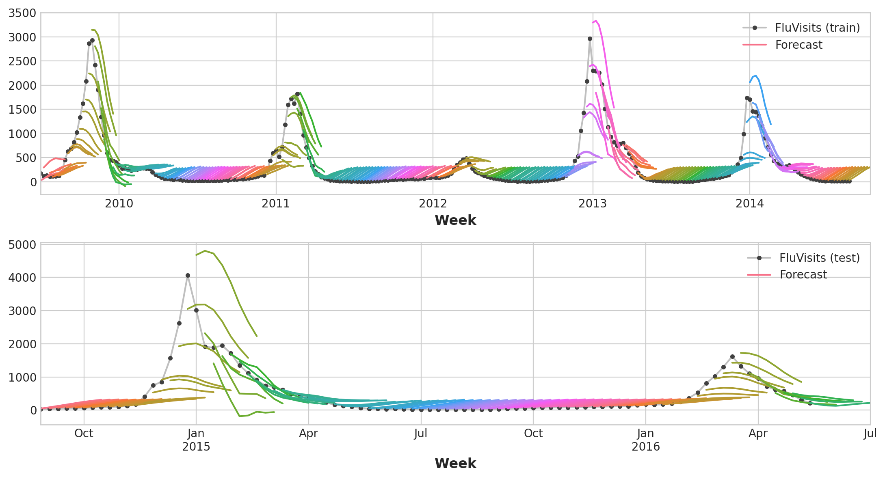</center>
<p style="text-align: center; color:grey;"><i></i></p>

XGBoost can't produce multiple outputs for regression tasks. But by applying the Direct reduction strategy, we can still use it to produce multi-step forecasts. This is as easy as wrapping it with scikit-learn's MultiOutputRegressor.

```py
from sklearn.multioutput import MultiOutputRegressor

model = MultiOutputRegressor(XGBRegressor())
model.fit(X_train, y_train)

y_fit = pd.DataFrame(model.predict(X_train), index=X_train.index, columns=y.columns)
y_pred = pd.DataFrame(model.predict(X_test), index=X_test.index, columns=y.columns)
```

```py
train_rmse = mean_squared_error(y_train, y_fit, squared=False)
test_rmse = mean_squared_error(y_test, y_pred, squared=False)
print((f"Train RMSE: {train_rmse:.2f}\n" f"Test RMSE: {test_rmse:.2f}"))

palette = dict(palette='husl', n_colors=64)
fig, (ax1, ax2) = plt.subplots(2, 1, figsize=(11, 6))
ax1 = flu_trends.FluVisits[y_fit.index].plot(**plot_params, ax=ax1)
ax1 = plot_multistep(y_fit, ax=ax1, palette_kwargs=palette)
_ = ax1.legend(['FluVisits (train)', 'Forecast'])
ax2 = flu_trends.FluVisits[y_pred.index].plot(**plot_params, ax=ax2)
ax2 = plot_multistep(y_pred, ax=ax2, palette_kwargs=palette)
_ = ax2.legend(['FluVisits (test)', 'Forecast'])
```

<center>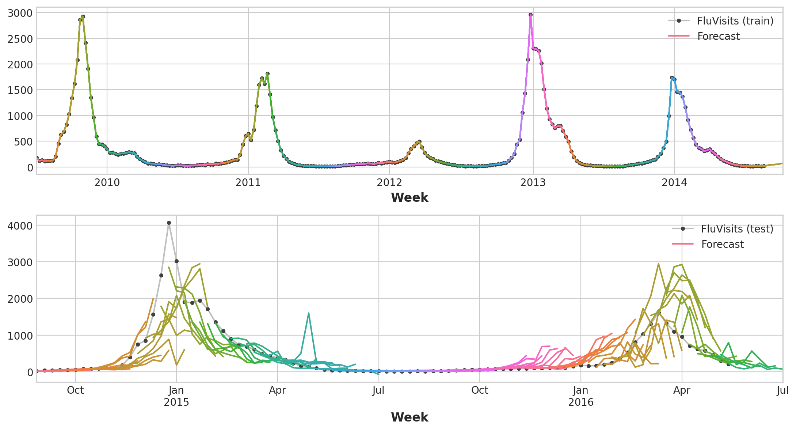</center>
<p style="text-align: center; color:grey;"><i></i></p>