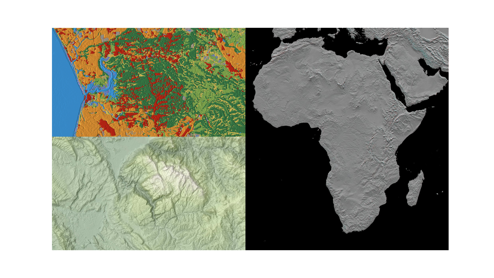

<center></center>
<p style="text-align: center; color:grey;"><i>Images from Unsplash</i></p>

Google Earth Engine is used by scientists, engineers and developers to detect change, map trends and quantify differences on the Earth’s surface.

In this article, I will share about the ways that we can obtain information such as elevation, slope and land cover from Earth Engine by telling the services the geo coordinates that we are interested in. All in simple Python code.

<center></center>
<p style="text-align: center; color:grey;"><i>Land Cover, Slope and Elevation</i></p>

Before we get started, make sure you have already installed the Earth Engine library on Python and you also have an **Earth Engine account**:

```py
py -m pip install ee
```

To use the Earth Engine API on Python, you also need to perform some authentication, you can run the following command on a Jupyter notebook or Python script:

```py
import ee
ee.Authenticate()
```

A pop-up box will appear and ask for an API key, after typing the API key you are ready to go.

## 1. Elevation
The elevation of a geographic location is its height above or below a fixed reference point, most commonly a reference geoid, a mathematical model of the Earth’s Sea level as an equipotential gravitational surface.

To obtain elevation data for any particular location, we can use the [Shuttle Radar Topography Mission digital elevation data](https://developers.google.com/earth-engine/datasets/catalog/USGS_SRTMGL1_003#description), we can get the data by calling:

```py
ee.Initialize()
DEM = ee.Image("USGS/SRTMGL1_003")
```

Let’s say I have already prepared a dataset called regression_data containing all the latitude and longitude for a particular location as follows:

```
latitude longtitude
2.234    103.24242
3.435    101.5364
4.345    105.1454
...      ...
```

I will then convert these coordinates into a point with the format `(latitude, longtitude)`. Subsequently, all the points will then be converted into features in list order:

```py
import pandas as pd
df = pd.read_csv('regression_data.csv')
nodes = []

for i in range(0, 4000):
    temp = [df['longitude'][i], df['latitude'][i]]
    nodes.append(temp)

# make points from nodes
points = [ee.Geometry.Point(coord) for coord in nodes]
```

Notice that there are 4000 coordinates being converted to point.

```py
# make features from points (name by list order)
feats = [ee.Feature(p, {'name': 'node{}'.format(i)}) for i, p in enumerate(points)]

# make a featurecollection from points
fc = ee.FeatureCollection(feats)
```

Now, we have transformed all the points into a feature. The next step is to extract the points from the digital elevation map.

```py
# extract points from DEM
reducer = ee.Reducer.first()
data = DEM.reduceRegions(fc, reducer.setOutputs(['elevation']), 30)
```

Do note that the data is stored as an Earth Engine object, and we could not view it directly. But here we can use `geemap` to convert the output into a `csv` file that contains all the elevation for each of the coordinate:

```py
import geemap
geemap.ee_to_csv(data, filename='altitude3.csv')
```

```
// output
node1 23
node2 50
node3 0
```

## 2. Slope
Well, how about slope. Slope can be defined as the angle of inclination where it describes the steepness of the ground’s surface, the slope data is also available in the [Shuttle Radar Topography Mission](https://developers.google.com/earth-engine/datasets/catalog/USGS_SRTMGL1_003#description) digital elevation data that we used to find elevation data earlier.

In fact, by just changing the output from elevation to slope:
```py
# extract points from DEM
reducer = ee.Reducer.first()
data = DEM.reduceRegions(fc, reducer.setOutputs(['slope']), 30)
```

We are able to obtain the slope in degree for all our coordinate.

## 3. Land Cover
Land cover is the physical material at the surface of Earth. Land covers include grass, asphalt, trees, bare ground, water, build area and more.

For land cover data, we can use the [Copernicus Global Land Cover Layers](https://developers.google.com/earth-engine/datasets/catalog/COPERNICUS_Landcover_100m_Proba-V-C3_Global) from Earth Engine:

```py
landcover = ee.ImageCollection('COPERNICUS/Landcover/100m/Proba-V-C3/Global')
```

What the code will do is to check for any particular coordinates in which type of land does it falls on. From the Copernicus dataset they are more than 20 land types that the coordinates can be classified. You can refer to it here.

The steps are similar to what we have done previously:

```py
landcover_at_point = landcover.filterBounds(fc).first()
reducer = ee.Reducer.first()

# Get the land cover class at the given point
data = landcover_at_point.reduceRegions(fc, reducer.setOutputs(['discrete_classification']), 30)
```

Using `geemap` again, we can export the classified output into a `csv` file:
```py
geemap.ee_to_csv(data, filename='landcover.csv')
```

Then we are done. We managed to obtain the elevation, slope and land cover information for 4000 coordinates, all in simple yet powerful code!
