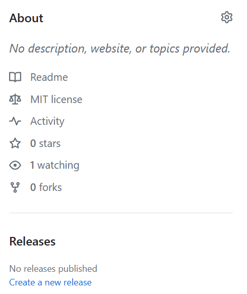
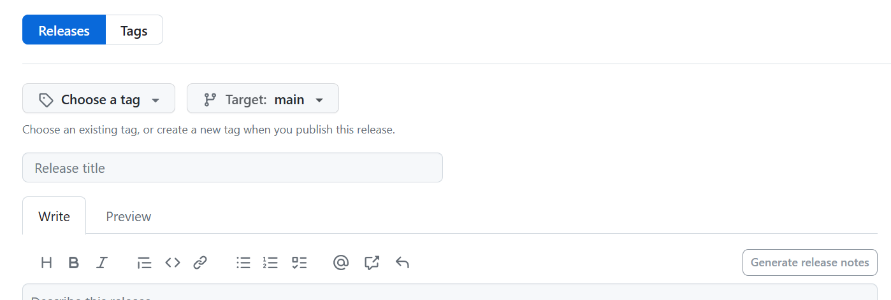
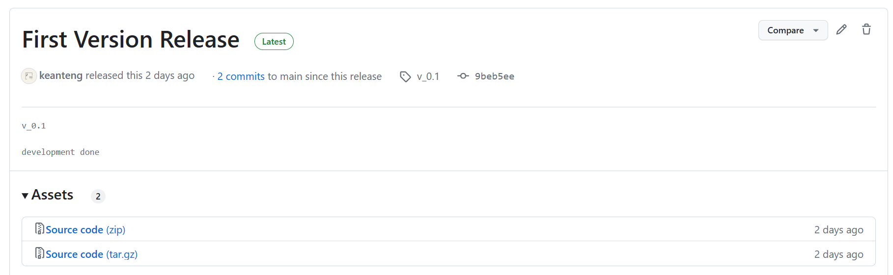
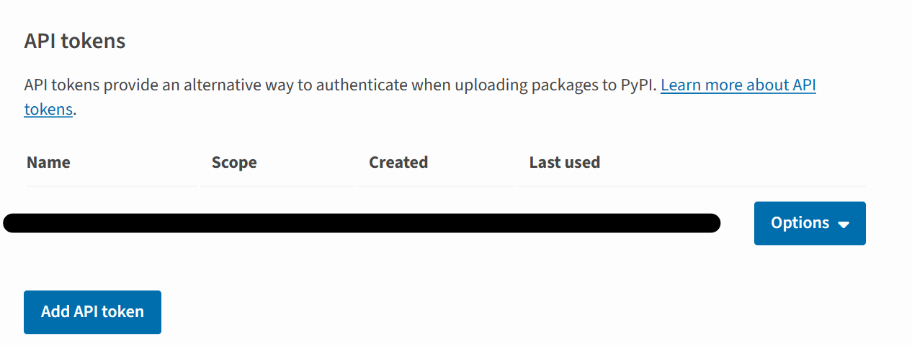

<center></center>
<p style="text-align: center; color:grey;"><i>Images from Unsplash</i></p>

Let's talk about Python package publishing. You have spent hours creating a Python package with some wonderful tools in it, and you want to share to others so that they can use it to simplify their work, speed up their workflows, this article will share about the ways that how you can release your package to the world. 

## Creating Package

For Python package publishing, we will use [Pypi](https://pypi.org/) which is a repository of software for the Python programming language. On the platform, it allows you to find and install software developed by the Python community, it is also a platform where package authors distribute their software. 

Generally, you can use Python to create a package that looks like this:

```txt
CURRENTFOLDER
    - package_name
        - class_1.py
        - class_2.py
```

In the above example, we are creating a class for each Python script. Python classes provide a mean of bundling data and functions together. And the classes are stored in a folder named `package_name` and this package is stored inside a folder **(make sure you use File> Open Folder to read the folder content on VS Code)**. It is good to not put any print statements in class, but you can write functions with return output for your class.

Now, let's add a `__init__.py` script and import the classes, and you are ready to publish this package:

```py
package_name
    - __init__.py
    - class_1.py
    - class_2.py
```

```py
# __init__.py
from package_name.class_1.py import class_A
from package_name.class_2.py import class_B
```

## Package Publishing
To publish your created package, you first have to create an account at [Pypi](https://pypi.org/). You might need to perform two-factor authentication for your account creation where you need to install [Google Authenticator](https://play.google.com/store/apps/details?id=com.google.android.apps.authenticator2) on your mobile phone to generate OTP to verify your account. 

### Using GitHub

Then, create a [GitHub](https://github.com/) repository for your package and upload the package there, here's some guide:

```py
# first commit for empty repo
echo "#reponame" >> README.md
git init
git add README.md
git commit -m "first commit"
git branch -M main
git remote add origin https://github.com/username/reponame.git
git push -u origin main

# second commit and upload your package
git add .
git commit -m "second commit"
git push
```

Once your package is on GitHub, you need to create 3 additional files before publishing your package (make sure you also push these files to GitHub):
- `setup.py`
- `setup.cfg`
- `LICENSE.txt`

The files are stored outside your package:

```txt
CURRENTFOLDER
    - package_name
        - class_1.py
        - class_2.py
    - setup.py
    - setup.cfg
    - LICENSE.txt
```

For the three files you have created just now, let's see what should we write in the file:

### setup.py

```py
from distutils.core import setup
setup(
  name = 'YOURPACKAGENAME',         # How you named your package folder (MyLib)
  packages = ['YOURPACKAGENAME'],   # Chose the same as "name"
  version = '0.1',      # Start with a small number and increase it with every change you make
  license='MIT',        # Chose a license from here: https://help.github.com/articles/licensing-a-repository
  description = 'TYPE YOUR DESCRIPTION HERE',   # Give a short description about your library
  author = 'YOUR NAME',                   # Type in your name
  author_email = 'your.email@domain.com',      # Type in your E-Mail
  url = 'https://github.com/user/reponame',   # Provide either the link to your github or to your website
  download_url = '',  # put empty first
  keywords = ['SOME', 'MEANINGFULL', 'KEYWORDS'],   # Keywords that define your package best
  install_requires=[       
        "",
      ], # put empty first
  classifiers=[
    'Development Status :: 3 - Alpha',      # Chose either "3 - Alpha", "4 - Beta" or "5 - Production/Stable" as the current state of your package
    'Intended Audience :: Developers',      # Define that your audience are developers
    'Topic :: Software Development :: Build Tools',
    'License :: OSI Approved :: MIT License',   # Again, pick a license
    'Programming Language :: Python :: 3.11',      #Specify which pyhton versions that you want to support
  ],
)
```

In the above code, you can see that the `download_url` and the `install_requires` parameters are still empty. For `download_url`, you can get it from GitHub the release section, then click create new release:

<center></center>

You will be asked to give a tag and release title, you can write tag such as `v_0.1` and a title that you want
<center></center>

Then, once your published the release, you can view your release. As we can see below, two zipped files are created. Now, you can copy the link for the `Source code(tar.gz)` and paste it on the `download_url` parameter in the `setup.py` file. Whenever you have a new version update for your package, do remember to publish a new release on GitHub so that you can update the link on this file.

<center></center>

For the `install_requires` parameter, it means the dependencies your package has or the packages that you are importing when you build your package. You only need to add package that you download through pip, for standard libraries such as `os` `random` you can ignore putting them. 

```py
# example
install_requires = [
    'geopandas',
    'rancoord',
]
```

### setup.cfg
For this file, you can put in your description file like this:

```py
[metadata]
description-file = README.md
```

### LICENSE.txt
For License file, you just need to copy and paste the license content where you can refer [here](https://opensource.org/licenses/).

### Time to Upload
It's time to publish your package. On Windows terminal type:

```py
py -m setup.py sdist
```

Then you need to install `twine`, a Python package for you to upload the package:

```py
py -m pip install twine
```

After installing, type:

```py
py -m twine upload dist/*
```

You will be asked to type your username and password. But remember just now you might register your account with two-factor authentication, and you might face error such as `insufficient authentication scope`. I do recommend using API token in this case for the upload. Go to your Pypi account the `Account Setting` section and search for API tokens and create a new API token:

<center></center>

Then you can type your username and password like this and hit Enter:

```
username: __token__
password: PASTETOKENHERE
```

Congrats, and now your package is uploaded to [Pypi](https://pypi.org/) and you can view it there.