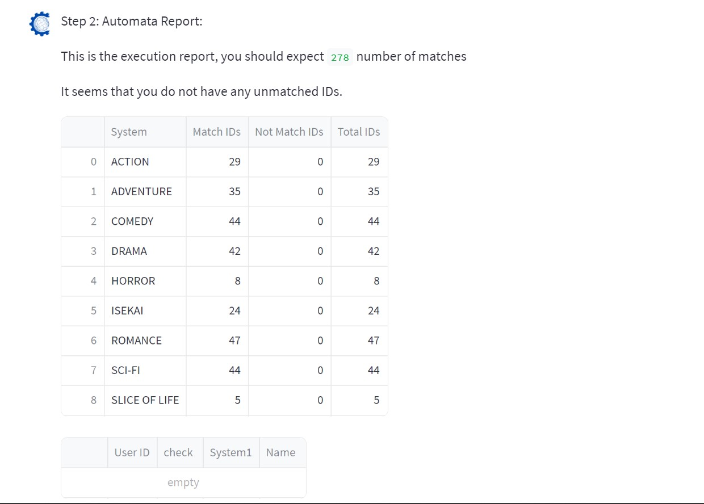
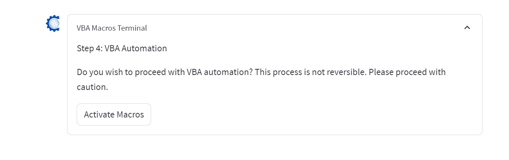

<center></center>
<p style="text-align: center; color:grey;"><i>Images from Unsplash</i></p>

From my previous article, I have introduced a [Python package](https://github.com/keanteng/blueautomata) `blueautomata` that is capable of providing the framework for reporting workflow automation. In this article, I provide example to integrate the package into application, preferably a Chatbot as an agent as we are seeing user-agent interaction is starting to redefine how do we work today in industry. The usage of Chatbot is helping us to perform routine tasks more quickly so that more time can be spent on something more productive and meaningful.

The package can be installed by calling:

```py
pip install blueautomata
```

Here's an overview of the function of `blueautomata`, this is a [case study](https://keanteng.github.io/blueautomata/casestudy/) that explain how to use the package:
1. Data Compilation
   1. Compiling files in folder as a single dataframe
2. Categorized File Export
   1. Exporting the compiled dataframe as individual Excel files by Department
3. VBA Automation
   1. Applying macros on the exported Excel files
4. Output Foresight
   1. Receive status report of the output from data compilation
5. Inconsistency Data Entry Fix
   1. Perform fixes to the `name` column for wrong names
6. System and Cube Checking
   1. Perform update and change to the content of the `system` and `cube` column


To create `ChatAutomata` we will create three web pages using `streamlit` that utilizes all the package functionality. 
- Main page
  - A one-stop station to user perform data compilation. output foresight, categorized file export and VBA automation 
- Inconsistency Page
  - A page to allow user to fix the inconsistency data entry
- System Cube Update Page
  - A page to allow user update the content of the `system` and `cube` column

## Main Page

This is how the main page should look like. In the main page, the user can edit the page setting where it contains parameters that will be used by the `blueautomata` package:

```py
with st.chat_message("assistant", avatar="favicon.png"):
    st.write("Hi there, welcome to the tutorial: Managing Data With Makima")
    st.write("You can see your setting here:")
    with st.expander("🔨 Page Settings", expanded = False):

        your_checklist_path = st.text_input("Enter your checklist path here:", "kaggledata/checklist.xlsx")
        your_staff_data_path = st.text_input("Enter your staff data path here:", "kaggledata/hr.xlsx")
        your_name_key = st.multiselect("Enter your files keywords here:", ["action","adventure","comedy","drama","horror","isekai","romance","sci-fi","slice of life"])
        your_name_code =  st.number_input("Enter your execution code here:", 1)

    st.write("After changing the setting, you can begin the automation:")
    submitted = st.button("Submit For Automation", type='primary')
```

<center></center>

After the users select the parameter, they can click on the `Submit for Automation` button to start processing the data and the program will show the processes in a series of steps:

**Step 1**

```py
test = BlueAutomata(
   folder_path= folder_location,
   checklist=your_checklist_path,
   staff_data= your_staff_data_path,
   name_key= your_name_key,
   name_code=nameCode,
)
df = test.automata_execution()

with st.chat_message("assistant", avatar="favicon.png"):
   st.write("Step 1: Automata Compilataion")
   st.write("Number of rows processed: ", df.shape[0], " The output is saved as: `output.xlsx`")

   st.dataframe(df.head())
```

<center></center>
<p style="text-align: center; color:grey;"><i>Step 1</i></p>

**Step 2**

```py
test = AutomataReport(
folder_path=folder_location,
checklist=your_checklist_path,
staff_data=your_staff_data_path,
name_key=your_name_key,
name_code=nameCode,
)
df = test.automata_report_summary()
df1 = test.automata_report_unmatch()

with st.chat_message("assistant", avatar="favicon.png"):
   st.write("Step 2: Automata Report:")
   st.write("This is the execution report, you should expect ", df['Match IDs'].sum(), " number of matches")
   st.write("It seems that you do not have any unmatched IDs.")

   st.dataframe(df.head(n = len(df)))
   st.dataframe(df1.head())
```

<center></center>
<p style="text-align: center; color:grey;"><i>Step 2</i></p>

**Step 3**

```py
with st.chat_message("assistant", avatar="favicon.png"):
   st.write("Step 3: Batch Export By Department")
   
   df = pd.read_excel("output.xlsx")

   temp = BatchExport(
         destination="dept",
         masterlist=df,
   )

   temp.batch_export()

   st.markdown("""Your files are successfully exported by Department at the `dept` folder.""")
```

<center></center>
<p style="text-align: center; color:grey;"><i>Step 3</i></p>

```py
with st.chat_message("assistant", avatar="favicon.png"):
    with st.expander("VBA Macros Terminal"):
        markdown = """
                Step 4: VBA Automation
                
                Do you wish to proceed with VBA automation? This process is not reversible. Please proceed with caution.
            """

        st.markdown(markdown)

        submit = st.button("Activate Macros")
```

<center></center>
<p style="text-align: center; color:grey;"><i>Step 4</i></p>

If the users trigger the `macros` button, then this function will be run:

```py
if submit:
    with st.chat_message("assistant", avatar="favicon.png"):
        with st.spinner("Automating ... This process might take one minute ..."):
            xl = win32com.client.Dispatch("Excel.Application",pythoncom.CoInitialize())

            temp = automate_vba(
                filepath=r"C:\\Users\\sskkteng\\Downloads\\BlueAutomata Testing\\vbanew.xlsm",
                macro="vbanew.xlsm!Module1.kt_template",
            )

            temp.templatetize()
            st.write("""Execution Completed!""")    
```

## Inconsistency Page
We can use the same approach that we used earlier to build the inconsistency page. The steps are previewing data, show the updated data and show the data that cannot be updated or fixed:

**Page Setting**

```py
with st.chat_message("assistant", avatar="favicon.png"):
    st.write("Hi there, you can see you setting here:")
    with st.expander("Page settings", expanded= False):
        your_file_path = st.text_input("Enter the file path here:", "kaggledata/sample1.xlsx")
        your_checklist_path = st.text_input("Enter your checklist path here:", "kaggledata/checklist.xlsx")
        your_staff_data_path = st.text_input("Enter your staff data path here:", "kaggledata/hr.xlsx")
        your_sheet_number = st.number_input("Enter the sheet number:", 0)

    submitted = st.button("Submit For Automation")
```

<center></center>
<p style="text-align: center; color:grey;"><i>Page Setting</i></p>

**Step 1:**

```py
with st.chat_message("assistant", avatar="favicon.png"):
   st.write("Step 1: Data preview")
   st.markdown("""Let's have a look at the data""")

   preview = pd.read_excel("kaggledata/sample1.xlsx")
   st.dataframe(preview.head(n = 6))

test = Inconsistency(
   filepath=your_file_path,
   staff_data=your_staff_data_path,
   checklist=your_checklist_path,
   sheet_number=your_sheet_number,
)
```

<center></center>
<p style="text-align: center; color:grey;"><i>Step 1</i></p>

**Step 2:**

```py
df = test.fix_inconsistency()

with st.chat_message("assistant", avatar="favicon.png"):
   st.write("Step 1: Fixed Data Overview")
   st.write("The table below shows the fixed data. ", len(df), " rows are fixed")

   st.dataframe(df.head(n = len(df)))
```

<center></center>
<p style="text-align: center; color:grey;"><i>Step 2</i></p>

**Step 3:**

```py
with st.chat_message("assistant", avatar="favicon.png"):
   st.write("Step 3: Show the name that cannot be fixed")
   st.write("There is/are ", len(df), " rows the program cannot fix. These names are not searcheable.")

   st.dataframe(df.head())
```

<center></center>
<p style="text-align: center; color:grey;"><i>Step 3</i></p>

## System Cube Update Page
Now, let's use the same approach again to build the `system cube update` page.

**Page Setting:**

```py
with st.chat_message("assistant", avatar="favicon.png"):
    st.write("Hi there, you can see your setting here:")
    with st.expander("Page setting", expanded= False):
        your_file_path = st.selectbox("Enter the file path here:", ("kaggledata/sample2.xlsx", "update.xlsx"))
        your_system = st.multiselect("Choose the system you want to check: ", ['Mappa', 'ufotable'])
        your_cube = st.multiselect("Choose the cube to assign: ", ['Action', 'Adventure'])

    submitted = st.button("Submit For Automation")
```

<center></center>
<p style="text-align: center; color:grey;"><i>Page Setting</i></p>

**Step 1:**
```py
with st.spinner("Computing ... Please Wait ..."):
   with st.chat_message("assistant", avatar="favicon.png"):
      st.write("Step 1: Preview the data")
      st.markdown("""Let's have a look at the data""")

      preview = pd.read_excel(your_file_path)
      st.dataframe(preview.head())
```

<center></center>
<p style="text-align: center; color:grey;"><i>Step 1</i></p>

**Step 2:**
```py
with st.chat_message("assistant", avatar="favicon.png"):
   st.write("Step 2: Performing fixes")
   st.markdown("""You can check the fixed data. The output is saved to `update.xlsx`""")

   test = SystemCubeChecker(
         masterlistpath=your_file_path,
         system_to_check=your_system,
         cube_to_assign=your_cube[0],
   )

   df = test.system_cube_update()
   df.to_excel("update.xlsx", index=False)

   preview2 = pd.read_excel("update.xlsx")
   st.dataframe(preview2.head())
```

<center></center>
<p style="text-align: center; color:grey;"><i>Step 2</i></p>

