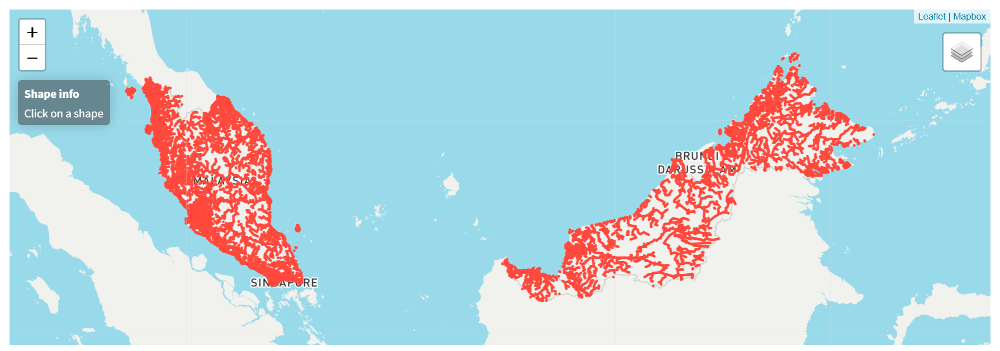
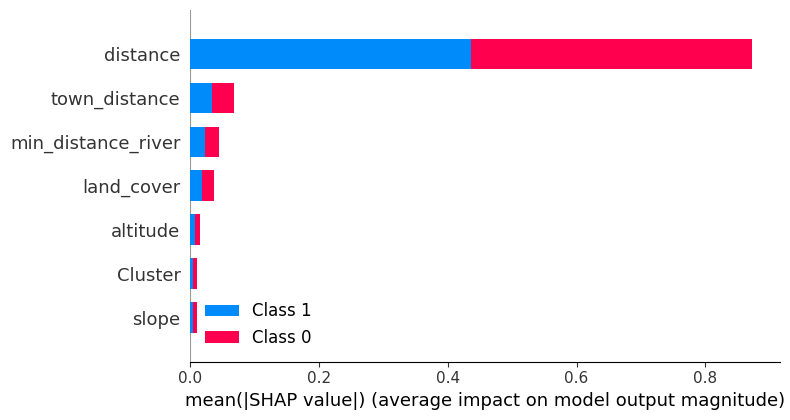
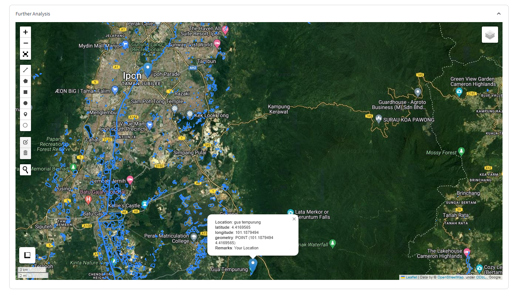

<center></center>
<p style="text-align: center; color:grey;"><i>Images from Unsplash</i></p>

## Introduction

In this article, we will walk through the steps of creating a flood risk prediction chatbot with interface similar to ChatGPT that is able to predict flood risk of any location in Malaysia and show you the prediction details such as the nearest river, the nearest town and the nearest historical flood point on the map. For this study, we will use flood data collected from the annual report published by the [Department of Irrigation and Drainage](https://www.water.gov.my/) from 2020-2021. We will then train our prediction model with 19,000 labelled random coordinates in Malaysia using Multivariate Logistic Regression.

> This is the project [Git Repo](https://github.com/keanteng/flood_risk_model_2)

<center></center>
<p style="text-align: center; color:grey;"><i>ChatFloodRisk Interface</i></p>

There are several variables that will be used for our prediction model such as elevation, slope, land cover, distance to the nearest town, distance to the nearest river and cluster, as follows:

```py
target = distance_to_hist_floodsite + 
         altitude + 
         slope + 
         land_cover + 
         town_distance + 
         river_distance + 
         cluster + 
         error_term
```

## Data Collection
We will need to prepare some data to kick-start this project. First, some labelled random coordinates were generated using `rancoord` a [Python package](https://github.com/hugodscarvalho/rancoord) that is capable of random sampling for geographic coordinates.

```py
import rancoord as rc

# Get the bounding box
bounding_box = rc.nominatim_geocoder('1000, Kangar, Perlis, Malaysia')

# Create a polygon based on the previously created bounding box
poly = rc.polygon_from_boundingbox(bounding_box)

# get 10 random coordinates
a = rc.coordinates_randomizer(polygon = poly, num_locations = 10, plot = True, save = True)
a
```

To create labels for each coordinate, unique flood locations gathered from the 2020-2021 annual report published by the Department of Irrigation and Drainage were used to check whether the coordinate fall within 1.5 km radius of all the flood coordinates.

```py
# get the flood points
data = gpd.GeoDataFrame(data, geometry = gpd.points_from_xy(data.longitude, data.latitude), crs = "EPSG:4326")

# draw 1.5KM radius around all the points
two_mile_buffer = data.geometry.buffer(0.009)

# union all the polygons
my_union = two_mile_buffer.geometry.unary_union

# check random coordinates lies inside polygon or not
location = gpd.GeoDataFrame(location, geometry = gpd.points_from_xy(location.longitude, location.latitude), crs = "EPSG:4326")
location['flood_risk'] = my_union.contains(location.iloc[0:len(location)].geometry)
```

Furthermore, the nearest distances between the random coordinates and the historical flood points were also computed using the `geopandas` module.

```py
# write a function to compute for the minimum distances from any flood point
random_location = geocoded_data.iloc[360]
distances = flood_points_data.geometry.distance(random_location.geometry)
distances.min()

for i in range(0, len(geocoded_data)):
    distances = flood_points_data.geometry.distance(geocoded_data.iloc[i].geometry)
    geocoded_data.loc[i, 'distance'] = distances.min()
```

Features such as altitude, slope and land cover were collected by using [Google Earth Engine](https://developers.google.com/earth-engine/) services. For the land cover or land type, the information is gathered by using the [Copernicus Global Land Cover Layers](https://developers.google.com/earth-engine/datasets/catalog/COPERNICUS_Landcover_100m_Proba-V-C3_Global).

<center></center>
<p style="text-align: center; color:grey;"><i>Copernicus Global Land Cover Layers</i></p>

For town distances, 62 largest towns from [Wikipedia](https://en.wikipedia.org/wiki/List_of_cities_and_towns_in_Malaysia_by_population) were geocoded using [`Nominatim`](https://nominatim.openstreetmap.org/ui/search.html) and [`Opencage`](https://opencagedata.com/demo) geocoding services. The minimum distance between these towns and the random locations were computed.

<center></center>
<p style="text-align: center; color:grey;"><i>Malaysia Towns</i></p>

Moreover, to calculate the nearest river distance from the random coordinates, the waterways shape file was collected from [`HOTOSM`](https://data.humdata.org/dataset/hotosm_mys_waterways?) Malaysia Waterways.

<center></center>
<p style="text-align: center; color:grey;"><i>Malaysia Waterways</i></p>

The distance between points (coordinate) and the polygon (waterways shape file) ware computed.

<center></center>

```py
# get the data
river = gpd.GeoDataFrame(river, geometry='geometry', crs = 'EPSG:4326').to_crs('EPSG:3857')
df2 = gpd.GeoDataFrame(df, geometry = gpd.points_from_xy(df.longitude, df.latitude), crs = 'EPSG:4326').to_crs('EPSG:3857')

# write a function to compute for the minimum distances from any flood point
for i in range(0, len(df2)):
    distances = river.geometry.distance(df2.iloc[i].geometry)
    df2.loc[i, 'distance'] = distances.min()
```

K-means clustering was used to create 15 clusters class based on the latitude and the longitude of each coordinate.

```py
# we perform k-means clustering on the geographical coordinates
from sklearn.cluster import KMeans

kmeans = KMeans(n_clusters=15)
data["Cluster"] = kmeans.fit_predict(data[["latitude", "longitude"]])
data["Cluster"] = data["Cluster"].astype("category")
```

<center></center>

As a bonus to this study, [SHAP](https://shap.readthedocs.io/en/latest/index.html) or `SHapley Additive exPlanations` was used to break down a prediction to show the impact of each feature. We can see that `distance` has the biggest impact on the model prediction.

<center></center>

## Model Fitting
After collecting all the data, we can perform the logistic regression on the data to get the model's parameters:

```py
from sklearn.linear_model import LogisticRegression

model = LogisticRegression(solver = 'liblinear')

model.fit(X_train_s, y_train_s)

model.coef_
model.intercept_
```

## Building ChatFloodRisk
To build the chatbot, we will be using the framework provided by `Streamlit`. We will receive two input from the users: the location of interest and the cluster code of the location. Since our chatbot can only receive one input at a time, user would need to give their input in the following format:

```py
your_location, your_code
```

Now, let's build the chatbot interface with chat history enabled:

```py
prompt = st.chat_input("Enter your address of interest and cluster code here:")

if prompt:
    # assign variables
    your_cluster = prompt.split(",")[-1]
    your_address = prompt.split(",")[0]
    your_cluster = int(your_cluster)
    
    # Display user message in chat message container
    st.chat_message("user").markdown(prompt)
    # Add user message to chat history
    st.session_state.messages.append({"role": "user", "content": prompt})

    response = f"Hi there, your address of interest is: {your_address} and your cluster code is: {your_cluster}"
    
    # Display assistant response in chat message container
    with st.chat_message("assistant", avatar = "images/favicon.png"):
        st.markdown(response)
    # Add assistant response to chat history
    st.session_state.messages.append({"role": "assistant", "content": response})
```

<center></center>

You can see that after typing `gua tempurung, 9`, the chatbot replies us with `Hi there, your address of interest is gua tempurung and your cluster code is 9`. The next thing we are going to do is we will add the second message the chatbot produces:

```py
with st.chat_message("assistant", avatar = "images/favicon.png"):
                st.write("Hi there, the flood risk for your location is: ", flood_risk)
                st.write("According to Earth Engine, you location elevation is ", location_elevation, "meters. The slope is ", location_slope, "degrees. I notice that your location is ", landcover_description, "area.")
                st.write("From you location, the distance to the nearest flood point is ", dist_to_hist['distance'][0], "meters. The distance to the nearest river is ", dist_to_river['distance'][0], "meters. The distance to the nearest town is ", dist_to_town['distance'][0], "meters.")
            
                if flood_risk < 0.5:
                    st.markdown("Your location is at a low risk of flooding.")
                else:
                    st.markdown("Your location is at a high risk of flooding. Please be careful and take precautions.")
```

The Chatbot will also visualize the location the user key in on the map and showing them where is the nearest town, river and historical flood location. To add the map output, just add the map inside the chatbot message box:

```py
# plot the map
with st.expander("Further Analysis", expanded=True):
    m = leafmap.Map(center=[3, 101], zoom=6, google_map="HYBRID")
    regions = 'data/river_polygon.geojson'
    m.add_geojson(regions, layer_name="Waterways")
    m.add_points_from_xy(
        data, 
        x="longitude", 
        y="latitude",
        icon_names=['gear', 'map', 'leaf', 'globe'],
    )
    m.to_streamlit(height = 700)
```

<center></center>

Now, you have created a Chatbot that will tell you the flood risk a any location in Malaysia. 
