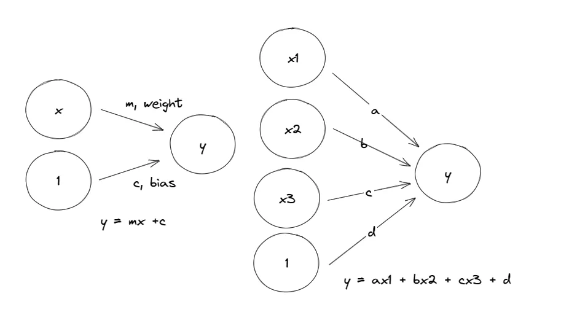
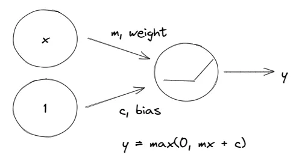

<center></center>
<p style="text-align: center; color:grey;"><i>Images from Unsplash</i></p>

> *Disclaimer: This article is my learning note from the courses I took from Kaggle.*

## 0. Concepts
Creation and evaluation of a deep learning model is a procedural work with steps. *Data preparation >> Model optimization>> Model fitting >> Model evaluation >> Model prediction*

**Note:**
- Model optimization (adam optimizer)
- Model fitting (batch, epoch)
- Model evaluation(dropout, batch normalization)

## 1. Modelling & Neural Network
*Terms: layer, activation function, neural network, dense, rectified linear unit*

<center></center>
<p style="text-align: center; color:grey;"><i>Simple Neural Network (linear)</i></p>

The above neural network can be generated with code using Python. The network above organized neurons into layers. Collecting linear units with common set of inputs result in a dense layer.

```python
from tensorflow import keras
from tensorflow.keras import layers

# 1 linear unit network
model = keras.Sequential([
  layers.Dense(units = 1, input_shape = [1])
])

model = keras.Sequential([
  layers.Dense(units = 1, input_shape = [3])
])
```

If we want to fit a curve (non-linear), a feature called activation function is needed, otherwise the neural network can only learn linear relationships. A common example is the rectifier function `max(0,x)`, where we get a rectified linear unit when we attach the function to a linear unit.

We can also stack layers to achieve a complex data transformation.

<center></center>
<p style="text-align: center; color:grey;"><i>Visualizing the Network</i></p>

Using code to define the network:

```py
from tensorflow import keras
from tensorflow.keras import keras

# [layer1, layer2, layer3,...]
model = keras.Sequential([
  layers.Dense(units = 4, activation = 'relu', input_shape = [2],
  layers.Dense(units = 3, activation = 'relu'),
  layers.Dense(units = 1)
])
```

## 2. Model Optimization & Fitting
*Terms: loss function, stochastic gradient descent, batch, epoch, error/loss*

Similar to regression, we need to know how well our model fits the data. We use **loss function** to measures the difference between observed and predicted values. The common measure would be the mean absolute error where it computed the average length between the fitted curve and data points. Other errors examples are mean-squared error or Huber loss.

How can we minimize the error? We can use optimization algorithms — the stochastic gradient descent. The concepts as follows:

- Get random sample (`batch`) from original dataset and run through the network for prediction.
- Measure the error (`loss`)
- Adjust the weight in a direction that makes the loss smaller (an epoch for each complete round a training)

We can use a built-in “`adam`” optimizer to optimize our model. This allows self-tuning to minimize loss. Below is code to fit 256 rows of training data for 10 times:

```py
# get training data dimension (row, column)
print(X_train.shape)

# define model
from tensorflow import keras
from tensorflow.keras import layers

mode = keras.Sequential([
  layers.Dense(512, activation = 'relu', input_shape = [11]),
  layers.Dense(512, activation='relu'),
  layers.Dense(512, activation='relu'),
  layers.Dense(1),
])

# add in optimizer and loss function
model.compile(
  optimizer = 'adam',
  loss = 'mae',
)

# model fitting
history = model.fit(
  X_train, y_train,
  validation_data = (X_valid, y_valid),
  batch_size = 256,
  epochs = 10,
)

# visualize outcome
import pandas as pd
# training history to data frame
history_df = pd.DataFrame(history.history) 
# plot the loss
history_df['loss'].plot(); 
```

## 3. Model Evaluation 1
*Terms: underfitting, overfitting, capacity, training, callback, stopping criteria*

Training data normally contains signal and noise where signal helps our model make prediction from new data and noise represent the random fluctuation coming from data in the real world. To see if our model fits the data well, we will compare learning curve between training set and validation set.

**Underfitting** the training set is when the loss is not as low as it could be because the model hasn’t learned enough signal. **Overfitting** the training set is when the loss is not as low as it could be because the model learned too much noise.

A model’s capacity is the size and complexity of the patterns it is able to learn. We can adjust a model’s capacity if we detect overfitting or underfitting scenarios.

```py
# sample model
model = keras.Sequential([
  layers.Dense(16, activation = 'relu'),
  layers.Dense(1),
])

# wider 
model = keras.Sequential([
  layers.Dense(32, activation = 'relu'),
  layers.Dense(1),
])

# deeper
model = keras.Sequential([
  layers.Dense(16, activation = 'relu'),
  layers.Dense(16, activation = 'relu'),
  layers.Dense(1),
])
```

Sometimes the validation increase during training after a certain point although it kept decreasing early on. This can due to a model is learning noise from the datasets. We can overcome this issue by imposing an early stopping criterion.

A callback function is used where we detect when the validation loss starts to rise again, and we reset the weights back the where the minimum occurred. An example “if there is not at least 0.001 improvement in the validation loss over 20 epochs, then stop training and keep the best model you found”.

```py
from tensorflow.keras.callbacks import EarlyStopping

early_stopping = EarlyStopping(
  min_delta = 0. 001, # min change to count as improvement
  patience = 20, # how many epochs to wait before stopping
  restore_best_weights = True,
)
```

## 4. Model Evaluation 2
*Terms: dropout, batch normalization*

To correct overfitting in our model, we can implement the idea of dropout where we randomly drop out some fraction of a layer’s input units every step of training. This avoids the network to learn spurious patterns in the training data which leads to overfitting.

```py
model = keras.Sequential([
  ...
  layers.Dropout(rate = 0.3) # 30% dropout to the next layer
  layers.Dense(16),  
  ...
])
```

To correct slow or unstable training, we can apply batch normalization to put all data on a common scale. SGD will shift the network weights in proportion to how large an activation the data produces. Features that tend to produce activations of very different sizes can make for unstable training behavior.

```py
model = keras.Sequential([
  layers.Dense(16, activation = 'relu'),  
  layers.BatchNormalization(),
])

# or
model = keras.Sequential([
  layers.Dense(16),  
  layers.BatchNormalization(),
  layers.Activation('relu'),
])
```

Example for a full model fitting process:
```py
from tensorflow import keras
from tensorflow.keras import layers

# define network
model = keras.Sequential([
    layers.Dense(1024, activation='relu', input_shape=[11]),
    layers.Dropout(0.3),
    layers.BatchNormalization(),
    layers.Dense(1024, activation='relu'),
    layers.Dropout(0.3),
    layers.BatchNormalization(),
    layers.Dense(1024, activation='relu'),
    layers.Dropout(0.3),
    layers.BatchNormalization(),
    layers.Dense(1),
])

# add optimier
model.compile(
  optimizer = 'adam',
  loss = 'mae',
)

# model fitting
history = model.fit(
  X_train, y_train,
  validation_data = (X_valid, y_valid),
  batch_size = 256,
  epochs = 100,
  verbose = 0,
)

# visualize
history_df = pd.DataFrame(history.history)
history_df.loc[:,['loss','val_loss']].plot();
```

## 5. Binary Classification
*Terms: sigmoid, binary, accuracy*

We cannot use accuracy to measure model performance as it does not change smoothly — it changes in jumps as it represents ratio counts. Thus, a replacement would be the cross-entropy function where it measures the distance between probabilities. To convert outputs from dense layer into probabilities, we will use the sigmoid activation function.

**Code example:**
```py
from tensorflow import keras
from tensorflow.keras import layers

# define network
model = keras.Sequential([
    layers.Dense(4, activation='relu', input_shape=[33]),
    layers.Dense(4, activation='relu'),    
 # final layer need sigmoid function to produce class probabilities
    layers.Dense(1, activation='sigmoid'),
])

# add optimizer
model.compile(
  optimizer = 'adam',
  loss = 'binary_crossentropy',
  metrics = ['binary_accuracy']
)

# add stopping criteria
early_stopping = keras.callbacks.EarlyStopping(
  patience = 10,
  min_delta = 0.001,
  restore_best_weights = True,
)

#  model fitting
history = model.fit(
  X_train, y_train,
  validation_data=(X_valid, y_valid),
  batch_size=512,
  epochs=1000,
  callbacks = [early_stopping],
  verbose = 0 # hide output since too many to display
)

# model levaluation
history_df = pd.DataFrame(history.history)

# starts at epoch 5
history_df.loc[5:, ['loss', 'val_loss']].plot()
history_df.loc[5:, ['binary_accuracy', 'val_binary_accuracy']].plot()

print(("Best Validation Loss: {:0.4f}" +\
      "\nBest Validation Accuracy: {:0.4f}")\
      .format(history_df['val_loss'].min(), 
              history_df['val_binary_accuracy'].max()))
```

## 6. Reference
- [Learn Intro to Deep Learning Tutorials - Kaggle](https://www.kaggle.com/learn/intro-to-deep-learning)