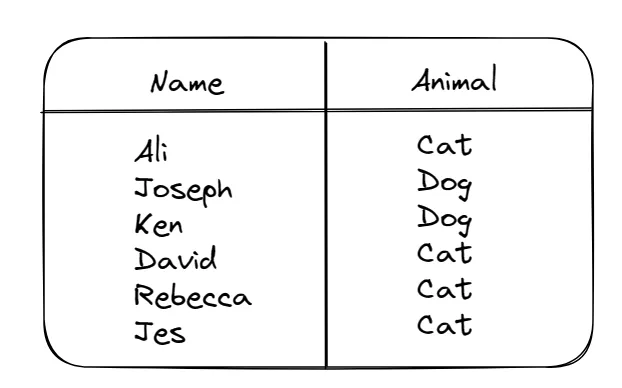

<center></center>
<p style="text-align: center; color:grey;"><i>Images from Unsplash</i></p>

> *Disclaimer: This article is my learning note from the courses I took from Kaggle.*

For examining and assessing huge datasets and databases, SQL or structured programming language skills plays a vital role to enable us to design and manage data.

Some **common keywords** used in SQL as follows:

- `SELECT`, `WHERE`, `FROM`
- `GROUP BY`, `HAVING`, `COUNT`
- `ORDER BY`
- `AS`, `WITH`
- `JOIN`

## 1. Data Preparation
Since we will be using Python to apply SQL, there are some steps required for data preparation. We will first start by establishing a connection to the BigQuery service to create a client object that hold projects. We will then select a project from the *biquery-public-data* which holds a collection of datasets for each project. The datasets will contain the tables that we want for our analysis. Here’s how we can do that in Python:

```py
from google.cloud import bigquery

# 1. create a client object
client = bigquery.Client()

dataset_ref = client.dataset("hacker-news", project = "bigquery-public-data")

# 2. get the hacker news dataset from a project
dataset = client.get_dataset(dataset_ref)

# 3. list the tables in the datasets
tables = list(client.list_tables(dataset))

# 4. print the all the table names
for table in table:
  print(table.table_id)
```

Now from the code we learn about all the table names in the datasets from the printed outputs. Here’s how we can fetch the table with code:

```py
# create a reference to the table name full
table_ref = dataset_ref.table("full")

# get the table
table = client.get_table(table_ref)
```

Oftentimes, when we want to preview at the table before our analysis, but it contains a huge number of rows and might consume resources to load, we can choose to display only a certain number of rows of the table.

```py
# Restrict rows and convert the result to dataframe
client.list_rows(table, max_results = 5).to_dataframe()
```

### 1.1 Table Schema
The structure of a table is known as table schema, and it will tell us information about each specific columns in our table. The information is:

- `Name` of the column
- `Datatype` of the column
- `Mode` of the column (by default it will allow null values — nullable)
- `Description` of the data in the particular column

```py
# code command
table.schema

# Output:
[SchemaField('title', 'STRING', 'NULLABLE', 'Story title', (), None)]
```

## 2. Queries Foundations
We will start by three keywords which represents the foundational components of a SQL query, namely `SELECT`, `FROM` and `WHERE`.

By `SELECT`, it refers to the columns that we want to select, FROM refers to the table that we are after and finally WHERE refers to the return condition that we want to impose on the output. Below is how we can select the cat owner’s name from an imaginary dataset:

<center></center>
<p style="text-align: center; color:grey;"><i>An imaginary dataset</i></p>

```py
query = """
  SELECT Name 
  FROM `bigquery-public-data.pet_records.pets`
  WHERE Animal = 'Dog'
"""
```

### 2.1 Big Datasets
Some BigQuery datasets can be huge and costly to compute. If you are running them on cloud services with limited computing hours, your limit might drain easily with huge datasets. We can avoid this issue by imposing a function to limit the amount of data that we are capable to scan to avoid running over our computing limit.

Here’s how we can check how much data a query will scan, alternatively we can also impose a limit with a parameter on how much data that will be scanned:

```py
# query
query = """"
  SELECT score, title
  FROM `bigquery-public-data.hacker_news.full`
  WHERE type = "job"
"""

## 1. Cost estimation
# create object for cost estimation without running it
dry_run_config = bigquery.QueryJobConfig(dry_run = True)

# estimate cost
dry_run_query_job = client.query(query, job_config = dry_run_config)

print("This query will process {} bytes.".format(dry_run_query_job.total_bytes_processed))

## 2. Setting parameter
ONE_GB = 1000*1000*1000

# set up the query
safe_config = bigquery.QueryJobConfig(maximum_bytes_billed = ONE_GB)

# run the query
safe_query_job = client.query(query, job_config = safe_config)

job_posts_scores = safe_query_job.to_dataframe()
job_posts_scores.mean()
```

## 3. More Queries 1
This section will add three new techniques: `GROUP BY`, `HAVING` and `COUNT()` to assist us in getting more interesting insights from our queries.

`GROUP BY` means grouping together rows with the same value in that column as a single group, `COUNT()` will return a count of things such as the number of entries of a column while `HAVING` is used in combination with `GROUP BY` to ignore groups that do not meet a certain criterion.

Here is how we can apply these techniques to find the most discussed new comments on the Hacker News project:

```py
# select comment with > 10 replies
query_popular = """
                SELECT parent, COUNT(1) AS NumPosts
                FROM `bigquery-public-data.hacker_news.comments`
                GROUP BY parent
                HAVING COUNT(1) > 10
                """

# limit how much data will be scan
safe_config = bigquery.QueryJobConfig(maximum_bytes_billed=10**10)
query_job = client.query(query_popular, job_config=safe_config)

# run query and convert to data frame
popular_comments = query_job.to_dataframe()

# print the first five rows
popular_comments.head()
```

## 4. More Queries 2
In this section, we will learn about `ORDER BY` clause where it is used to sort the returned results by the rest of the query. When we use ORDER BY the returned results will be sorted in ascending order whether it is string or numeric. If we would like to have the order reverse, we can add in the `DESC` argument.

```py
query = """
  SELECT Name 
  FROM `bigquery-public-data.pet_records.pets`
  WHERE Animal = 'Dog'
  ORDER BY Name DESC
"""
```

Now considering we have a column that tell us about the date that a pet owner getting a pet, we can use the `EXTRACT` clause to get the day, month, week and year information from the column.

## 5. More Queries 3
In this section, we will work on two keywords that helps to organize our query for better readability — if we happen we have a complex query. Starting with `AS`, it is used to rename columns generated by our queries. `WITH` is used together with `AS` to create a temporary table so that we can write query against them. This helps us to split queries into readable chunks and makes the data cleaning work easier.

Consider that we want to know the pet IDs that are owned for more than five years:

```py
query = """
  WITH Seniors AS
  (
    SELECT Name, ID
    FROM `bigquery-public-data.pet_records.pets`
    WHERE Years_old > 5
  )
  SELECT ID
  FROM Seniors
"""
```

Another example is to find how many bitcoins transactions being made in a month:
```py
query = """"
  WITH Time AS 
  (
    SELECT DATE(block_timestamp) AS trans_date
    FROM `bigquery-public-data.crypto_bitcoin.transactions`
  )
  SELECT COUNT(1) AS transactions, trans_date
  FROM Time
  GROUP BY trans_date
  ORDER BY trans_date
"""

# limit how much data will be scanned
safe_config = bigquery.QueryJobConfig(maximum_bytes_billed=10**10)
query_job = client.query(query, job_config=safe_config)

# run query and convert to data frame
transactions_by_date = query_job.to_dataframe()

# Print the first five rows
transactions_by_date.head()

# Extra: visualize the result
transactions_by_date.set_index('trans_date').plot()
```

## 6. Combining Data Sources
For the last clause in this course, we will learn about `JOIN — INNER JOIN` in this section. For `INNERJOIN`, a row will only be selected if the column that we used to combine in one table also matches with the table that we used for joining. `JOIN` clause allows us to query and combine the information from different tables. For example, we have two tables; one contains the pet name and the other one contains the pet’s owner name. Here how we can associate the pet with its owner:

```py
query = """
  SELECT p.Name AS Pet_Name, 0.Name AS Owner_Name
  FROM `bigquery-public-data.pet_records.pets` AS P
  INNER JOIN bigquery-public-data.pet_records.owners` AS O
    ON p.ID = o.Pet_ID
""" 
```

Here’s another example where we want to find how many files are covered by each type of software license on GitHub.
```py
query = """
        SELECT L.license, COUNT(1) AS number_of_files
        FROM `bigquery-public-data.github_repos.sample_files` AS sf
        INNER JOIN `bigquery-public-data.github_repos.licenses` AS L 
            ON sf.repo_name = L.repo_name
        GROUP BY L.license
        ORDER BY number_of_files DESC
        """

# limit how much data will be scanned
safe_config = bigquery.QueryJobConfig(maximum_bytes_billed=10**10)
query_job = client.query(query, job_config=safe_config)

# run query and convert to data frame
file_count_by_license = query_job.to_dataframe()

file_count_by_license
```