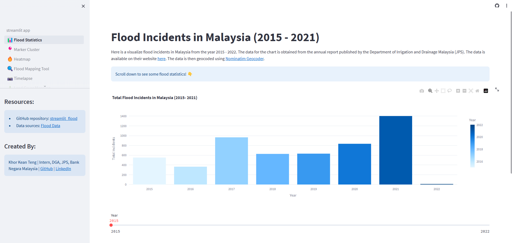
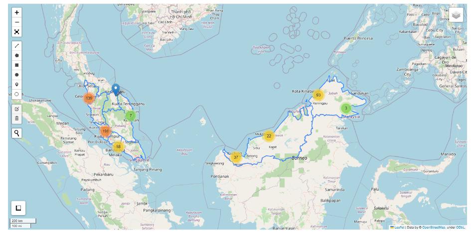
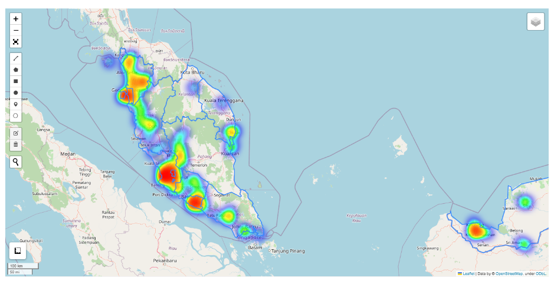
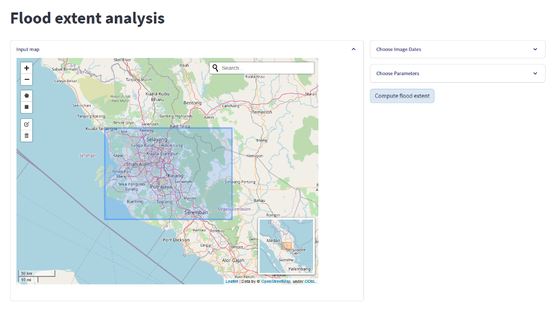
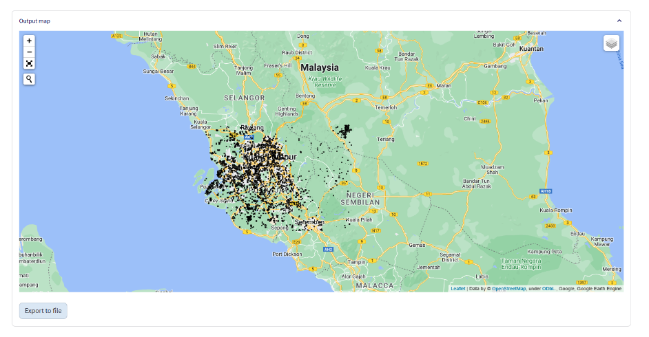

<center></center>
<p style="text-align: center; color:grey;"><i>Images from Unsplash</i></p>

In this project, I make use of [Streamlit](https://streamlit.io/), which is an open-source Python library that allows us to build and deploy powerful apps with speed and efficiency. It also offers a cloud deployment feature for you to host the Streamlit app that you created online publicly through [Streamlit Community Cloud](https://streamlit.io/cloud). 

The purpose of building the app is to get an understanding of the flood impacts towards collateral hold by banks. Floods are a frequent natural disaster that occurs in almost every state in Malaysia. The impact of floods extends beyond the destruction of homes, infrastructure and crops. Often, floods result in displacement of communities, disruptions to vital services like electricity, transportation and communication. 

Therefore, by collecting all the historical flood points in Malaysia and using sophisticated tool such as Google Earth Engine to estimate or forecast the flood extent using Sentinel-1 synthetic-aperture radar (SAR) data, a better understanding of the impact of the flood can be achieved, the economic impact of the flood can be evaluated, and the precautions towards future flood occurrences can be implemented.  

With the forecasted flood data points as well as collateral location gathered, we can estimate the loss and devise strategies to minimize flood risk and economic loss. 

The process of deploying the app is a series of workflow, as follows:
- Flood Data Collection from annual report published by Department of Drainage and Irrigation
- Flood data points geocoding using geocoding services: `Nominatim`
- App Building (Flood Statistics Visualization, Market Cluster/Heatmap) via Local Deployment
- Flood Extent Mapping Feature on Streamlit Cloud

<center></center>
<p style="text-align: center; color:grey;"><i>Webapp Overview</i></p>

Refer to my GitHub repository, for my work on [this project](https://github.com/keanteng/streamlit_floodv2), the link to the web app can be found on the **landing page**. 

## 1. Flood Data Collection
The data used to visualize the flood incidents in Malaysia from 2015 to 2021 can be collected by the annual report published by the [Department of Irrigation and Drainage, JPS](https://www.water.gov.my/). Due to no flood data files available online, the flood data could only be extracted by establishing data connection using Power Query on Excel. Moreover, the tables in the report has inconsistent format and typing, a series of process would need to be implemented to clean up the data set:

<center></center>
<p style="text-align: center; color:grey;"><i>Data Cleaning Workflow</i></p>

The second issue to overcome would be the huge amount of `.xlsx` files to merge assuming you created each file for flood incidents in each state and each year.

```
TOTAL STATES = 15 (13 States and 2 Federal Territories)
TOTAL YEAR = 7
AMOUNT OF FILES = 15 * 7 = 105
```

We can use Python `openpyxl` packages to quickly merge all these files with the following code:

```python
# importing the required modules
import glob
import pandas as pd
 
# specifying the path to csv files
path = folder
 
# csv files in the path
file_list = glob.glob(path + "/*.xlsx")
 
# list of excel files we want to merge.
excl_list = []
 
for file in file_list:
    excl_list.append(pd.read_excel(file, sheet_name= 'Sheet1'))
 
# concatenate all DataFrames in the list
# into a single DataFrame, returns new
# DataFrame.
excl_merged = pd.concat(excl_list, ignore_index=True)
 
# exports the dataframe into excel file
# with specified name.
excl_merged.to_excel('FILENAME_WITH_ALL_THE_DATA.xlsx', index=False)
```

## 2. Flood Data Points Geocoding
To convert all the flood location addresses into coordinates identified by longitude and latitude, geocoding services such as Nominatim are used. In the Python “geopy” module, it includes the Nominatim API services for such a conversion. A geocoding program is written by me in Python to perform the conversion. The program runs for 146 minutes with a success rate of about 31%. That means, only about 5000 addresses are successfully geocoded. 

Several runs of the program are performed to check for improvement in success rate. No significant improvement is observed throughout all the runs due to Nominatim unable to locate a certain address in Malaysia.

```python
# geocoding function
def my_geocoder(row):
    try:
        point = geolocator.geocode(row).point
        return pd.Series({'Latitude': point.latitude, 'Longitude': point.longitude})
    except:
        return pd.Series({'Latitude': None, 'Longitude': None})

data[['Latitude', 'Longitude']] = data.apply(lambda x: my_geocoder(x['Name']), axis=1)

# check the percentage of data successfully geocoded
print("{}% of addresses were geocoded!".format(
    (1 - sum(np.isnan(data["Latitude"])) / len(data)) * 100))
```


## 3. App Building via Local Deployment
To use Streamlit, we have to install it first `py -m pip install streamlit` on Windows terminal. You can check out its [documentation](https://docs.streamlit.io/) to see the list of components that can be used to build interactive and powerful web app. 

To run the app you have created, simply type `py -m streamlit run filename.py` on terminal. You will deploy the app locally. 

In my app, I included bar charts using `plotly` package to visualize the flood statistics that I gathered. Heatmap and Marker Cluster map were also plotted to indicated the location of flood and the areas in a particular state that experienced a higher density of flood incidents. The relevant code can be found in my [Git repository](https://github.com/keanteng/streamlit_floodv2). 

<center></center>
<p style="text-align: center; color:grey;"><i>Marker Cluster Plot</i></p>
<center></center>
<p style="text-align: center; color:grey;"><i>Heatmap</i></p>

## 4. Adding Additional Feature via Cloud Deployment
In my project, I added some tools for flood extent analysis and features supported by Google Earth Engine using resources from [mapaction/flood mapping tool](https://github.com/mapaction/flood-mapping-tool) and [opengeos/streamlit-geospatial](https://github.com/opengeos/streamlit-geospatial).

<center></center>
<p style="text-align: center; color:grey;"><i>Selecting the area for prediction</i></p>

<center></center>
<p style="text-align: center; color:grey;"><i>Prediction outcome</i></p>

The reason these features need to be added via cloud deployment of Streamlit is because of a missing package `fcntl module` that is not available on my Windows machine but on Linux system. Of course, after deploying these feature to cloud, authentication token from Google Earth Engine would also be required. To get the key, got to Windows Terminal:

```python
py -m pip install ee
import ee
ee.Authenticate()
```

You will need to paste the authorization code back on the terminal. Once the step is complete, you can find the token on your local machine at `C:\\Users\\Username\\.congif\\earthengine\\credentials`. It is also important to note that the token at `C:\\Users\\Username\\.congif\\earthengine\\credentials` would need to be put at the **secret section** of the app that you deployed on cloud using the following format:

```toml
EARTHENGINE_TOKEN = 'PASTE WHAT YOU COPY HERE'
ee_keys = 'PASTE WHAT YOU COPY HERE'
```

The secret section can be found by clicking the app `setting > secret`. 

After that, the app is ready to be shared and used!