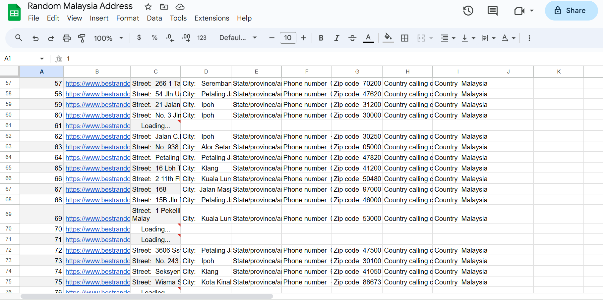
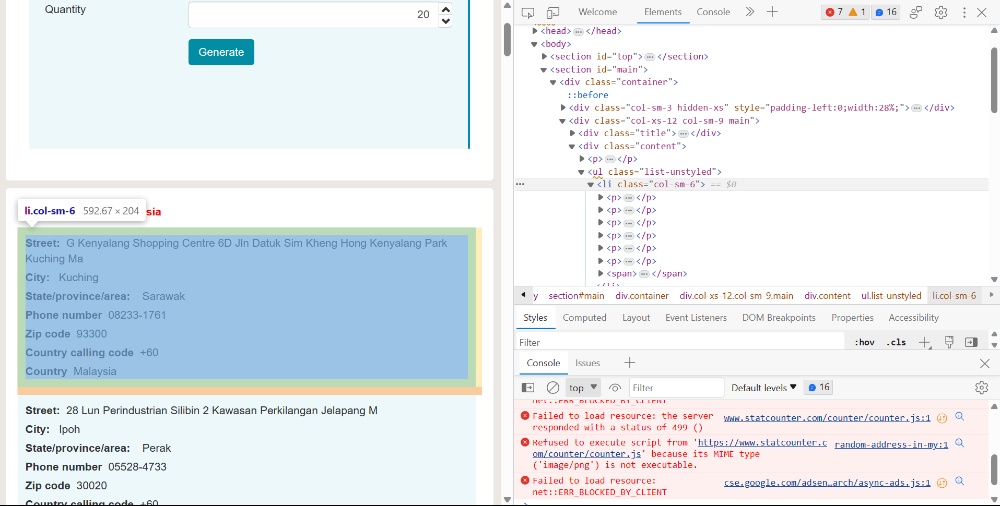

<center></center>
<p style="text-align: center; color:grey;"><i>Images from Unsplash</i></p>

Google Sheet `importxml()` function is a wonderful tool to allow you to scrape for website information by just identifying the corresponding `Xpath`. But it has a limit, when you have hundreds or thousands of data items to be gathered, your Sheet's cell will get stuck at endless loading. As you can see from the image below, for about 250 rows of data, after waiting for more than 30 minutes, the loading cell does not refresh. 

<center></center>
<p style="text-align: center; color:grey;"><i>Google Sheet Data Extraction Using IMPORTXML()</i></p>

Luckily, the Python [selenium](https://www.selenium.dev/documentation/) package offers a powerful solution to this issue. With just a few lines of code, you can scrape hundreds or even thousands rows of data and compile them into a Python data frame for you to perform further analysis, with speed and efficiency. 

## 1. What is Selenium
Selenium is a project that provides a range of tools and libraries to support the automation of web browsers. It supports extensions to emulate user interaction with browsers, a distribution of servers for scaling browser allocation and allows you to write interchangeable code for all major web browsers. 

You can install the package by writing this code on Windows Terminal:
```terminal
py -m pip install selenium
```

## 2. Finding Xpath
Previously, I have shown the Random Malaysia Address on Google Sheet, where `IMPORTXML()` is used to scrape for random addresses. The website used is [here](https://www.bestrandoms.com/random-address-in-my?quantity=20). 

<center></center>
<p style="text-align: center; color:grey;"><i>Site For Random Address Generation</i></p>

This site allows user to generate 20 random addresses at once and the addresses are shown in several blue boxes as shown in the above images. In order to locate the addresses, or in other words, all the information inside each blue boxes, we would need to locate their Xpath. The Xpath can be found by opening the developer mode on your web browser by pressing `Ctrl + Shift + I` and search for the required element. Once you have found the required element, right click and select `Copy Full Xpath`. The Xpath is as follows:

```txt
/html/body/section[2]/div/div[2]/div[2]/ul/li[1]
```

As mentioned earlier, there are 20 random addresses generated. Thus, notice that the `*` in `/html/body/section[2]/div/div[2]/div[2]/ul/li[*]`, it will be numbered from 1 to 20, representing 20 different boxes containing random addresses. 

<center></center>
<p style="text-align: center; color:grey;"><i>Finding Site Element Xpath</i></p>

## 3. Web Scraping In Action
Everything is easy after knowing the Xpath of the web page element you want. We will start by importing the required package:

```py
from selenium import webdriver
from selenium.webdriver.common.by import By
import time
import pandas as pd
import random
```

Then, we need to write a function to extract the random address based on the Xpath we copied. We will write a `get_address` function for that. 

```py
def get_address(url):
    driver = webdriver.Chrome()
    driver.get(url)
    time.sleep(2)

    container1 = driver.find_element(By.XPATH, "/html/body/section[2]/div/div[2]/div[2]/ul/li[1]")

    driver.close()

    return container1.text
```

But the output will be in this format:

```txt
//output:
Street:  G Kenyalang Shopping Centre 6D Jln Datuk Sim Kheng Hong Kenyalang Park Kuching Ma
City:   Kuching
State/province/area:    Sarawak
Phone number  08233-1761
Zip code  93300
Country calling code  +60
Country  Malaysia

//What we want:
Street:  G Kenyalang Shopping Centre 6D Jln Datuk Sim Kheng Hong Kenyalang Park Kuching Ma; City:   Kuching; State/province/area:    Sarawak; Phone number  08233-1761; Zip code  93300; Country calling code  +60; Country  Malaysia
```

The output makes us hard to put in a data frame. Therefore, we need an additional function called `textline` to convert the output to one string as shown above:

```py
def get_address(url):
    driver = webdriver.Chrome()
    driver.get(url)
    time.sleep(2)

    container1 = driver.find_element(By.XPATH, "/html/body/section[2]/div/div[2]/div[2]/ul/li[1]")
    container2 = driver.find_element(By.XPATH, "/html/body/section[2]/div/div[2]/div[2]/ul/li[2]")

    def textLine(poem):
        lst=list(poem)
        string=''
        for i in lst:
            string+=i
        # print(string)
        lst1=string.split("\n")
        str1=""

        for i in lst1:
            str1+=i+" ;"
        str2=str1[:-2]
        return str2
    
    location1 = textLine(container1.text)
    location2 = textLine(container2.text)

    driver.close()
    
    temp = [location1, location2]

    return temp
```

Now, we can put the output into a Python data frame:

```py
url = https://www.bestrandoms.com/random-address-in-my?quantity=20
df = pd.DataFrame({'address':get_address(url)})
```

And we are done! You can also write a loop if you need more random locations as each function can return at most 20 random locations.

## 4. Scrape More Than 1000 Locations
Check out my [GitHub](https://github.com/keanteng/flood_risk_model/blob/main/randomaddress.ipynb) for the full Jupyter notebook to scrape more than 1000 random locations with a `.csv` output at the end.