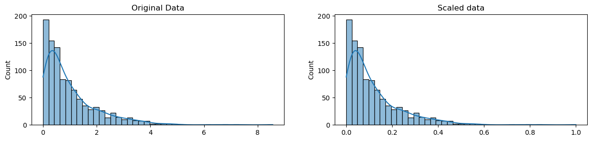
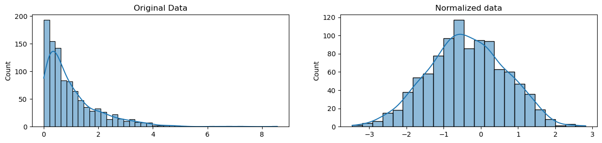
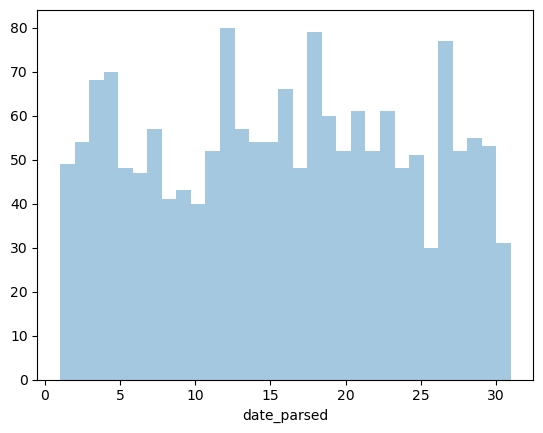

<center></center>
<p style="text-align: center; color:grey;"><i>Images from Unsplash</i></p>

> *Disclaimer: This article is my learning note from the courses I took from Kaggle.*

Data cleaning is the process of fixing or removing incorrect, corrupted, incorrectly formatted, duplicate, or incomplete data within a dataset. It is a key part of data science, and it can be deeply frustrating. What should we do to the missing values? Why the dates are not in the correct format? How to clean up inconsistent data entry? These are some of the problems that we will learn to tackle in this course. 

## 1. Handling Missing Values
Let's start by taking a look at the data and check how many missing values are there:

```py
df.head()

missing = df.isnull().sum()
print(missing)
```

Now let's look at the percentage of values in our dataset that were missing:

```py
total_cells = np.product(df.shape)
total_missing = missing.sum()

percent_missing = (total_missing/total_cells)*100
print(percent_missing)
```

The next step is to figure out why the data is missing. It is important to ask ourselves, is this value missing because it wasn't recorded, or it doesn't exist? If it is the latter, it wouldn't make sense to guess those values, we could just leave them empty. But if it is the other way round, we probably would need to guess what it might have been based on some other values in the column and row. 

We called this method as imputation. In statistics, imputation is the process of replacing missing data with substituted values.

```py
# look at the # of missing points in the first ten columns
missing_values_count[0:10]

Date                0
GameID              0
Drive               0
qtr                 0
down            61154
time              224
TimeUnder           0
TimeSecs          224
PlayTimeDiff      444
SideofField       528
dtype: int64
```

We can see that the columns has information on the number of seconds left in the game when the play was made. These values are probably missing because they were not recorded, it would be better for us to try and have a guess on it. 

Conversely, other fields such as `PenalizedTeam` contains a lot of missing fields. This is because if there was no penalty, then the field will be missed. We could just leave it empty as it is. 

Of course, if we wouldn't want to guess for the missing value, we can remove the rows of columns with missing values:

```py
df.dropna() # remove rows with missing value
```

```py
df.dropna(axis = 1) # remove all columns with at least one missing value
```

On the other hand, if we would like to try to fill in the missing value, we can use the Pandas' `fillna` function:

```py
# get a small subset of the NFL dataset
subset_nfl_data = nfl_data.loc[:, 'EPA':'Season'].head()
subset_nfl_data

# replace all NA's with 0
subset_nfl_data.fillna(0)
```

If we want to replace the missing value with value comes directly after it in the same column:

```py
# replace all NA's the value that comes directly after it in the same column, 
# then replace all the remaining na's with 0
subset_nfl_data.fillna(method='bfill', axis=0).fillna(0)
```

## 2. Scaling & Normalization
Let's start by importing some libraries:

```py
# modules we'll use
import pandas as pd
import numpy as np

# for Box-Cox Transformation
from scipy import stats

# for min_max scaling
from mlxtend.preprocessing import minmax_scaling

# plotting modules
import seaborn as sns
import matplotlib.pyplot as plt
```

The difference between scaling and normalization:
- Scaling: changing the range of data
- Normalization: changing the shape of the distribution of the data

When we perform scaling, we are transforming the data so that it fits within a specific scale like 0 to 1 or 1 to 100. We will scale data if we are using methods based on measures of how far apart data points are such as SVM (support vector machines) and KNN (k-nearest neighbors).

For example, you might be looking at the prices of some products in both Yen and US Dollars. One US Dollar is worth about 100 Yen, but if you don't scale your prices, methods like SVM or KNN will consider a difference in price of 1 Yen as important as a difference of 1 US Dollar! This clearly doesn't fit with our intuitions of the world. With currency, you can convert between currencies. But what about if you're looking at something like height and weight? It's not entirely clear how many pounds should equal one inch (or how many kilograms should equal one meter).

Scaling variables help us to compare different variables on equal footing. The shape of the data will not change with scaling, but the range will change.

```py
# generate 1000 data points randomly drawn from an exponential distribution
original_data = np.random.exponential(size=1000)

# mix-max scale the data between 0 and 1
scaled_data = minmax_scaling(original_data, columns=[0])

# plot both together to compare
fig, ax = plt.subplots(1, 2, figsize=(15, 3))
sns.histplot(original_data, ax=ax[0], kde=True, legend=False)
ax[0].set_title("Original Data")
sns.histplot(scaled_data, ax=ax[1], kde=True, legend=False)
ax[1].set_title("Scaled data")
plt.show()
```

<center></center>
<p style="text-align: center; color:grey;"><i>Scaling Example</i></p>

Furthermore, for normalization it represents a more radical transformation. We perform normalization because our observations cannot be described as a normal distribution. Normally, we perform normalization when the data will be used for machine learning or statistical technique that assumes the data is normally distributed. 

```py
# normalize the exponential data with boxcox
normalized_data = stats.boxcox(original_data)

# plot both together to compare
fig, ax=plt.subplots(1, 2, figsize=(15, 3))
sns.histplot(original_data, ax=ax[0], kde=True, legend=False)
ax[0].set_title("Original Data")
sns.histplot(normalized_data[0], ax=ax[1], kde=True, legend=False)
ax[1].set_title("Normalized data")
plt.show()
```

<center></center>
<p style="text-align: center; color:grey;"><i>Scaling Example</i></p>

## 3. Parsing Date
Importing library:

```py
# modules we'll use
import pandas as pd
import numpy as np
import seaborn as sns
import datetime
```

Let's output the data column from the `DataFrame` to see if it really contains date:

```txt
# print the first few rows of the date column
print(landslides['date'].head())

0     3/2/07
1    3/22/07
2     4/6/07
3    4/14/07
4    4/15/07
Name: date, dtype: object
```

By observation, these outputs look like date. But the data type is being set to object. That means this date column is not being recognized as a date, and we need to convert it so that it can be recognized as date. 

```py
landslide['data_parsed'] = pd.to_datetime(landslide['date'], format = "%m/%d/%y")
```

If we check back again:

```txt
# print the first few rows
landslides['date_parsed'].head()

0   2007-03-02
1   2007-03-22
2   2007-04-06
3   2007-04-14
4   2007-04-15
Name: date_parsed, dtype: datetime64[ns]
```

We can see that now the date is being correctly recognized. Here's some tip, if we run into an error with multiple date formats, we could run: `landslides['date_parsed'] = pd.to_datetime(landslides['Date'], infer_datetime_format=True)`.

### 3,.1 Select The Day of The Month
```py
dom = landslide['date_parsed'].dt.day
dom.head()
```

One of the biggest dangers in parsing dates is mixing up the months and days. The `to_datetime()` function does have very helpful error messages, but it doesn't hurt to double-check that the days of the month we've extracted make sense.

```py
# remove na's
day_of_month_landslides = day_of_month_landslides.dropna()

# plot the day of the month
sns.distplot(day_of_month_landslides, kde=False, bins=31)
```

<center></center>
<p style="text-align: center; color:grey;"><i>Scaling Example</i></p>

Looks like the date is parsed correctly. 

## 4. Character Encoding
Import libraries:

```py
# modules we'll use
import pandas as pd
import numpy as np

# helpful character encoding module
import charset_normalizer

# set seed for reproducibility
np.random.seed(0)
```

Character encoding are specific sets of rules for mapping from raw binary byte strings to character that make-up human-readable text. If you tried to read in text with a different encoding than the one it was originally written in, you ended up with scrambled text called `mojibake` (said like `mo-gee-bah-kay`). Here's an example of `mojibake`:

```
æ–‡å—化ã??
```

In fact, character encoding mismatches are less common today. There are a lot of different character encoding out there, the main one for you to know is UTF-8.

UTF-8 is the standard text encoding. All Python code is in UTF-8 and, ideally, all your data should be as well. It's when things aren't in UTF-8 that you run into trouble.

```py
# start with a string
before = "This is the euro symbol: €"

# check to see what datatype it is
type(before)

# output
# str
```
```py
# encode it to a different encoding, replacing characters that raise errors
after = before.encode("utf-8", errors="replace")

# check the type
type(after)

# output
# bytes
```

```py
# take a look at what the bytes look like
after

# output
# b'This is the euro symbol: \xe2\x82\xac'
```
```py
# convert it back to utf-8
print(after.decode("utf-8"))

# output
# This is the euro symbol: €
```

However, when we try to use a different encoding to map our bytes into a string, we get an error. This is because the encoding we're trying to use doesn't know what to do with the bytes we're trying to pass it. You need to tell Python the encoding that the byte string is actually supposed to be in.

## 5. Inconsistent Data Entry
Import libraries:

```py
# modules we'll use
import pandas as pd
import numpy as np

# helpful modules
import fuzzywuzzy
from fuzzywuzzy import process
import charset_normalizer
```

In this section, we would like to check the 'country' column to make sure that there is no data entry inconsistencies in it.

```py
# get all the unique values in the 'Country' column
countries = professors['Country'].unique()

# sort them alphabetically and then take a closer look
countries.sort()
countries
```

```
array([' Germany', ' New Zealand', ' Sweden', ' USA', 'Australia',
       'Austria', 'Canada', 'China', 'Finland', 'France', 'Greece',
       'HongKong', 'Ireland', 'Italy', 'Japan', 'Macau', 'Malaysia',
       'Mauritius', 'Netherland', 'New Zealand', 'Norway', 'Pakistan',
       'Portugal', 'Russian Federation', 'Saudi Arabia', 'Scotland',
       'Singapore', 'South Korea', 'SouthKorea', 'Spain', 'Sweden',
       'Thailand', 'Turkey', 'UK', 'USA', 'USofA', 'Urbana', 'germany'],
      dtype=object)
```

We notice that there are some problems with this array of data. For instance, 'germany' and 'Germany'; 'New Zealand' and ' New Zealand'. Firstly, we would convert everything to the lower case and remove the white spaces at the beginning and the end:

```py
df['Country'] = df['Country'].str.lower()
df['Country'] = df['Country'].str.strip()
```

Next, we want to perform fuzzy matching to correct inconsistent data entry. 

```py
# get all the unique values in the 'Country' column
countries = professors['Country'].unique()

# sort them alphabetically and then take a closer look
countries.sort()
countries
```

```
array(['australia', 'austria', 'canada', 'china', 'finland', 'france',
       'germany', 'greece', 'hongkong', 'ireland', 'italy', 'japan',
       'macau', 'malaysia', 'mauritius', 'netherland', 'new zealand',
       'norway', 'pakistan', 'portugal', 'russian federation',
       'saudi arabia', 'scotland', 'singapore', 'south korea',
       'southkorea', 'spain', 'sweden', 'thailand', 'turkey', 'uk',
       'urbana', 'usa', 'usofa'], dtype=object)
```

So what is it about fuzzy matching? Fuzzy matching is the process of automatically finding text strings that are very similar to the target string. In general, a string is considered "closer" to another one the fewer characters you'd need to change if you were transforming one string into another. So "apple" and "snapple" are two changes away from each other (add "s" and "n") while "in" and "on" and one change away (replace "i" with "o"). You won't always be able to rely on fuzzy matching 100%, but it will usually end up saving you at least a little time.

Fuzzywuzzy returns a ratio given two strings. The closer the ratio is to 100, the smaller the edit distance between the two strings. Here, we're going to get the ten strings from our list of cities that have the closest distance to "south korea".

```py
# get the top 10 closest matches to "south korea"
matches = fuzzywuzzy.process.extract("south korea", countries, limit=10, scorer=fuzzywuzzy.fuzz.token_sort_ratio)

# take a look at them
matches
```

```
[('south korea', 100),
 ('southkorea', 48),
 ('saudi arabia', 43),
 ('norway', 35),
 ('austria', 33),
 ('ireland', 33),
 ('pakistan', 32),
 ('portugal', 32),
 ('scotland', 32),
 ('australia', 30)]
```

We can see that the first two items appear to be similar. Let's replace all rows in the 'Country' column that have a ratio > 47 with "south korea".

```py
# function to replace rows in the provided column of the provided dataframe
# that match the provided string above the provided ratio with the provided string
def replace_matches_in_column(df, column, string_to_match, min_ratio = 47):
    # get a list of unique strings
    strings = df[column].unique()
    
    # get the top 10 closest matches to our input string
    matches = fuzzywuzzy.process.extract(string_to_match, strings, 
                                         limit=10, scorer=fuzzywuzzy.fuzz.token_sort_ratio)

    # only get matches with a ratio > 90
    close_matches = [matches[0] for matches in matches if matches[1] >= min_ratio]

    # get the rows of all the close matches in our dataframe
    rows_with_matches = df[column].isin(close_matches)

    # replace all rows with close matches with the input matches 
    df.loc[rows_with_matches, column] = string_to_match
    
    # let us know the function's done
    print("All done!")

# use the function we just wrote to replace close matches to "south korea" with "south korea"
replace_matches_in_column(df=professors, column='Country', string_to_match="south korea")
```

Now, let's do a double check:

```py
# get all the unique values in the 'Country' column
countries = professors['Country'].unique()

# sort them alphabetically and then take a closer look
countries.sort()
countries
```

```
array(['australia', 'austria', 'canada', 'china', 'finland', 'france',
       'germany', 'greece', 'hongkong', 'ireland', 'italy', 'japan',
       'macau', 'malaysia', 'mauritius', 'netherland', 'new zealand',
       'norway', 'pakistan', 'portugal', 'russian federation',
       'saudi arabia', 'scotland', 'singapore', 'south korea', 'spain',
       'sweden', 'thailand', 'turkey', 'uk', 'urbana', 'usa', 'usofa'],
      dtype=object)
```

Now we can see that we only have "south korea" in the `DataFrame`!
