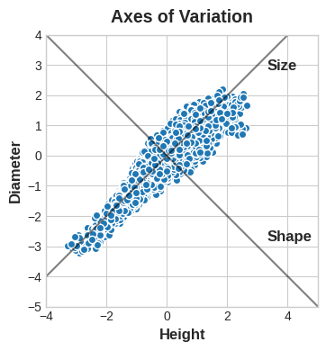
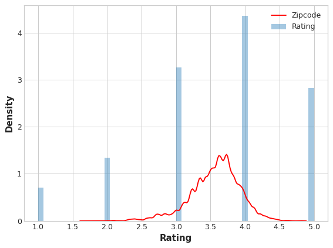

<center></center>
<p style="text-align: center; color:grey;"><i>Images from Unsplash</i></p>

> *Disclaimer: This article is my learning note from the courses I took from Kaggle.*

In this course, we will learn on how to:
- determine which features are the most important with mutual information
- invent new features in several real-world problem domains
- encode high-cardinality categoricals with a target encoding
- create segmentation features with k-means clustering
- decompose a dataset's variation into features with principal component analysis

## 1. Introduction
The reason we perform feature engineering is we want to make our data more suited to the problem at hand. Consider "apparent temperature" measures like the heat index and the wind chill. These quantities attempt to measure the perceived temperature to humans based on air temperature, humidity, and wind speed, things which we can measure directly. You could think of an apparent temperature as the result of a kind of feature engineering, an attempt to make the observed data more relevant to what we actually care about: how it actually feels outside!

For a feature to be useful, it needs to have a relationship with the target that the model can learn. For example, linear model can only learn linear relationship. So, when using a linear model, your goal is to transform the features to make their relationship to the target linear.

Let's say we square the `Length` feature to get `Area`, however, we create a linear relationship. Adding `Area` to the feature set means this linear model can now fit a parabola. Squaring a feature, in other words, gave the linear model the ability to fit squared features.

<center></center>
<p style="text-align: center; color:grey;"><i>We can see that the model fit the are and length feature well</i></p>

### 1.1 Example
We will use the concrete dataset for this section. We'll first establish a baseline by training the model on the un-augmented dataset. This will help us determine whether our new features are actually useful.

Establishing baselines like this is good practice at the start of the feature engineering process. A baseline score can help you decide whether your new features are worth keeping, or whether you should discard them and possibly try something else.

```py
X = df.copy()
y = X.pop("CompressiveStrength")

# Train and score baseline model
baseline = RandomForestRegressor(criterion="absolute_error", random_state=0)
baseline_score = cross_val_score(
    baseline, X, y, cv=5, scoring="neg_mean_absolute_error"
)
baseline_score = -1 * baseline_score.mean()

print(f"MAE Baseline Score: {baseline_score:.4}")
```

If you ever cook at home, you might know that the ratio of ingredients in a recipe is usually a better predictor of how the recipe turns out than their absolute amounts. We might reason then that ratios of the features above would be a good predictor of `CompressiveStrength`.

The cell below adds three new ratio features to the dataset. The output in fact, shows the performance of our model improved:

```py
X = df.copy()
y = X.pop("CompressiveStrength")

# Create synthetic features
X["FCRatio"] = X["FineAggregate"] / X["CoarseAggregate"]
X["AggCmtRatio"] = (X["CoarseAggregate"] + X["FineAggregate"]) / X["Cement"]
X["WtrCmtRatio"] = X["Water"] / X["Cement"]

# Train and score model on dataset with additional ratio features
model = RandomForestRegressor(criterion="absolute_error", random_state=0)
score = cross_val_score(
    model, X, y, cv=5, scoring="neg_mean_absolute_error"
)
score = -1 * score.mean()

print(f"MAE Score with Ratio Features: {score:.4}")
```

## 2. Mutual Information
Let's say you encounter a dataset with hundreds or even thousands of features, it can be overwhelming to think of where should we choose to begin our study. A great option that we can choose is to construct a ranking with feature utility metric - to measure the associations between a feature and a target. Then, we can choose a smaller set of the most useful features to develop our initial model. 

Such metric is known as mutual information - it is a lot like correlation that measures the relationship between two quantities. The good thing is mutual information can detect any kind of relationship, but for correlation, it is only for linear relationship. 

Mutual information describes relationship in terms of uncertainty. For two quantities, it is a measure of the extent to which knowledge of one quantity reduces uncertainty about the other. If we know the value of a feature, how much more confident can we get about the target.

<center></center>
<p style="text-align: center; color:grey;"><i></i></p>

From the above image, it seems that knowing the value of `ExterQual` should make you more certain about the corresponding `SalePrice` -- each category of `ExterQual` tends to concentrate `SalePrice` to within a certain range. The mutual information that `ExterQual` has with `SalePrice` is the average reduction of uncertainty in `SalePrice` taken over the four values of `ExterQual`. Since `Fair` occurs less often than `Typical`, for instance, `Fair` gets less weight in the MI score.

The least possible mutual information between quantities is 0.0. When MI is zero, the quantities are independent: neither can tell you anything about the other. Conversely, in theory there's no upper bound to what MI can be. In practice though values above 2.0 or so are uncommon

<center></center>
<p style="text-align: center; color:grey;"><i></i></p>

Note:
- MI can help you to understand the relative potential of a feature as a predictor of the target, considered by itself.
- It's possible for a feature to be very informative when interacting with other features, but not so informative all alone. MI can't detect interactions between features. It is a univariate metric.
- The actual usefulness of a feature depends on the model you use it with. A feature is only useful to the extent that its relationship with the target is one your model can learn. Just because a feature has a high MI score doesn't mean your model will be able to do anything with that information. You may need to transform the feature first to expose the association.

### 2.1 Example
Now we have an automobile dataset with a few features related to cars. Here's how we can compute the MI score for the dataset:

The `scikit-learn` algorithm for MI treats discrete features differently from continuous features. Consequently, you need to tell it which are which. As a rule of thumb, anything that must have a float `dtype` is not discrete. Categoricals (object or categorial `dtype`) can be treated as discrete by giving them a label encoding. 

```py
X = df.copy()
y = X.pop("price")

# Label encoding for categoricals
for colname in X.select_dtypes("object"):
    X[colname], _ = X[colname].factorize()

# All discrete features should now have integer dtypes (double-check this before using MI!)
discrete_features = X.dtypes == int
```

```py
from sklearn.feature_selection import mutual_info_regression

def make_mi_scores(X, y, discrete_features):
    mi_scores = mutual_info_regression(X, y, discrete_features=discrete_features)
    mi_scores = pd.Series(mi_scores, name="MI Scores", index=X.columns)
    mi_scores = mi_scores.sort_values(ascending=False)
    return mi_scores

mi_scores = make_mi_scores(X, y, discrete_features)
mi_scores[::3]  # show a few features with their MI scores
```

```
curb_weight          1.540126
highway_mpg          0.951700
length               0.621566
fuel_system          0.485085
stroke               0.389321
num_of_cylinders     0.330988
compression_ratio    0.133927
fuel_type            0.048139
Name: MI Scores, dtype: float64
```

Let's visualize the above output with a bar plot:
```py
def plot_mi_scores(scores):
    scores = scores.sort_values(ascending=True)
    width = np.arange(len(scores))
    ticks = list(scores.index)
    plt.barh(width, scores)
    plt.yticks(width, ticks)
    plt.title("Mutual Information Scores")


plt.figure(dpi=100, figsize=(8, 5))
plot_mi_scores(mi_scores)
```

<center></center>
<p style="text-align: center; color:grey;"><i>W</i></p>

As we might expect, the high-scoring `curb_weight` feature exhibits a strong relationship with `price`, the target.

```py
sns.relplot(x="curb_weight", y="price", data=df);
```

<center></center>
<p style="text-align: center; color:grey;"><i></i></p>

The `fuel_type` feature has a fairly low MI score, but as we can see from the figure, it clearly separates two price populations with different trends within the horsepower feature. This indicates that fuel_type contributes an interaction effect and might not be unimportant after all. Before deciding a feature is unimportant from its MI score, it's good to investigate any possible interaction effects -- domain knowledge can offer a lot of guidance here.

```py
sns.lmplot(x="horsepower", y="price", hue="fuel_type", data=df);
```

<center></center>
<p style="text-align: center; color:grey;"><i></i></p>

## 3. Creating Features
In the Automobile dataset are features describing a car's engine. Research yields a variety of formulas for creating potentially useful new features. The "stroke ratio", for instance, is a measure of how efficient an engine is versus how performant:

```py
autos["stroke_ratio"] = autos.stroke / autos.bore

autos[["stroke", "bore", "stroke_ratio"]].head()
```

The more complicated a combination is, the more difficult it will be for a model to learn, like this formula for an engine's "displacement", a measure of its power:

```py
autos["displacement"] = (
    np.pi * ((0.5 * autos.bore) ** 2) * autos.stroke * autos.num_of_cylinders
)
```

We can use data visualization to get an idea on how to perform transformation (using powers or logarithms). For example, the distribution of `WindSpeed` in US Accidents is highly skewed, we can perform a log-transformation:

```py
# If the feature has 0.0 values, use np.log1p (log(1+x)) instead of np.log
accidents["LogWindSpeed"] = accidents.WindSpeed.apply(np.log1p)

# Plot a comparison
fig, axs = plt.subplots(1, 2, figsize=(8, 4))
sns.kdeplot(accidents.WindSpeed, shade=True, ax=axs[0])
sns.kdeplot(accidents.LogWindSpeed, shade=True, ax=axs[1]);
```

<center></center>
<p style="text-align: center; color:grey;"><i></i></p>

### 3.1 Counts
When the have features describing the presence or absence of something, they often come in sets, we can aggregate them by creating a count:

In Traffic Accidents are several features indicating whether some roadway object was near the accident. This will create a count of the total number of roadway features nearby using the sum method:

```py
roadway_features = ["Amenity", "Bump", "Crossing", "GiveWay",
    "Junction", "NoExit", "Railway", "Roundabout", "Station", "Stop",
    "TrafficCalming", "TrafficSignal"]
accidents["RoadwayFeatures"] = accidents[roadway_features].sum(axis=1)

accidents[roadway_features + ["RoadwayFeatures"]].head(10)
```

In the Concrete dataset are the amounts of components in a concrete formulation. Many formulations lack one or more components (that is, the component has a value of 0). This will count how many components are in a formulation with the dataframe's built-in greater-than gt method:

```py
components = [ "Cement", "BlastFurnaceSlag", "FlyAsh", "Water",
               "Superplasticizer", "CoarseAggregate", "FineAggregate"]
concrete["Components"] = concrete[components].gt(0).sum(axis=1)

concrete[components + ["Components"]].head(10)
```

### 3.2 Building-Up & Breaking Down Features
Often you'll have complex strings that can usefully be broken into simpler pieces. Some common examples:
```
ID numbers: '123-45-6789'
Phone numbers: '(999) 555-0123'
```

Features like these will often have some kind of structure that you can make use of. US phone numbers, for instance, have an area code (the '(999)' part) that tells you the location of the caller

`str` accessor lets you apply string methods like split directly to columns. The Customer Lifetime Value dataset contains features describing customers of an insurance company. From the Policy feature, we could separate the Type from the Level of coverage:

```py
customer[["Type", "Level"]] = (  # Create two new features
    customer["Policy"]           # from the Policy feature
    .str                         # through the string accessor
    .split(" ", expand=True)     # by splitting on " "
                                 # and expanding the result into separate columns
)

customer[["Policy", "Type", "Level"]].head(10)
```

Of course, we can join simple features into a composed feature if there was some interaction in the combination:

```py
autos["make_and_style"] = autos["make"] + "_" + autos["body_style"]
autos[["make", "body_style", "make_and_style"]].head()
```

### 3.3 Group Transform
Group transform aggregate infromation across multiple rows grouped by some category. We can create features like "the average income of a person's state of residence," or "the proportion of movies released on a weekday, by genre.".

Using an aggregation function, a group transform combines two features: a categorical feature that provides the grouping and another feature whose values you wish to aggregate. For an "average income by state", you would choose State for the grouping feature, mean for the aggregation function, and Income for the aggregated feature. To compute this in Pandas, we use the groupby and transform methods:

```py
customer["AverageIncome"] = (
    customer.groupby("State")  # for each state
    ["Income"]                 # select the income
    .transform("mean")         # and compute its mean
)

customer[["State", "Income", "AverageIncome"]].head(10)
```

Here's a function to create a `DataFrame` that calculate the frequency with which each state occurs in the dataset:

```py
customer["StateFreq"] = (
    customer.groupby("State")
    ["State"]
    .transform("count")
    / customer.State.count()
)

customer[["State", "StateFreq"]].head(10)
```

If you're using training and validation splits, to preserve their independence, it's best to create a grouped feature using only the training set and then join it to the validation set. We can use the validation set's merge method after creating a unique set of values with drop_duplicates on the training set:

```py
# Create splits
df_train = customer.sample(frac=0.5)
df_valid = customer.drop(df_train.index)

# Create the average claim amount by coverage type, on the training set
df_train["AverageClaim"] = df_train.groupby("Coverage")["ClaimAmount"].transform("mean")

# Merge the values into the validation set
df_valid = df_valid.merge(
    df_train[["Coverage", "AverageClaim"]].drop_duplicates(),
    on="Coverage",
    how="left",
)

df_valid[["Coverage", "AverageClaim"]].head(10)
```

## 4. Clustering with K-means
Clustering means the assigning of data points to group based on how similar the points are to each other. In feature engineering, we attempt to discover groups of customers representing a market segment or geographic area that share similar weather patterns. By adding a feature of cluster labels, it helps machine learning models untangle complicated relationships of space and proximity. 

<center></center>
<p style="text-align: center; color:grey;"><i></i></p>

`Cluster` is a categorical variable. The motivating idea for adding cluster labels is that the clusters will break up complicated relationships across features into simpler chunks. Our model can then just learn the simpler chunks one-by-one instead having to learn the complicated whole all at once. It's a "divide and conquer" strategy.

<center></center>
<p style="text-align: center; color:grey;"><i>Clustering the YearBuilt feature helps this linear model learn its relationship to SalePrice.</i></p>

The figure shows how clustering can improve a simple linear model. The curved relationship between the YearBuilt and SalePrice is too complicated for this kind of model -- it underfits. On smaller chunks however the relationship is almost linear, and that the model can learn easily.

### 4.1 k-Means Clustering
K-means clustering measures similarity using ordinary straight-line distance (Euclidean distance, in other words). It creates clusters by placing a number of points, called centroids, inside the feature-space. Each point in the dataset is assigned to the cluster of whichever centroid it's closest to. The "k" in "k-means" is how many centroids (that is, clusters) it creates. You define the k yourself.

You could imagine each centroid capturing points through a sequence of radiating circles. When sets of circles from competing centroids overlap they form a line. The result is what's called a Voronoi tessallation. The tessallation shows you to what clusters future data will be assigned; the tessallation is essentially what k-means learns from its training data.

<center></center>
<p style="text-align: center; color:grey;"><i></i></p>

The k-means algorithm:
- Randomly initialize some predefined number of centroids
- Assign points to the nearest cluster centroid
- Move each centroid to minimize the distance to its point
- Iterate from second step until centroid not moving anymore

### 4.2 Example
As spatial features, California Housing's 'Latitude' and 'Longitude' make natural candidates for k-means clustering. Since k-means clustering is sensitive to scale, it can be a good idea rescale or normalize data with extreme values. Our features are already roughly on the same scale, so we'll leave them as-is.

```py
# Create cluster feature
kmeans = KMeans(n_clusters=6)
X["Cluster"] = kmeans.fit_predict(X)
X["Cluster"] = X["Cluster"].astype("category")

X.head()
```

Let's see the cluster on a plot:

```py
sns.relplot(
    x="Longitude", y="Latitude", hue="Cluster", data=X, height=6,
);
```

<center></center>
<p style="text-align: center; color:grey;"><i></i></p>

Let's compare the distributions of the target within each cluster using box-plot. 

> If the clustering is informative, these distributions should, for the most part, separate across `MedHouseVal`, which is indeed what we see.

```py
X["MedHouseVal"] = df["MedHouseVal"]
sns.catplot(x="MedHouseVal", y="Cluster", data=X, kind="boxen", height=6);
```

<center></center>
<p style="text-align: center; color:grey;"><i></i></p>

## 5. Principal Component Analysis (PCA)
PCA is typically applied to standardized data. With standardized data "variation" means "correlation". With unstandardized data "variation" means "covariance". All data in this section will be standardized before applying PCA.

In the Abalone dataset are physical measurements taken from several thousand Tasmanian abalone. (An abalone is a sea creature much like a clam or an oyster.) We'll just look at a couple features for now: the 'Height' and 'Diameter' of their shells.

<center></center>
<p style="text-align: center; color:grey;"><i></i></p>

We can think that in this data, there are axes of variation that describe the ways the abalone tend to differ from one to another. We can give names to these axes of variation. The longer axis we might call the "Size" component: small height and small diameter (lower left) contrasted with large height and large diameter (upper right). The shorter axis we might call the "Shape" component: small height and large diameter (flat shape) contrasted with large height and small diameter (round shape).

Of course, we can also describe the abalone with size and shape. The whole idea of PCA: instead of describing the data with the original features, we describe it with its axes of variation. The axes of variation become the new features.

<center></center>
<p style="text-align: center; color:grey;"><i></i></p>

In fact these new features are actually just linear combinations of the original features:

```
df["Size"] = 0.707 * X["Height"] + 0.707 * X["Diameter"]
df["Shape"] = 0.707 * X["Height"] - 0.707 * X["Diameter"]
```

The size and shape features are known as the principal components of the data. The weights are called loadings. There will be as many principal components as there are features in the original dataset: if we had used ten features instead of two, we would have ended up with ten components.

Moreover, PCA also tells us the amount of variation in each component:

<center></center>
<p style="text-align: center; color:grey;"><i></i></p>

The Size component captures the majority of the variation between Height and Diameter. It's important to remember, however, that the amount of variance in a component doesn't necessarily correspond to how good it is as a predictor: it depends on what you're trying to predict.

### 5.1 PCA for Feature Engineering
We can use PCA for feature engineering in two ways. First, we can use it as a descriptive technique. Since the components tell you about the variation, you could compute the MI scores for the components and see what kind of variation is most predictive of your target. That could give you ideas for kinds of features to create -- a product of 'Height' and 'Diameter' if 'Size' is important, say, or a ratio of 'Height' and 'Diameter' if Shape is important. You could even try clustering on one or more of the high-scoring components.

On the other hand, we can use the components themselves as features. Because the components expose the variational structure of the data directly, they can often be more informative than the original features. Here are some use-cases:

- Dimensionality reduction: When your features are highly redundant (multicollinear, specifically), PCA will partition out the redundancy into one or more near-zero variance components, which you can then drop since they will contain little or no information.
- Anomaly detection: Unusual variation, not apparent from the original features, will often show up in the low-variance components. These components could be highly informative in an anomaly or outlier detection task.
- Noise reduction: A collection of sensor readings will often share some common background noise. PCA can sometimes collect the (informative) signal into a smaller number of features while leaving the noise alone, thus boosting the signal-to-noise ratio.
- Decorrelation: Some ML algorithms struggle with highly-correlated features. PCA transforms correlated features into uncorrelated components, which could be easier for your algorithm to work with.

### 5.2 Example
We will use the Automobile dataset from previous study and apply PCA to discover some features from the dataset:

```py
features = ["highway_mpg", "engine_size", "horsepower", "curb_weight"]

X = df.copy()
y = X.pop('price')
X = X.loc[:, features]

# Standardize
X_scaled = (X - X.mean(axis=0)) / X.std(axis=0)
```

Now we can fit scikit-learn's PCA estimator and create the principal components. You can see here the first few rows of the transformed dataset.

```py
from sklearn.decomposition import PCA

# Create principal components
pca = PCA()
X_pca = pca.fit_transform(X_scaled)

# Convert to dataframe
component_names = [f"PC{i+1}" for i in range(X_pca.shape[1])]
X_pca = pd.DataFrame(X_pca, columns=component_names)

X_pca.head()
```

After fitting, the PCA instance contains the loadings in its components_ attribute. (Terminology for PCA is inconsistent, unfortunately. We're following the convention that calls the transformed columns in X_pca the components, which otherwise don't have a name.) We'll wrap the loadings up in a dataframe.

```py
loadings = pd.DataFrame(
    pca.components_.T,  # transpose the matrix of loadings
    columns=component_names,  # so the columns are the principal components
    index=X.columns,  # and the rows are the original features
)
loadings
```

```
	         PC1	        PC2	        PC3	        PC4
highway_mpg	 -0.492347	0.770892	0.070142	-0.397996
engine_size	 0.503859	0.626709	0.019960	0.594107
horsepower	 0.500448	0.013788	0.731093	-0.463534
curb_weight	 0.503262	0.113008	-0.678369	-0.523232
```
Recall that the signs and magnitudes of a component's loadings tell us what kind of variation it's captured. The first component (PC1) shows a contrast between large, powerful vehicles with poor gas milage, and smaller, more economical vehicles with good gas milage. We might call this the "Luxury/Economy" axis. The next figure shows that our four chosen features mostly vary along the Luxury/Economy axis.

```py
# Look at explained variance
plot_variance(pca);
```

<center></center>
<p style="text-align: center; color:grey;"><i></i></p>

Let's check the MI score of the components. 

```py
mi_scores = make_mi_scores(X_pca, y, discrete_features=False)
mi_scores
```

```
PC1    1.013264
PC2    0.379156
PC3    0.306703
PC4    0.203329
Name: MI Scores, dtype: float64
```

PC1 is highly informative, though the remaining components, despite their small variance, still have a significant relationship with price. Examining those components could be worthwhile to find relationships not captured by the main Luxury/Economy axis.

PC3 shows a contrast between horsepower and curb_weight -- sports cars vs. wagons, it seems.

```py
# Show dataframe sorted by PC3
idx = X_pca["PC3"].sort_values(ascending=False).index
cols = ["make", "body_style", "horsepower", "curb_weight"]
df.loc[idx, cols]
```

```
    make	body_style	horsepower	curb_weight
118	porsche	hardtop	    207	        2756
117	porsche	hardtop	    207	        2756
119	porsche	convertible	207	        2800
45	jaguar	sedan	    262	        3950
96	nissan	hatchback	200	        3139
```

We will create a new ratio features from this:

```py
df["sports_or_wagon"] = X.curb_weight / X.horsepower
sns.regplot(x="sports_or_wagon", y='price', data=df, order=2);
```

<center></center>
<p style="text-align: center; color:grey;"><i></i></p>

## 6. Target Encoding
A target encoding is any kind of encoding that replaces a feature's categories with some number derived from the target.

```py
autos["make_encoded"] = autos.groupby("make")["price"].transform("mean")

autos[["make", "price", "make_encoded"]].head(10)
```

From the above code, we are performing a mean encoding to the dataset. We can do this to a binary dataset as well - and we call it as bin counting.

Target encoding for the above example presents a couple of problems, however. First are unknown categories. Target encodings create a special risk of overfitting, which means they need to be trained on an independent "encoding" split. When you join the encoding to future splits, Pandas will fill in missing values for any categories not present in the encoding split. These missing values you would have to impute somehow.

Moreover, for rare categories. When a category only occurs a few times in the dataset, any statistics calculated on its group are unlikely to be very accurate. In the Automobiles dataset, the mercury make only occurs once. The "mean" price we calculated is just the price of that one vehicle, which might not be very representative of any Mercuries we might see in the future. Target encoding rare categories can make overfitting more likely.

To avoid the above issues, we need to apply smoothing. That is, to blend in-category average with the overall average. 

```
encoding = weight * in_category + (1 - weight) * overall
```

So how do we compute for the weight? We can do it by computing the m-estimate. 

```
weight = n / (n + m)
```

`n` is the total number of times that category occurs in the data. The parameter m determines the "smoothing factor". Larger values of m put more weight on the overall estimate.

<center></center>
<p style="text-align: center; color:grey;"><i></i></p>

Let's say in the Automobile dataset and there are 3 cars with the make of `chevrolet`. For m = 2, `chevrolet` category would be encoded with 60% of the average Chevrelot price and 40% of the overall average price. 

> When choosing a value for m, consider how noisy you expect the categories to be. Does the price of a vehicle vary a great deal within each make? Would you need a lot of data to get good estimates? If so, it could be better to choose a larger value for m; if the average price for each make were relatively stable, a smaller value could be okay.

Benefits of Target Encoding:
- High-cardinality features: 
    - A feature with many categories can be troublesome to encode: a one-hot encoding would generate too many features and alternatives, like a label encoding, might not be appropriate for that feature. A target encoding derives numbers for the categories using the feature's most important property: its relationship with the target.
- Domain-motivated features: 
    - From prior experience, you might suspect that a categorical feature should be important even if it scored poorly with a feature metric. A target encoding can help reveal a feature's true informativeness.

### 6.1 Example
In this final example, we will be using `MovieLens1M` dataset with one-million movie rating by users of the MovieLens website. With over 3000 categories, the Zipcode feature makes a good candidate for target encoding, and the size of this dataset (over one-million rows) means we can spare some data to create the encoding.

```py
# 25% split to train the encoder
X = df.copy()
y = X.pop('Rating')

X_encode = X.sample(frac=0.25)
y_encode = y[X_encode.index]
X_pretrain = X.drop(X_encode.index)
y_train = y[X_pretrain.index]
```

```py
from category_encoders import MEstimateEncoder

# Create the encoder instance. Choose m to control noise.
encoder = MEstimateEncoder(cols=["Zipcode"], m=5.0)

# Fit the encoder on the encoding split.
encoder.fit(X_encode, y_encode)

# Encode the Zipcode column to create the final training data
X_train = encoder.transform(X_pretrain)
```

Now we want to compare the encoded values to the target to see how informative it is:

```py
plt.figure(dpi=90)
ax = sns.distplot(y, kde=False, norm_hist=True)
ax = sns.kdeplot(X_train.Zipcode, color='r', ax=ax)
ax.set_xlabel("Rating")
ax.legend(labels=['Zipcode', 'Rating']);
```

<center></center>
<p style="text-align: center; color:grey;"><i></i></p>

We can see that the distribution of the encoded Zipcode feature roughly follows the distribution of the actual ratings, meaning that movie-watchers differed enough in their ratings from zipcode to zipcode that our target encoding was able to capture useful information.