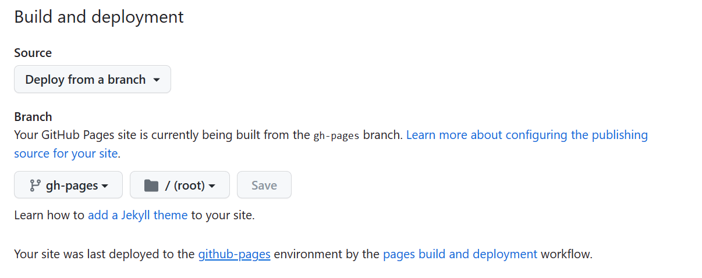

<center></center>
<p style="text-align: center; color:grey;"><i>Images from Unsplash</i></p>

[MkDocs](https://www.mkdocs.org/) is a fast, simple and downright gorgeous static site generator that's geared towards building project documentation. With source files in Markdown configured with a `YAML` configuration, site can be easily generated and deployed. [Material for Mkdocs](https://squidfunk.github.io/mkdocs-material/getting-started/) is build on top of Mkdocs, and it is targeted for project documentation with a set of powerful and beautiful documentation framework. Let's go through how the site below is built:

<center></center>
<p style="text-align: center; color:grey;"><i>My created site</i></p>

## Getting Started
Let's create a folder and open it using VS Code (File > Open Folder). Then using `pip` we can install `mkdocs-material` to our machine:

```py
pip install mkdocs-material
```

Before we are ready to start creating content for our site, we need to load some files from Material for Mkdocs:

```py
py -m mkdocs new folderpath
```

Below files will be created:

```py
yourfolder
    - docs
        - index.md
    - mkdocs.yml
```

### Configure Your Site
To configure your site, you can refer to some references [here](https://squidfunk.github.io/mkdocs-material/creating-your-site/), here's some code for you to start quickly and you can then make changes whenever you see fit:

```py
# site info
site_name: WEBSITE_NAME
site_url: ""
site_author: 'YOUR NAME'
site_description: 'YOUR DESCRIPTION'

# site theme
theme:
  name: material
  palette:
    primary:  lime
    accent: black
  plugins:
    - search:
      lang: en
  features:
    - navigation.footer
    - content.code.copy
  logo: assets/logo.png
  favicon: assets/favicon.png

# add repository
repo_url: YOUR GIT REPO LINK
repo_name: GITUSERNAME/GITREPONAME

# copyright
copyright: PACKAGE NAME &copy; 2023 YOUR NAME

# social links
extra:
  social:
  - icon: fontawesome/brands/github
    link: 
  - icon: fontawesome/brands/medium
    link: 
  - icon: fontawesome/brands/linkedin
    link: 
  - icon: fontawesome/brands/instagram
    link:
  - icon: fontawesome/brands/twitter
    link: 

```

You can also type something inside the `index.md` file, for example:

```
# Lorem Ipsum

> Vitae suscipit tellus mauris a. Euismod nisi porta lorem mollis. 

Lorem ipsum dolor sit amet, consectetur adipiscing elit, sed do eiusmod tempor incididunt ut labore et dolore magna aliqua. Ut enim ad minim veniam, quis nostrud exercitation ullamco laboris nisi ut aliquip ex ea commodo consequat. 
 - Duis aute irure dolor in reprehenderit in voluptate velit esse cillum dolore eu fugiat nulla pariatur. 
 - Excepteur sint occaecat cupidatat non proident, sunt in culpa qui officia deserunt mollit anim id est laborum.
```

To see how the content looks like on your site, type in terminal:

```py
py -m mkdocs serve
```

A link will pop up and direct you to your site you have just created. 

## Publish As GitHub Page
If you want to put this site online, you can use [GitHub](https://github.com/) to do that. Let's start by creating an empty repository on GitHub and upload your files there:

```py
# first commit for empty repo
echo "#reponame" >> README.md
git init
git add README.md
git commit -m "first commit"
git branch -M main
git remote add origin https://github.com/username/reponame.git
git push -u origin main

# second commit and upload your package
git add .
git commit -m "second commit"
git push
```

Then go to the repository page and create a new branch called `gh-pages`:

<center></center>

Then go to Settings. You need to do two things here:
1. Go to Page and add the `gh-pages` branch that you created just now to `Build and Deployment`
   
<center></center>

2. Go to Actions > General and change the Workflow permissions to `Read and write perission`

<center></center>

Then let's get back to Visual Studio Code where you work with your website, you need to create a file that look like this:

```
- docs
- mkdocs.yml
- .github
    - workflows
        - ci.yml
```

Then in `ci.yml` paste this into the file:

```py
name: ci 
on:
  push:
    branches:
      - master 
      - main
permissions:
  contents: write
jobs:
  deploy:
    runs-on: ubuntu-latest
    steps:
      - uses: actions/checkout@v3
      - uses: actions/setup-python@v4
        with:
          python-version: 3.x
      - run: echo "cache_id=$(date --utc '+%V')" >> $GITHUB_ENV 
      - uses: actions/cache@v3
        with:
          key: mkdocs-material-${{ env.cache_id }}
          path: .cache
          restore-keys: |
            mkdocs-material-
      - run: pip install mkdocs-material 
      - run: mkdocs gh-deploy --force
```

Once you push the changes to your repository, you can go to the Actions tab, and you can see your website link is being created under **pages build and deployment**!

<center></center>