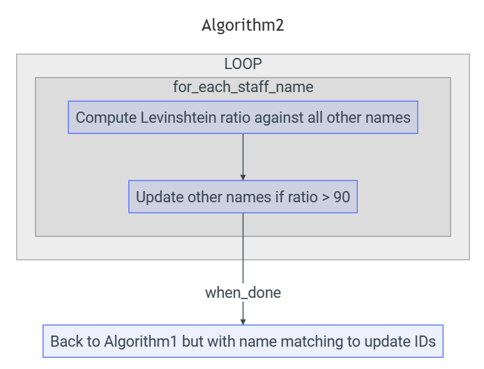
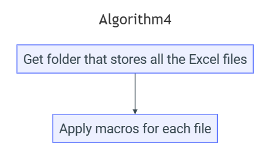
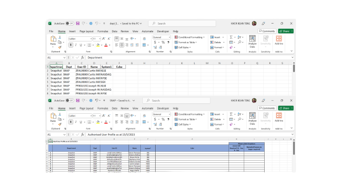
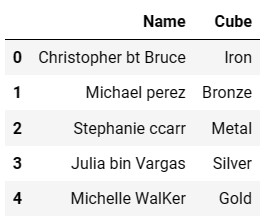
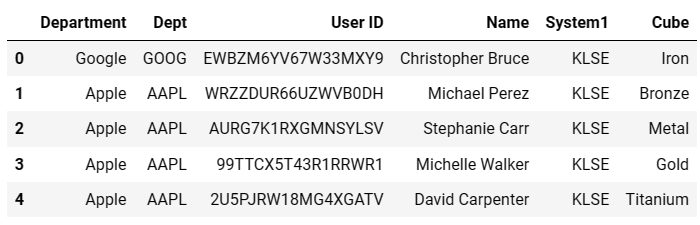
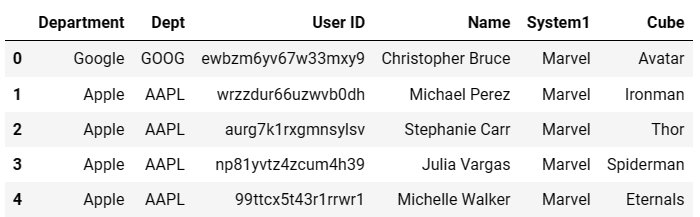

<center></center>
<p style="text-align: center; color:grey;"><i>Images from Unsplash</i></p>

> *[BlueAutomata](https://github.com/keanteng/blueautomata), MIT Licensed © Kean Teng 2023*

## 0. Introduction

Reporting is a crucial aspect of various sectors across industries to ensure transparency, compliance, decision-making, and accountability. It helps in decision-making to build trust, manage risk and informed decision. Generally, workflows for reporting involves gathering raw data, cleaning of raw data and compiling raw data into their respective template using Microsoft Excel. This can be a repetitive and routine tasks in large organization which is time-consuming and mistake-prone when dealing with large number of raw data during these processes due to human errors.

`blueautomata` is a Python package built to provide a framework to automate the workflow for reporting in a company. Such framework allows you to automate the data cleaning, data compilation and data preparation in reportable format on Excel by auto-calling written macros processes. 

The package can be installed by writing:

```py
pip install blueautomata
```

## 1. A Case Study

### A New Manager

In the year 2055, a guy named Travis Umbrella become the Manager of LightSpeed Investment under the Department of Data Management. Previously, he works as the Manager under the Department of Investment. He is an adventurous person and dare to try something new, so when opportunities come, he decided to advance in the field of managing data to get some new perspective in his work.

In fact, Travis works in a weird company that might not exist on this planet because the company makes investment in a weird way but with a high return. The company gives stocks to the employee so that they can sell in stock markets, around the world.

For each employee, they can only receive one type of stock like Google `GOOG`, but they are allowed to sell in a few markets such as New York Stock Exchange `NYSE` and Hong Kong Stock Exchange `HKSE`. Every month, Travis needs to submit a report for auditing where he needs to track down the employees stock holding type and the market that they sell their stock. LightSpeed Investment is a fast-moving company, where employees come and go staying less than 3 months. So at the end of the month when Travis submits his report he has to make sure that employees that resigned should not be included in his report.

### Time To Act
For Travis to complete his report he would first need to get hold of the stocks' data that are traded by the firms' employees in worldwide stock markets. He then stored the transactions record for each stock market in an individual file for reference. Since there is no well-build system for the data collection, each of the file looks different, some contains more columns than the other, some with missing information such as employees' name and some even contains wrong employee IDs, wrong employee names and outdated information.

Travis realizes that he must find some other data to validate his collected data, so he reached out to his friend, James Claude Diamond from the Human Resources Department to get the latest copy of the staff data where it contains the staff's assigned stocks and stock market that they can sell their stock. He also compiles a copy of checklist data by himself to match up the stock code and stock market code to their respective stock name and stock market name.

### Think Different

From an investment background, Travis is good at math and logical thinking. Of course, he knows for resigned employees their names will not be in the staff dataset. In fact, what he will do is he will match the staff ID from the stock market data he collected with the staff data to obtain information as follows:

- The staff's name
- The staff's assigned stock
- The staff's status (resigned or not)
- The staff's cube (type of options)

That approach, allows him to work quickly to compile the data he collects from the stock markets, what he will do then, is to create files for each stock category to see where they are traded around the world - of course with a nice looking template before submitting for audit review after the quarter ends!

### Pattern Finding
Travis is quick to find patterns in his collected raw data, he noticed that although there are empty cells about the staff name, department and department code, the staff ID is always recorded whenever transaction is performed. Of course, with the staff data on his hand, he can then learn about the stock that the staff used.

Moreover, although staff data does not tell him about the department code, but it does tell him the staff department name where he can then make reference to his checklist data for the department code. Well, he can also reference the cube code on his checklist for the name of the code.

<center></center>

## 2. A Notorious Case

Travis's idea is able processed most of his datasets. But there are some notorious dataset that puzzled him. He noticed that on one of the data he collected from `HKSE` the name of the staff does not match with the company staff directory, for example "Muhamad Ali bin Abu" is named as "Muhamad Ali Abu"; "Lucas Den Shi Ki" is named as "Lucas Shi Ki Den" and "Jeff Adrian" is named as "Jef aA_Drian". And in the dataset, there is no IDs column and only name column. 

To resolve this, he has to rely on a metric, called the [Levinshtein](https://en.wikipedia.org/wiki/Levenshtein_distance) ratio that computes the difference between two sequences. Generally if two sequences are exactly the same, the Levinshtein ratio will be 100 and when they gradually differ more in terms of arrangement and alphabets the ratio will decrease.

## 3. Towards The End

What he will do then is he will match all the names in the staff data against the similar names, if the Levinshtein ratio is higher than 90, then the similar names will be replaced with the names in the staff data.

<center></center>

With all the data being cleaned and labelled, Travis can now start to prepare for his reports. Since all the data are stored as one dataset, he would need to export it as individual Excel files for each stock category:

<center></center>

Now Travis gets all the files he wants, but these files are raw, he'll use VBA to add some formatting to them so that they look nice before submitting to his boss. The good news is he don't really need to do a loop to apply the macros he wrote because the macro can run on the entire specify folder:

<center></center>

Here is the output that Travis will get for each of his stock category, the picture showing the file before using macros and after using macros:

<center></center>

## 4. Real Applications

### `BlueAutomata`

`BlueAutomata` is a class that is build for data compilation workflow, the class takes in 5 parameters in the form of path and list. Let's look at an example of processing raw data in folders into a masterlist:

```py
from blueautomata.data_compilation import BlueAutomata

test = BlueAutomata(
    folder_path= 'PATH',
    checklist = 'PATH',
    staff_data = 'PATH',
    name_key= ['BSE', 'HKEX', 'KLSE', 'LSE1', 'NASDAQ', 'NYSE', 'SGX', 'SSE', 'TSE'],
    name_code= [1, 1, 1, 1, 1, 1, 1, 1, 1],
)
df = test.automata_execution()

# print the dataframe
df.head()
```

<center></center>
<p style="text-align: center; color:grey;"><i>Output, first five rows</i></p>

### `AutomataReport`

This package also provides function for you to take a preview at the output with a summary report based on your input parameter, for example:

```py
from blueautomata.automation_report import AutomataReport

test = AutomataReport(
    folder_path=r"C:\Users\Khor Kean Teng\Downloads\AUP Automata\data\fakesystem",
    checklist = 'data/checklist.xlsx',
    staff_data = 'data/fake_hr_data.xlsx',
    name_key= ['BSE', 'HKEX', 'KLSE', 'LSE1', 'NASDAQ', 'NYSE', 'SGX', 'SSE', 'TSE'],
    name_code= [1, 1, 1, 1, 1, 1, 1, 1, 1],
)
df = test.automata_report_summary()

# print the dataframe
df.head(n = len(df))
```

<center></center>
<p style="text-align: center; color:grey;"><i>Output, all possible matches and unmatches</i></p>

### `Inconsistency`

A special class named `Inconsistency` is created to deal with Excel file that:
- Does not have a User ID column
- Have a Name column, but the names are written in format different from the staff data. Even for files with only Name column and all the names are correct but no User ID, this class is still able to compile the data.
  
A wrong dataset example with only two columns:

<center></center>
<p style="text-align: center; color:grey;"><i>Wrong name column</i></p>

Let's apply this package to fix:

```py
from blueautomata.inconsistency import Inconsistency

test = Inconsistency(
    filepath="data/fakesystem/experiment/sample1.xlsx",
    staff_data="data/fake_hr_data.xlsx",
    checklist="data/checklist.xlsx",
    sheet_number=0,
)

df = test.fix_inconsistency()

df.head()
```

<center></center>
<p style="text-align: center; color:grey;"><i>Output, fixed name and granular</i></p>

### `SystemCubeChecker`

This package also contains a class called `SystemCubeChecker` to update the wrongly assigned system and cube. In other words, it will update the entries where the cube names are put as system names by moving the cube names to the cube column and re-assigning a system name to them.

<center></center>
<p style="text-align: center; color:grey;"><i>Data with wrong system columns</i></p>

Let's fix it:

```py
from blueautomata.system_cube import SystemCubeChecker

test = SystemCubeChecker(
masterlistpath = 'data/fakesystem/experiment/sample2.xlsx',
system_to_check= ['Avatar', 'Ironman', 'Thor', 'Spiderman', 'Eternals'],
cube_to_assign='Marvel'
)

df = test.system_cube_update()

df.head()
```
<center></center>
<p style="text-align: center; color:grey;"><i>Output, fixed system and cube columns</i></p>

### Others

A Function to export large datasets into individual files based on column category of `Department`:
```py
from blueautomata.batch_export import BatchExport

df = pd.read_excel('data/output.xlsx')

temp = BatchExport(
    destination='data/dept',
    masterlist= df,
)

temp.batch_export()
```

A function to call VBA macros within Excel:

```py
from blueautomata.to_vba import automate_vba

temp = automate_vba(
    filepath=r'C:\\Users\\user\\Downloads\\Automata\\vbanew.xlsm',
    macro = 'vbanew.xlsm!Module1.template' 
)
temp.templatetize()
```

## 5. References
1. Modified from https://keanteng.github.io/blueautomata/

## 6. Disclaimer
The case study is purely a creative endeavor to illustrate how this package is inspired and should not be interpreted as a representation of reality. Any opinions, beliefs, or ideologies expressed within the story do not reflect those of the author or any other entity mentioned herein.

It is a work of fiction. Names, characters, places, and incidents are the products of the author's imagination or are used fictitiously. Any resemblance to actual events, locales, or persons, living or dead, is entirely coincidental.


