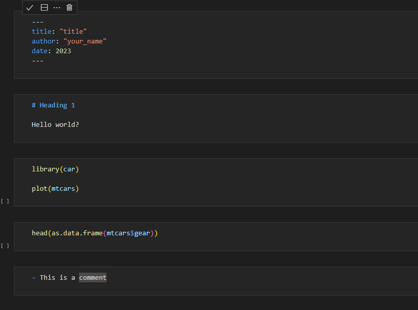
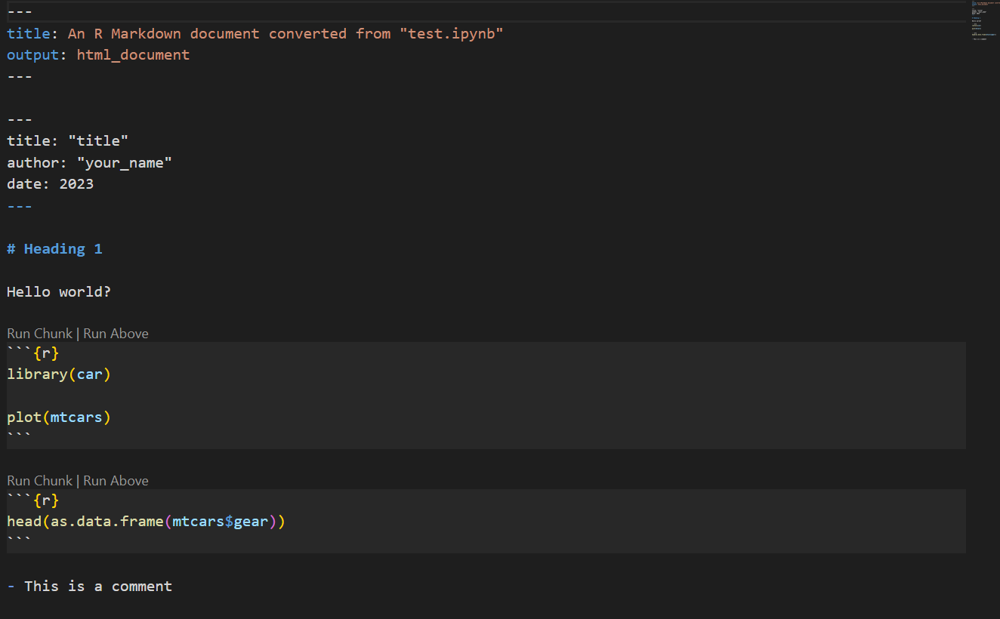
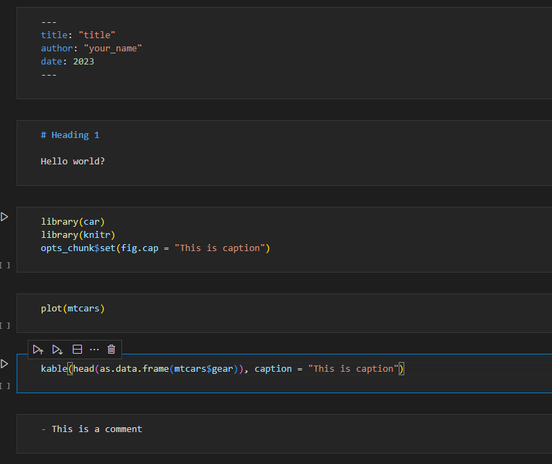
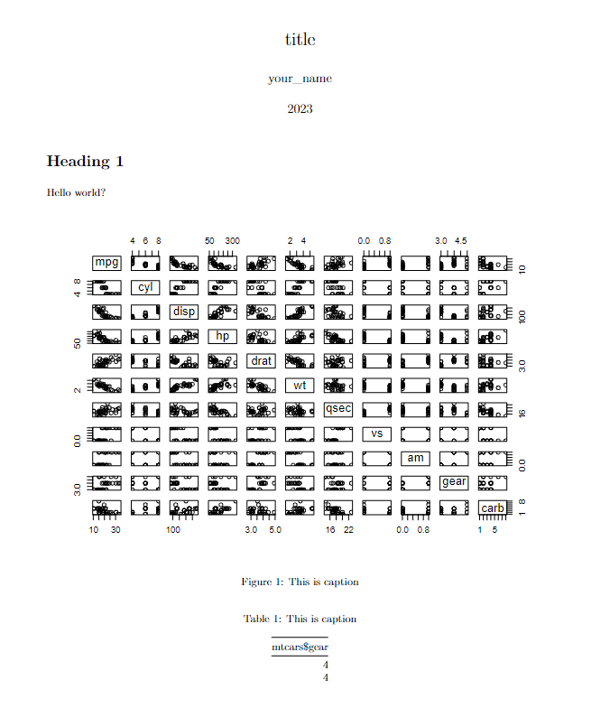

<center></center>
<p style="text-align: center; color:grey;"><i>Image from Unsplash</i></p>

[Jupyter notebook](https://jupyter.org/) is a great documentation option when it comes to writing R or Python code. Personally, I use Jupyter notebook together with [Visual Studio code](https://code.visualstudio.com/) a lot when it comes to data analysis and visualization work. But here's the catch, oftentimes, I could not share my work to others that use [RStudio](https://posit.co/download/rstudio-desktop/), since you need additional tool to render the Jupyter notebook and if your laptop does not configure Jupyter with R kernel properly, you cannot reproduce the result using R code written on Jupyter notebook. 

Today I will walk you through a simple program written in R that helps you to easily convert a Jupyter notebook written with R to a `RMarkdown` file and also a PDF output with visuals and visual numbering. 

## Get The Files Ready

For starter, you can prepare a Jupyter notebook with some R codes in it, notice there is also `yaml` code which will be used for the PDF formatting later:

<center></center>
<p style="text-align: center; color:grey;"><i></i></p>

The `yaml` code is written in box like this:

```yml
---
title:
author:
date:
---
```

You can also add more information to the `yaml` code, you can read more about it [here](https://bookdown.org/yihui/rmarkdown-cookbook/rmarkdown-anatomy.html): 

```yml
---
title: "Title"
subtitle: "Subtitle"
author:
  - Name^[Position, email]
abstract: "Blah * 3."
urlcolor: "blue"
date: 19-09-2023
---
```

## Conversion to RMarkdown
To convert this `ipynb` notebook to a `RMarkdown` file, we can use the `convert_ipynb()` function in the `rmarkdown` package. 

```r
rmarkdown::convert_ipynb('filename.ipynb')
```

After running the code, you will notice that a `filename.Rmd` file will be produced. You will notice that the file contains two `yml` sections, you can leave it as it is since only the one from your `ippynb` notebook will be read and used.

<center></center>
<p style="text-align: center; color:grey;"><i></i></p>

## Conversion to PDF

Now, to produce the PDF output from the `RMarkdown` file, we will need to perform some configurations. Here are some of the things we plan to do:

- Hide the input code, for our PDF output, we would like to see the output only
- Label the plot and table, we want to give our plots and tables some numbering with captions

In fact, there is also a problem about converting `RMarkdown` file to PDF format, sometimes the plot position will be incorrect as it will [jump to the other section](https://stackoverflow.com/questions/34145865/rmarkdown-image-skips-ahead-of-text). To resolve this problem, we will need a `tex` file to configure the output properly. 

By running the below code, we will produce a `PDF` version of our notebook without the input code. You can create a new `ipynb` notebook and run the code in it:

```r
# generate the RMarkdown file
rmarkdown::convert_ipynb('filename.ipynb')

# turn of showing the input code
knitr_options(
    opts_chunk = opts_chunk$set(echo = FALSE),
)

# convert Rmd to PDF, we also turn on the plot caption and numbering with some latex formatting
render(
    'filename.Rmd',
    pdf_document(fig_caption = TRUE, includes = includes(in_header = "my_header.tex")),
    clean = TRUE,
)
```

Notice that we also have a command `includes = includes(in_header = "my_header.tex")`, this code works to prevent the plot image to be improperly placed. You need to create a `.tex` file name `my_header` and paste this content into it:

```tex
\usepackage{float}
\let\origfigure\figure
\let\endorigfigure\endfigure
\renewenvironment{figure}[1][2] {
    \expandafter\origfigure\expandafter[H]
} {
    \endorigfigure
}
```

If you run the above code, you will notice that there is still no numbering for the table and plot. To allow numbering, we need to perform some workarounds:

For table output, we can use the `kable` function from the `knit` package, it allows us to convert the table into a `markdown` format with caption for rendering:

```r
kable(df, caption = "This is caption")
```

To write caption to out plot, it is simple, in the code chunk that produces plot, you can insert the below code:

```r
opts_chunk$set(fig.cap = "This is caption")
```

There are other configuration you can add to the `opts_chunk` function such as setting the plot width and height and more, you can check [here](https://yihui.org/knitr/options/#chunk-options).

These code should be written in the notebook that you want to render:

<center></center>
<p style="text-align: center; color:grey;"><i></i></p>

After running the conversion program, you can see the rendered PDF document based on your `ipynb` notebook. You can see that the plot and table are properly number and the plot position is also correct as it is:

<center></center>
<p style="text-align: center; color:grey;"><i></i></p>


