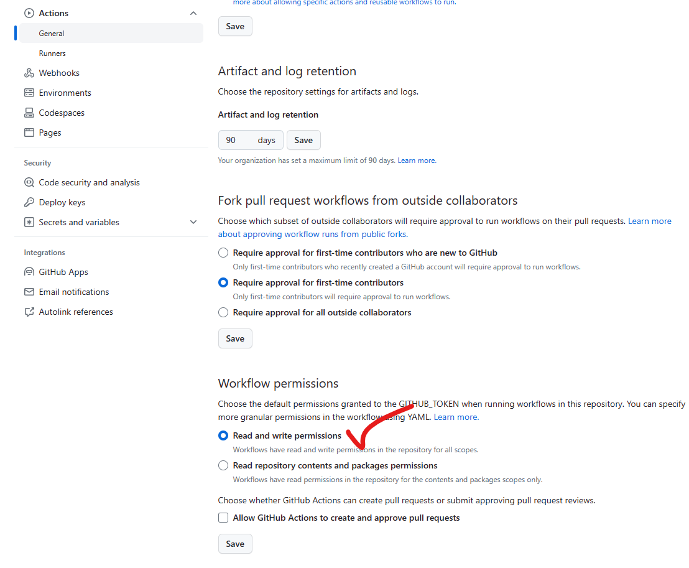

<p style="text-align: center; color:grey;"><i>Images from Unsplash</i></p>

> *This article aims to provide a comprehensive overview of how this site is set up and run.* 

## Pre-requisite 
There are a few things to prepare before your own site can be created, as follows:
- A [**GitHub**](https://github.com/) account
- Installed [**Microsoft Visual Studio Code**](https://code.visualstudio.com/download)
- Installed [**Git**](https://git-scm.com/downloads) 

After you create a GitHub account and installing the necessary software, we are ready to begin!

## Website Foundations Setup
The site that we are going to create will be based on [**Hugo**](https://gohugo.io/), an open-source site generators where it provides a framework for us to deploy a site with speed and ease. 

To build our website, we will need to install Hugo into our local machine. The installation process will be done on Windows Terminal with the support of [**Go**](https://go.dev/doc/install) language. Of course, you can also use other language such as chocolatey, scoop and winget. 

After installing go, here's how to install Hugo on terminal:
```yaml {linenos=true}
go install -tags extended github.com/gohugoio/hugo@latest
hugo version # check if you are using the latest version
```

With Hugo installed in our local system, we would like to now create the foundation or framework for our website. Here I encourage you to change your directory first, preferably to `\Desktop` so that you can access all your files easily:
```yaml {linenos=true}
cd C:\Users\Username\Desktop
hugo new site <your_site_name> -f yml 
```

Now change your directory again and create a page on your website:
```yaml {linenos=true}
cd <your_site_name>
hugo new docs/page.md
```

## Website Theme Setup
With the site foundation ready, we now add a theme or a specific design to our site for better functionality and appearance. You can check out different theme [**here**](https://themes.gohugo.io/), but in my case we will proceed with the [**PaperMode**](https://themes.gohugo.io/themes/hugo-papermod/) theme. 

Here we will use git to install the website theme:
```bash {linenos=true}
git init
git clone https://github.com/adityatelange/hugo-PaperMod themes/PaperMod --depth=1
git submodule add --depth=1 https://github.com/adityatelange/hugo-PaperMod.git themes/PaperMod
```
After that, navigate to GitHub to create an **empty repository** and head back to terminal where we need to link up our files with the repository created. Since we are using an empty repository, we need to create a first file, usually `README.md` to avoid causing any error:
```bash {linenos=true}
echo "# Test" >> README.md
git add README.md
git commit -m "Initial commit"
git branch -M main
git remote add origin https://github.com/YOUR-GIT-NAME/REPOSITORY-NAME.git
git push -u origin main
```

If you want to see how your website look like, you can deploy your site locally using Hugo. This is a good practice to check for error and website update before deploy your site publicly. Simply click the link or type 127.0.0.1 on your web browser:
```bash {linenos=true}
hugo server
```

## Website Deployment Workflow
Just now your were shown to deploy the site locally, now to do it publicly - meaning on the web, you need the support from GitHub workflow. 

Here we will need to create an additional directory and put in some codes into it:
```bash
mkdir -p .github/workflows
```

After creating this directory, create a file with name `deploy.yml` in the workflow folder. Then navigate these two files (your can use file explorer) and put in these codes:
- `config.yml`
    - After copying, change the first line `baseurl:` to the following format `"https://YOUR-NAME-ON-GITHUB.github.io/REPOSITORY-NAME/"`
```yaml {linenos=true}
copy the code from here (https://github.com/adityatelange/hugo-PaperMod/blob/exampleSite/config.yml)
```
- `deploy.yml`
```yaml {linenos=true}
name: Publish to GH Pages
on:
  push:
    branches:
      - main
  pull_request:

jobs:
  deploy:
    runs-on: ubuntu-latest
    steps:
      - name: Checkout source
        uses: actions/checkout@v3
        with:
          submodules: true

      - name: Checkout destination
        uses: actions/checkout@v3
        if: github.ref == 'refs/heads/main'
        with:
          ref: gh-pages
          path: built-site

      - name: Setup Hugo
        run: |
          curl -L -o /tmp/hugo.tar.gz 'https://github.com/gohugoio/hugo/releases/download/v0.110.0/hugo_extended_0.110.0_linux-amd64.tar.gz'
          tar -C ${RUNNER_TEMP} -zxvf /tmp/hugo.tar.gz hugo          
      - name: Build
        run: ${RUNNER_TEMP}/hugo

      - name: Deploy
        if: github.ref == 'refs/heads/main'
        run: |
          cp -R public/* ${GITHUB_WORKSPACE}/built-site/
          cd ${GITHUB_WORKSPACE}/built-site
          git add .
          git config user.name 'keanteng' # change to your username
          git config user.email 'u2004763@siswa.um.edu.my' # change to your email
          git commit -m 'Updated site'
          git push          
```

Before we link up our local files with the repository, you need to create a new branch on your repository called `git-pages` and you need to change the setting for GitHub actions. 


<p style="text-align: center; color:grey;"><i>Change the setting here</i></p>

## Final Step
For the last part of the website setup, we will link up our local files with the repository created so that we can view our site online:
```yaml {linenos=true}
git status
git add .
git commit -m "site update"
git push
```

Now, just head to GitHub actions and click on pages build and deployment, and click on your website link on the web!


<p style="text-align: center; color:grey;"><i>Click on the link to view your site</i></p>

## Acknowledgement ✨
I would like to thank [Hugo](https://gohugo.io/) and [PaperMode](https://github.com/adityatelange/hugo-PaperMod) for empowering me with the tool and foundations to build such a beautiful and impressive site. I want to thank [dhij](https://www.youtube.com/watch?v=_QSr2_pxIJs&t=306s) for the wonderful tutorial on YouTube for the site set-up, I failed on numerous attempt to set up the site by looking at some blogs on Medium until I look up his video. I am inspired to make this blog as comprehensive as possible so anyone that reads it can follow successfully. Thanks to [Abdur Rahman](https://arkalim.org/blog/) for his own site set-up as well where I can reference to his code on GitHub such as markdown pages set-up. Finally, thanks to [Lil'Log](https://lilianweng.github.io/) where I am inspired to kick-start my own site to share my learnings and some codes on her GitHub blog repository like embedding images and equations on pages, otherwise I might still struggle to add caption to all the images attached.