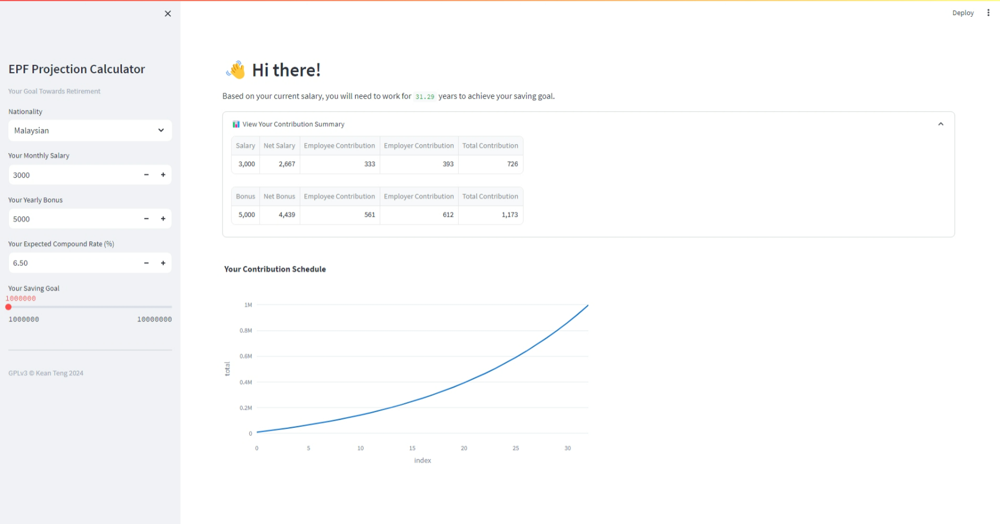
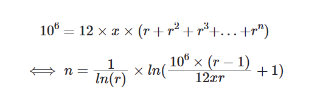

<center></center>
<p style="text-align: center; color:grey;"><i>Image from Unsplash</i></p>

EPF or KWSP (Employee Provident Fund) is formed by the Malaysian government on 1951 to help workers safeguard their retirement saving. Due to the rising cost of living and changing economic landscape, it poses a challenge for those having the notion of retire early. "How much saving is enough for me to retire early?" has become a pressing question for those who seek to retire comfortably.

According to the HSBC Quality of Life report, millennials in Malaysia said that they need an average of RM 4.86 million to retire comfortably. Furthermore, for the same purpose, Gen X and boomers would need an average of RM 4.53 million and RM 2.57 million respectively.

Personally, this is a concerning amount as increase in spending, in areas such as healthcare, higher tax rate, housings and more is making people difficult to accumulate enough savings to sustain a potentially lengthy retirement period. Of course, it has too, be imperative that a proper planning and projection of your personal retirement savings is key to achieve one's goal and lifestyle expectations during the retirement stage. 

That is not all, according to EPF, only 4% of its members has savings between RM 500,001 and RM 1 million and more than 35% of the members when turned 54 years old have less than RM 10,000 in savings. As such any action to withdraw your savings from the account could be a very bad idea.

In this study, we will set our retirement saving goal at RM 1 million, and we are interested to determine the number of years would take for a person to achieve the goal according to his monthly salary and yearly bonus. 

<center></center>

You can explore the app [here](https://jf7sray2rbu8bgclqnvaxu.streamlit.app/) together with the source code on [GitHub](https://github.com/keanteng/epf/tree/main).

Surprisingly, it only takes 31.29 years for you to accumulate your saving to 1 million if you earn a monthly salary of RM 3000. 

```
total_1_year = 12 * 728 * (1 + i)
total_2_year = 12 * 728 * (1 + i) + 12 * 728 * (1 + i)^2
...
...
```

To search for the number of year, we can develop a goal seek function using Python to search for any amount of interested:

<center></center>

We can translate the equation into Python code for execution:

```py
def goal_seek(goal, contribution, bonus_contribution, compound_rate):
    r = 1 + compound_rate/100
    contribution = contribution + bonus_contribution/12
    years = 1/np.log(r)*np.log((goal*(r-1))/(12*contribution*r) + 1)
    return years
```

You might be wondering how your yearly bonus fit into this equation? In the equation, it is assumed that interest is paid yearly and thus, the yearly bonus can be divided as a monthly payment:

```
contribution = bonus/12 + salary
```

But you should note that if the annual interest is to be given on monthly basis, such an assumption might cause inaccurate projection.

## Things To Note
For Malaysian and Non-Malaysian the EPF contribution rate works differently. Of course, different amount of salary will also subject to slightly different rate of contribution. For example, when your salary is below and equal to RM 5000, the employer's share of contribution is 13% and above that it will be 12%. The contribution amount should always be rounded up to the nearest ringgit, without any cents. Moreover, the monthly contribution rate can be referred from the [Third Schedule](https://www.kwsp.gov.my/documents/20126/140690/Jadual+Ketiga+BI.pdf).