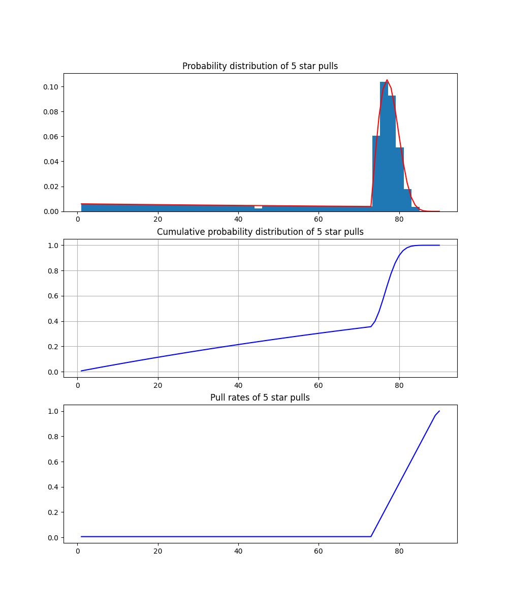

<center></center>
<p style="text-align: center; color:grey;"><i>Image from Unsplash</i></p>

> *The information provided in this article is for educational purposes only and it is not associated with any Gacha game providers.*

A gacha games is video game that implements the gacha mechanic to the likes of loot boxes to entice players to spend in-game currency to receive a random in-game item. Such mechanics began to be widely used in early 2010s, in particular, Japan and over time it has become an integral part of the mobile game culture. Some popular gacha games are Genshin Impact, Arknights, Epic Seven and Honkai Star Rail. These games are increasingly popular worldwide as they feature outstanding art, musics and stories as well as in game items collection via a lottery style system. 

<center></center>
<p style="text-align: center; color:grey;"><i>Honkai Star Rail</i></p>

## Introduction

Gacha games are mostly free to play by users worldwide. However, due to the gacha mechanics, obtaining rare or powerful items in the game are often difficult with very low probability. Moreover, limited in-game currency will rapidly get exhausted when players spend them in exchange of random in-game items through gacha. The expensiveness of the game stems from the pricing of the in-game currency where players need to spend significant amount of real world money to trade for opportunities to hit the jackpot in the gacha system due to its low probability nature.

Although gacha games are mostly free to play, they are lucrative businesses. The mechanics is often implemented in-game as standard and limited banners in game where the standard banner will feature items with perpertual availability that players can "roll" on. In contrast, the limited banner will only contain prizes that can only be obtained within a certain time frame. 

<center></center>
<p style="text-align: center; color:grey;"><i>Gacha Games Revenue</i></p>

Taking Honkai Star Rail as an example, the game features a standard and limited character banners where player gets a **0.6%** chance of getting a 5-star Character from each banner and a **5.1%** chance of getting a 4-star character or Light Cone. One good thing is that the game promise a guarantee 5-star character if player makes a total of **90 pulls** in the banner. But for the limited character banner, it works a bit differently, there is a 50% chance it will be the promotional 5-star character. Let's say the five-star character you receive is not said character, you’re guaranteed to get the character the next time you warp a 5-star.

## How To Get 5 Star?
We will get a 5 star if we have a random number <= pull rate given by the banner. The random number is generated on the server evenly between 0 and 1. Below is how the pull rate is computed:

```py
def get_rate(warp):
    # base rate same until we reach 74th pull
    if warp < 74:
        return 0.06
    
    # after 73th pull, the rate increase 6% per pull until 90 pull
    elif warp < 90 and warp >= 74:
        return (warp - 73) * 0.06 + 0.006
    
    else:
        return 1.00
```

To find the distribution of the pull, it is a bit complex where it involves geometric distribution and some recursive rate computation. Basically, for pull less than 74, we can use the geometric distribution to calculate our chance:

```
prob(X = k) = p * (1 - p)^(k-1)

p : probability of success
k : number of trials
```

After 73 pull, the rate will change with each pull we made until the 90 pull (guarantee):

```py
P(X < 74) = P(X < 73) + (1 - P(X < 73)) * get_rate(74)
P(X < 75) = (1 - P(X < 73)) * get_rate_mult(75) * get_rate(75) + P(X < 74)
P(X < 76) = (1 - P(X < 73)) * get_rate_mult(76) * get_rate(76) + P(X < 75) + P(X < 74)

# function
def get_rate_mult(warp):
    if warp == 75:
        return 1 - get_rate(74)
    
    else:
        return (1 - get_rate(warp - 1)) * get_rate_mult(warp - 1)
```

If we look at the distribution of the pulls, we can get some interesting insights:

<center></center>

The first plot shows us that the distribution of the 5-star pull where we are likely to get a 5-star if we make about 70 to 80 pulls. Around 74th pull, we can see that the cumulative probability curve stars to spike up showing an increase of chance. The third plot also shows likewise. To produce the plot, refers [here](https://github.com/keanteng/honkaistarrail/blob/main/2_hsr_gacha_system.ipynb). In fact, we can safely assume that if we prepared around 80 pulls, we can expect to get at least 1 5-star. 

## Setting Expectation
Well, for previous calculation we do not look into any pity or character guarantee cases. In real world scenario, players often comes with different conditions when they want to know their chances of getting the copies of 5-star that they want. We can use Python to perform simulation for a significant number of times and get the estimated probability by taking averages. The simulation will need to consider, the number of pulls we can make, the status of character guarantee in our account, and the pity amount in our account.

```py
def calculate_char_probability(
    warps,
    character_pity,
    character_guaranteed,
    character_copies,
    num_simulations
):
    ...
    ...
    estimated_probability = successful_simulations / num_simulations

    return estimated probability

```

If we give the function some input based on our game account progress, it will tell us how likely we are getting our target goals. Of course, this ensures us to pull more effectively - better expectation and lesser disappointment:

```
calculate_char_probability(
    warps,
    character_pity,
    character_guaranteed,
    character_copies,
    num_simulations
)

# return
Estimated probability: 0.90
```

You can refer to the full code [here](https://github.com/keanteng/honkaistarrail/tree/main).

## References
Some great resources and vidoes to look at:
- https://github.com/Jose-AE/hsr-warp-calculator
- https://github.com/sr229/gacha-prng
- https://www.youtube.com/watch?v=gZGW190E3ok